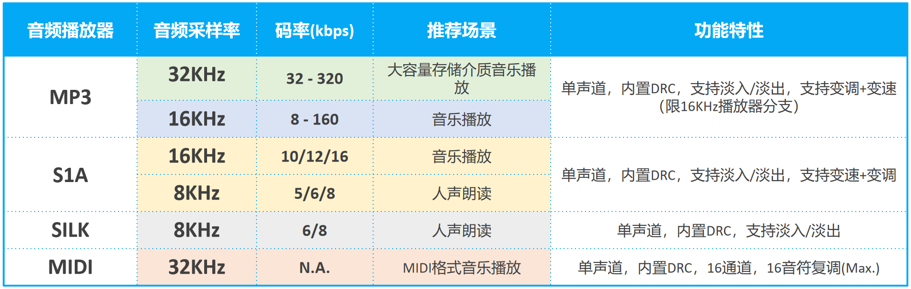

.. _player-parameter-structure:

音频播放器的必需数据结构
=========================

.. note::
   
   所有播放器接口类似，但支持的功能不完全一致，如变速变调，并不是所有播放器支持。

简介 
-------------------------

    本章节包含播放器需要的结构体和枚举信息，和通用的说明

    
说明
-------------------------

.. c:struct:: player_init_parameter_t

  初始化参数，player_xxx_init()输入参数，midi除外

   .. c:member:: void* file_info

    播放文件信息，资源文件放在flash上时，应为resource_t的指针

   .. c:member:: uint32_t fade_in_samples

    开始播放时，淡入音频点数

   .. c:member:: uint32_t fade_out_samples

    停止播放时，淡出音频点数

   .. c:member:: player_type_bit_t type

    播放的特性，详细参看  player_type_bit_t

   .. c:member:: uint32_t speed 

    播放速度，Q29 范围(0.5,2)，大于1加速，小于1减速。注意MP3 32KHZ,SILK,MIDI不支持

   .. c:member:: uint32_t pitch

    播放变调，Q29 范围 (0.5,2)，大于1频率升高，小于1频率降低。注意MP3 32KHZ,SILK,MIDI，S1A不支持

.. c:struct:: player_type_bit_t

  播放的特性
   
   .. c:member:: uint32_t loop_en :1

    循环播放，置位有效

   .. c:member:: uint32_t drc_en :1

    drc后置处理，置位有效

   .. c:member:: uint32_t file_type :1

    文件存放位置，0表示存放Flash

   .. c:member:: uint32_t resample_en :1

    播放上采样。置位有效。注意，8KHZ SILK，8KHZ S1A一定上采样，此位无效。32KHZ MP3 一定不上采样，此位无效。

   .. c:member:: uint32_t tsps_en :1

    变速变调，置位有效。当值为0，初始化参数，speed和pitch将无效。注意32KHZ MP3和SILK不支持变速变调，此位无效。
  

.. c:enum:: player_music_cmd_t

  解码命令，函数 player_xxx_xxx_cmd()输入参数

  - *Player_CMD_Stop*: 值为0，解码停止，若正在播放，会为其添加 fade_out_samples 长度的淡出
  - *Player_CMD_Start*: 值为1，解码开始，会为其添加 fade_in_sample 长度的淡入
  - *Player_CMD_Pause*: 值为2，解码暂停
  - *Player_CMD_Resume*: 值为3，恢复解码暂停

.. c:struct:: dec_info_t
  
  解码器运行状态结构体

   .. c:member:: player_dec_sequence_t dec_state

     解码器运行状态

   .. c:member:: uint32_t processed_frames

     已处理的数据帧数

   .. c:member:: int32_t total_size

     音频文件总大小（字节数）
    
   .. c:member:: uint32_t sampling_rate

     音频文件原生采样率

   .. c:member:: uint32_t scale

     当前音量缩放因子

.. c:enum:: player_dec_sequence_t

  解码器状态枚举，状态参数 dec_state 值选择范围

  - *Sequence_End*: 值为0，解码完成且播放完毕
  - *Sequence_Start*: 值为1，
  - *Sequence_Paused*: 值为2，解码暂停，此状态后不会再进解码和dma搬运播放
  - *Sequence_Stopped*: 值为3，解码停止
  - *Sequence_Initialised*: 值为4，解码初始化完成
  - *Sequence_Frame_Processing*: 值为5，正在解码帧
  - *Sequence_Frame_Processed*: 值为6，解码一帧完成，暂处空闲

使用方法
-------------------------

 所有播放器都按照如下示意图控制

 .. image:: ../../_static/kiwi-mp3-16k-fsm.png
  :align: center
 
 1. 调用 player_xxx_init() 进行播放器初始化，播放器进入 Ready 状态。
 2. 调用 player_xxx_cmd(`Player_CMD_Start`)，开始播放，播放器进入 Playing 状态。
 3. 播放过程中可以随时调用 player_xxx_cmd(`Player_CMD_Pause`)/player_xxx_cmd(`Player_CMD_Resume`) 在 Playing 和 Paused 之间切换播放器状态。
 4. 播放过程自然结束或调用 player_xxx_cmd(`Player_CMD_Stop`) 都会使得播放器进入 Stopped 状态。
 5. 通过调用 player_xxx_init() 可以将播放器重新置于 Ready 状态。
 6. 否则，调用 player_xxx_deinit() 即可释放播放器资源占用(Cleared 状态)。

注意事项
-------------------------

 1. 源码中需要先定义在音频播放器的必须品中的： player_dec_sequence_t ,player_file_attribute_t ,player_music_cmd_t 枚举和 dec_info_t 结构体，否者编译错误。
 2. 播放器运行过程占用DSM单元，指定的一路DMA通道，midi会占用两路DMA2、3通道，以及软件中断(MSIP)。播放器去初始化后，资源占用将被释放。
 3. 提供两个MP3，SILK，S1A解码播放库，其中名字中不带-vfs为flash播放库，带有-vfs为同时支持sd卡和flash播放库。
 