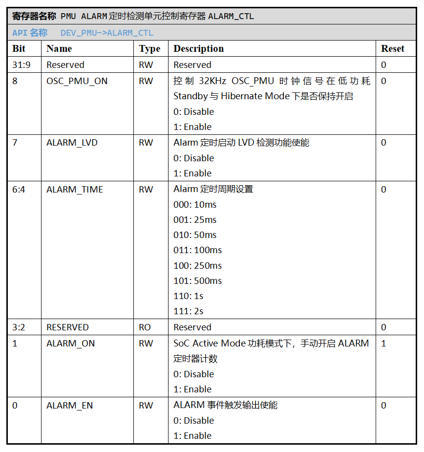

.. _alarm-module:

定时检测单元 (ALARM)
======================

.. note::
   
   前置知识： :ref:`pmu-module`

定时检测单元 (ALARM) 为PMU内建功能单元，以32KHz OSC_PMU时钟信号为计数驱动，
提供多个离散档位的时间周期设定，可以用于触发PMU中断请求或用于建立SoC低功耗唤醒信号。

外设特性
----------------------

 1. 可以在SoC Active Mode下充当定时器用途，周期性触发PMU中断。
 2. 可以在SoC Standby/Hibernate Mode下基于定时功能触发低功耗唤醒信号。
 3. 可以在SoC Standby/Hibernate Mode下定时启动低电压检测 (LVD) 功能。

外设使用
----------------------

典型使用场景
^^^^^^^^^^^^^^^^^^^^^^

**A. 在工作模式(Active Mode)下充当常规PMU定时器**

  该场景下，ALARM单元作为硬件定时器性质外设，周期性产生PMU中断，
  除执行定时逻辑外，也可作为SoC Sleep Mode下的WFI/WFE唤醒源。

  0. 清除 *PMU中断请求/低功耗唤醒信号状态寄存器PEND* 中的ALARM_PEND置位，
     防止未处置的PMU中断请求干扰后续配置流程。

     API链接：

      - :c:func:`pmu_irq_clear_flag`, 其中 source 传参选择预设枚举 *PMU_IRQ_Source_ALARM*

  1. 配置 `PMU ALARM定时检测单元控制寄存器ALARM_CTL`_ ，通过ALARM_CTL.ALARM_TIME 选择ALARM的定时周期。
     ALARM单元提供10/25/50/100/250/500/1000/2000ms的有限定时周期选择。
  2. 配置 PMU_ALARM_CTL.ALARM_EN = 1，开启ALARM定时事件的信号输出使能，ALARM单元将在计数到达定时后，向PMU输出
     中断请求信号ALARM_INT和低功耗唤醒信号ALARM_WAK。

     API链接：

      - :c:func:`alarm_init` , 其中 role 传参选择预设枚举 *ALARM_As_Active_Mode_PMU_Timer*  

  3. 配置 *PMU中断使能寄存器INT_EN*, 设置ALARM单元中断请求信号ALARM_INT作为PMU中断源(之一)。

     API链接：

      - :c:func:`pmu_irq_enable`, 其中 source 传参选择预设枚举 *PMU_IRQ_Source_ALARM*

  4. 使能 *ECLIC* 单元中PMU对应的中断请求通道。
  5. 配置 PMU_ALARM_CTL.ALARM_ON = 1，手动开启ALARM定时器计数。

     API链接：

      - :c:func:`alarm_manully_start`

  6. 当ALARM定时器触发PMU中断或作为WFE唤醒信号使SoC从Sleep Mode进入Active Mode后，
     用户代码需要清除 *PMU中断请求/低功耗唤醒信号状态寄存器PEND* 中的ALARM_PEND置位。

     API链接：

      - :c:func:`pmu_irq_clear_flag`, 其中 source 传参选择预设枚举 *PMU_IRQ_Source_ALARM*

  7. 用户按需手动关闭ALARM计数，或等待ALARM下次中断请求触发（周期性ALARM）。 

     API链接：

      - :c:func:`alarm_manully_stop`

**B. 在Standby/Hibernate低功耗模式下定时触发唤醒信号**

  该场景下，ALARM单元可作为低功耗Standby Mode和Hibernate Mode的唤醒源，在进入低功耗状态指定时长后触发
  唤醒信号。

  0. 清除 *PMU中断请求/低功耗唤醒信号状态寄存器PEND* 中的ALARM_PEND置位，
     防止未处置的PMU低功耗唤醒信号干扰后续配置流程。

     API链接：

      - :c:func:`pmu_wak_clear_flag`, 其中 source 传参选择预设枚举 *PMU_Lpm_Wakeup_Source_ALARM*

  1. 配置 `PMU ALARM定时检测单元控制寄存器ALARM_CTL`_ ，通过ALARM_CTL.ALARM_TIME 选择ALARM的定时周期。
     ALARM单元提供10/25/50/100/250/500/1000/2000ms的有限定时周期选择。
  2. 配置 PMU_ALARM_CTL.ALARM_EN = 1，开启ALARM定时事件的信号输出使能，ALARM单元将在计数到达定时后，向PMU输出
     中断请求信号ALARM_INT和低功耗唤醒信号ALARM_WAK。
  3. 配置 PMU_ALARM_CTL.OSC_PMU_ON = 1, 保证SoC进入低功耗模式后，ALARM正常计数。

     API链接：

      - :c:func:`alarm_init` , 其中 role 传参选择预设枚举 *ALARM_As_Standy_Or_Hibernate_Mode_Wakeup_Source*  

  4. 配置 *PMU低功耗唤醒信号使能寄存器WAK_EN*, 设置ALARM单元低功耗唤醒信号ALARM_WAK作为低功耗模式唤醒源(之一)。

     API链接：

      - :c:func:`pmu_wak_enable`, 其中 source 传参选择预设枚举 *PMU_Lpm_Wakeup_Source_ALARM*

  5. 如果在Standby Mode下使用ALARM唤醒功能，需要使能 *ECLIC* 单元中PMU对应的中断请求通道。
     如果仅在Hibernate Mode下使用ALARM唤醒功能，则无需此步骤。

  6. 调用指定的函数，将SoC置于Standby Mode或Hibernate Mode。

  7. SoC从ALARM定时产生的唤醒信号恢复工作后(Active Mode)，用户程序清除 *PMU中断请求/低功耗唤醒信号状态寄存器PEND* 中的ALARM_PEND置位，
     确保下一次低功耗状态的正常进入和唤醒。

     API链接：

      - :c:func:`pmu_wak_clear_flag`, 其中 source 传参选择预设枚举 *PMU_Lpm_Wakeup_Source_ALARM*

**C. 在Standby/Hibernate低功耗模式下定时启动低电压检测 (LVD)**

  详情请参考 :ref:`lvd-module` 章节。

----------------------------------------------------------------------------------------------------

API说明
----------------------

.. c:enum:: alarm_role_t

  ALARM单元工作场景设置。

   - *ALARM_As_Active_Mode_PMU_Timer*：ALARM作为常规PMU定时器使用，后续可以用于触发PMU中断或唤醒低功耗Sleep Mode下的SoC。
   
   - *ALARM_As_Standy_Or_Hibernate_Mode_Wakeup_Source*：ALARM作为SoC低功耗Standby/Hibernate Mode的定时唤醒源。

.. c:enum:: alarm_time_t

  ALARM单元定时周期设置。

   - *ALARM_Time_10ms*：ALARM定时10ms
   - *ALARM_Time_25ms*：ALARM定时25ms
   - *ALARM_Time_50ms*：ALARM定时50ms
   - *ALARM_Time_100ms*：ALARM定时100ms
   - *ALARM_Time_250ms*：ALARM定时250ms
   - *ALARM_Time_500ms*：ALARM定时500ms
   - *ALARM_Time_1s*：ALARM定时1s
   - *ALARM_Time_2s*：ALARM定时2s

.. c:function:: void alarm_init(alarm_role_t role, alarm_time_t period)

  alarm单元配置初始化。

  :param role: alarm工作场景设置，通过枚举定义 :c:enum:`alarm_role_t` 选择。
  :param period: alarm定时周期设置，通过枚举定义 :c:enum:`alarm_time_t` 选择。 
  :returns: 无

.. c:function:: void alarm_manully_start()

  ALARM单元手动开启计时。

  :returns: 无

.. c:function:: void alarm_manully_stop()

  ALARM单元手动关闭计时，ALARM内部计数清0。

  :returns: 无

-----------------------------------------------------------------------

寄存器定义
----------------------

.. _PMU ALARM定时检测单元控制寄存器ALARM_CTL:

