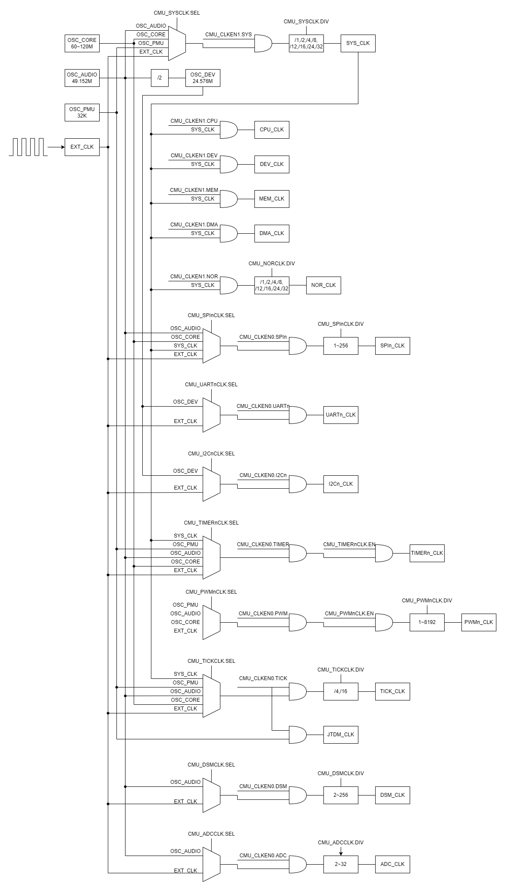
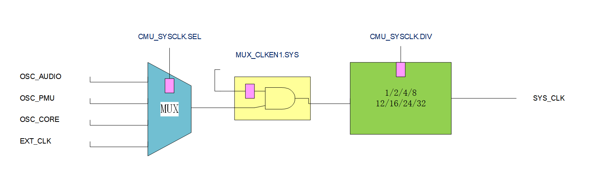
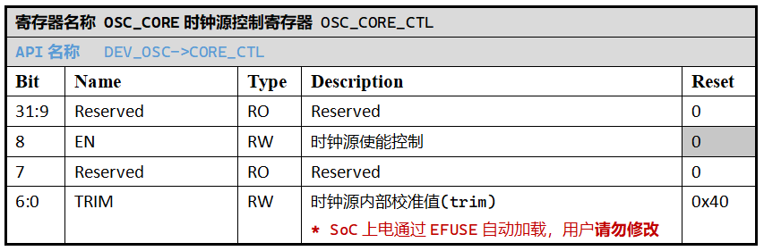
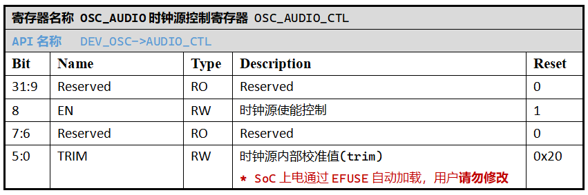
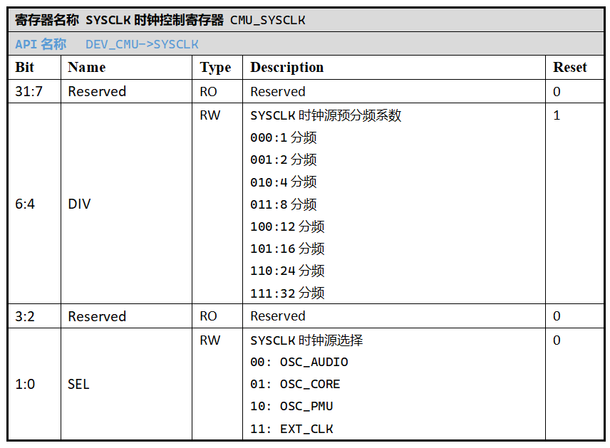
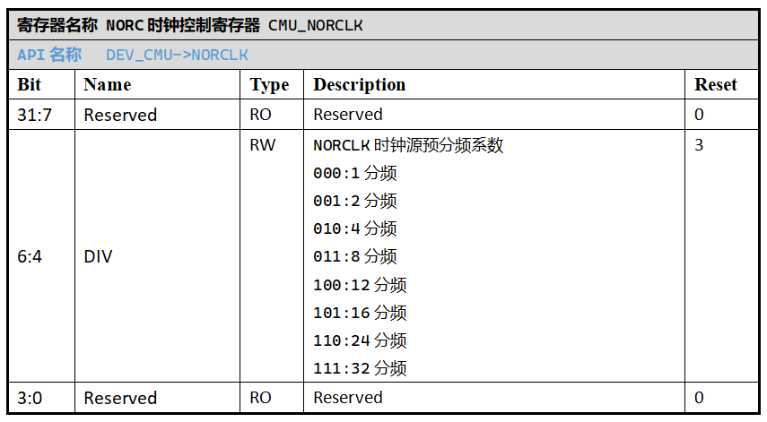

.. _clock-source-module:

时钟源
======================

本章节相关的配置涉及 SPV1x SoC 的时钟管理单元(CMU) 、电源管理单元(PMU) 和 振荡器(OSC)单元 的内容。

上游时钟源
----------------------

按照时钟信号通路的上下游逻辑关系进行分类，SPV1x SoC的下列4路时钟信号位于最上游：

 - 高频内核振荡器产生的 60-120Mhz 时钟信号： ``OSC_CORE``
 - 高性能音频振荡器产生的 49.152Mhz 时钟信号： ``OSC_AUDIO``
 - 低功耗RC振荡器产生的 32Khz 时钟信号： ``OSC_PMU``
 - 通过GPIO引脚输入的外部时钟信号： ``EXT_CLK``

OSC_CORE时钟频率在出厂阶段进行校准，并将离散档位的校准值写入SoC Efuse，用户可以自行配置。关联API链接：

 - :c:func:`clock_osc_core_set`

OSC_CORE时钟信号默认关闭，可以通过 `OSC_CORE时钟源控制寄存器CORE_CTL`_ 开启：OSC_CORE_CTL.EN = 1。关联API链接:

 - :c:func:`clock_osc_core_enable`
 - :c:func:`clock_osc_core_disable`

49.152Mhz OSC_AUDIO时钟信号默认开启，可以通过 `OSC_AUDIO时钟源控制寄存器AUDIO_CTL`_ 关闭：OSC_AUDIO_CTL.EN = 0。关联API链接:

 - :c:func:`clock_osc_audio_enable`
 - :c:func:`clock_osc_audio_disable`

32KHz OSC_PMU时钟信号在SoC Active Mode功耗模式下为常开。

外部时钟信号可以通过GPIO外部时钟输入控制寄存器ECLK指定的GPIO端口输入，关联API链接：

 - :c:func:`clock_extclk_set`
 - :c:func:`clock_extclk_enable`
 - :c:func:`clock_extclk_disable`

中游时钟信号
----------------------

依赖上游时钟源，下列2路内部时钟信号处于中游位置：

 - ``OSC_DEV`` 时钟信号
 - ``SYS_CLK`` 时钟信号

中游时钟信号依赖上游时钟源作为源头选择，通过固定或可配置的预分频产生：

OSC_DEV 是通过 OSC_AUDIO信号2分频产生的 24.576MHz 固定频率信号，可以通过控制 OSC_AUDIO 信号使能的方式进行开关。
由于 OSC_AUDIO 时钟SoC上电默认开启， OSC_DEV时钟信号也同时可以使用。

SYS_CLK 时钟信号可以在全部4路上游时钟源信号中产生，具有1/2/4/8/12/16/24/32总计8种预设分频系数，是CPU、BUS、SRAM、DMA、NOR控制器单元的唯一时钟源选择。
时钟管理单元 CMU 下属 `系统时钟控制寄存器SYSCLK`_ 用于对SYS_CLK信号的配置。
SoC上电时，SYS_CLK默认使用上电即开启的 OSC_AUDIO 时钟作为上游信号，预分频系数配置为2分频。关联API链接：

 - :c:func:`clock_sysclk_set`

下游时钟信号
----------------------

此类内部信号为SoC外设的时钟源，包括：

 - NOR控制器时钟信号 ``NOR_CLK``，其时钟源固定为SYSCLK，可以选择1/2/4/8/12/16/24/32总计8种预设分频系数。
   通过 `NORC时钟控制寄存器NORCLK`_ 进行配置。关联API链接：

    - :c:func:`clock_norclk_set`
 
 - SPI时钟信号 ``SPI0_CLK`` 与 ``SPI1_CLK``
 - I2C时钟信号 ``I2C0_CLK``
 - UART时钟信号 ``UART0_CLK`` 与 ``UART1_CLK``
 - PWM时钟信号 ``PWM0_CLK`` 至 ``PWM4_CLK``
 - TIMER时钟信号 ``TIMER0_CLK`` 与 ``TIMER1_CLK``
 - ADC时钟信号 ``ADC_CLK``
 - CPU内核定时器 Machine Timer 时钟信号 ``TICK_CLK``
 - DSM时钟信号 ``DSM_CLK``

这些外设的时钟源信号选择为中上游时钟源信号的特定子集构成，有些时钟信号还具备可配置的预分频系数项。
除NOR控制器外，其余外设的时钟源信号配置流程已包含于该外设的配套API中。

.. warning::
  
  1. 用户需要确保所需时钟信号的上游时钟信号通路妥善开启，同时要留意如进出低功耗场景时对各级时钟信号的处置。
  2. 大多数下游时钟信号均为有缝切换时钟，在进行时钟源切换或者分频比切换时，可能会出现毛刺。
     因此，需要先关闭时钟，再进行时钟配置的调整，最后打开时钟。SYS_CLK和NOR_CLK属于无缝切换时钟，可以在模块工作过程中进行调整。

--------------------------------------------------------------------------------

API说明
----------------------

.. c:enum:: osc_core_frequency_t

  OSC CORE时钟源频率设置枚举定义。

   - *OSC_Core_Frequency_80MHz*：设置OSC CORE时钟源频率至80MHz。
   - *OSC_Core_Frequency_100MHz*：设置OSC CORE时钟源频率至100MHz。

.. c:function:: void clock_osc_core_set(osc_core_frequency_t freq)

  配置OSC CORE频率（有限选择）。
  
  :param freq: OSC CORE频率设置，通过枚举定义 :c:enum:`osc_core_frequency_t` 选择。
  :returns: 设置成功与否: 0表示设置成功，-1表示设置失败：EFUSE对应位置trim数据无效。

.. c:function:: void clock_osc_core_enable()

  开启OSC CORE时钟源。

  :returns: 无

.. c:function:: void clock_osc_core_disable()

  关闭OSC CORE时钟源。

  :returns: 无

.. c:function:: void clock_osc_audio_enable()

  开启OSC AUDIO时钟源。

  :returns: 无

.. c:function:: void clock_osc_audio_disable()

  关闭OSC AUDIO时钟源。

  :returns: 无

.. c:function:: void clock_extclk_set(gpio_pin_t pin, gpio_pin_pull_t pull)

  将指定GPIO端口配置为外部时钟信号EXT CLK输入口。

  :param pin: GPIO端口号，通过枚举定义 :c:enum:`gpio_pin_t` 选择。
  :param pull: GPIO端口上/下拉选择，通过枚举定义 :c:enum:`gpio_pin_pull_t` 选择。 
  :returns: 无

.. c:function:: void clock_extclk_enable()

  开启外部时钟信号输入。

  :returns: 无

.. c:function:: void clock_extclk_disable()

  关闭外部时钟信号输入。

  :returns: 无

.. c:enum:: sysclk_source_sel_t

  SYSCLK时钟源选择枚举定义。

   - *Sysclk_Sel_Osc_Audio*：选择OSC_AUDIO作为时钟源。
   - *Sysclk_Sel_Osc_Core*：选择OSC_CORE作为时钟源。
   - *Sysclk_Sel_Osc_Pmu*：选择OSC_PMU作为时钟源。
   - *Sysclk_Sel_Ext_Clk*：选择外部时钟信号EXTCLK作为时钟源。

.. c:enum:: clock_source_div_t

  时钟源预分频系数枚举定义。

   - *Clock_Source_Div_1*：1分频。
   - *Clock_Source_Div_2*：2分频。
   - *Clock_Source_Div_4*：4分频。
   - *Clock_Source_Div_8*：8分频。
   - *Clock_Source_Div_12*：12分频。
   - *Clock_Source_Div_16*：16分频。
   - *Clock_Source_Div_24*：24分频。
   - *Clock_Source_Div_32*：32分频。

.. c:function:: void clock_sysclk_set(sysclk_source_sel_t sel, clock_source_div_t div)

  配置SYSCLK。

  :param sel: 配置SYSCLK时钟源，通过枚举定义 :c:enum:`sysclk_source_sel_t` 选择。
  :param div: 配置SYSCLK时钟源分频系数，通过枚举定义 :c:enum:`clock_source_div_t` 选择。 
  :returns: 无

.. c:function:: void clock_norclk_set(clock_source_div_t div)

  配置NORCLK。(NORCLK的时钟源固定为SYSCLK)

  :param div: 配置NORCLK时钟源分频系数，通过枚举定义 :c:enum:`clock_source_div_t` 选择。 
  :returns: 无

-----------------------------------------------------------------------

寄存器定义
----------------------

.. _OSC_CORE时钟源控制寄存器CORE_CTL:

----------------------------------------------

.. _OSC_AUDIO时钟源控制寄存器AUDIO_CTL:

----------------------------------------------

.. _系统时钟控制寄存器SYSCLK:

----------------------------------------------

.. _NORC时钟控制寄存器NORCLK:

