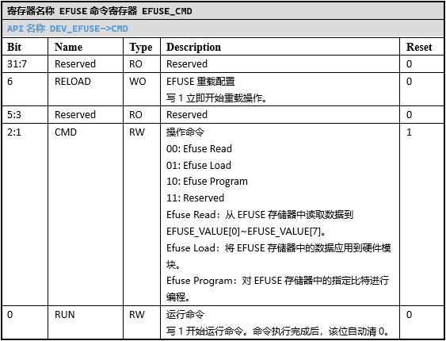

EFUSE
======================

外设特性
----------------------

| SPV1x有一个\ **256bit**\ 的EFUSE存储器。EFUSE为一次性存储器，其默认值为0。EFUSE的数据编程是按bit进行的，软件可以将值为“0”的bit编程为“1”，但是不能将值为“1”的bit编程为“0”。
| 读取或编程EFUSE存储器中的内容都需要对应的命令来完成。软件读取EFUSE中的内容时，要先通过READ命令，将EFUSE存储器中的内容加载到寄存器\ `EFUSE_VALUE0`_\ ~\ `EFUSE_VALUE7`_\ ；软件编程数据到EFUSE存储器时，需要通过PROGRAM命令，进行逐bit编程。
| 芯片上电时，硬件会自动加载EFUSE存储器中的内容，并应用到芯片的各项硬件配置中（如果EFUSE中的内容有效）。当软件修改EFUSE存储器中的内容后，如果需要让新的内容立即生效，可以使用LOAD命令完成一次载入操作。
| EFUSE还提供重载功能。重载功能使用寄存器\ `EFUSE_VALUE0`_\ ~\ `EFUSE_VALUE7`_\ 中的内容来代替EFUSE存储器中的内容对芯片的各项硬件进行配置。这使得在后期，可以使用软件的方式来对芯片进行二次配置。

外设使用
----------------------

1. EFUSE使用前的配置
^^^^^^^^^^^^^^^^^^^^^^^^^^^

访问EFUSE前，需要开启模块的工作时钟，解除模块的复位状态。
 1.	配置CMU_CLKEN0.EFUSE为1，使能EFUSE的时钟。
 2.	配置RMU_RSTEN0.EFUSE为1，解除EFUSE的复位状态。

2. EFUSE读取(READ)操作
^^^^^^^^^^^^^^^^^^^^^^^^^^^

 1. 向\ `EFUSE_PSW`_\ 写入\ **0xC9372C14**，授权读取操作。
 2. 配置\ `EFUSE_CMD`_.CMD为EFUSE READ，同时配置\ `EFUSE_CMD`_.RUN为1。EFUSE模块将开始读取操作。
 3. 等待EFUSE读取操作完成（命令执行完成后，\ `EFUSE_CMD`_.RUN会自动清0）。
 4. 读取\ `EFUSE_VALUE0`_\ ~\ `EFUSE_VALUE7`_\ ，获取EFUSE存储器中的数据。

3. EFUSE编程(PROGRAM)操作
^^^^^^^^^^^^^^^^^^^^^^^^^^^

 1. 向\ `EFUSE_PSW`_\ 写入\ **0xC9372C14**，授权编程操作。
 2. 配置\ `EFUSE_ADR`_.ADDR，设置要写的bit地址（有效地址范围0~255）。
 3. 配置\ `EFUSE_CMD`_.CMD为EFUSE PROGRAM，同时配置\ `EFUSE_CMD`_.RUN为1。EFUSE模块将开始对指定的bit进行编程操作。
 4. 等待EFUSE编程操作完成（命令执行完成后，\ `EFUSE_CMD`_.RUN会自动清0）。
 5. 重复步骤（2）和（3），直到所有需要编程的bit都操作完成。

4. EFUSE 载入(LOAD)操作
^^^^^^^^^^^^^^^^^^^^^^^^^^^

 1. 向\ `EFUSE_PSW`_\ 写入\ **0xC9372C14**，授权载入操作。
 2. 配置\ `EFUSE_CMD`_.CMD为EFUSE LOAD，同时配置\ `EFUSE_CMD`_.RUN为1。EFUSE模块将开始载入操作。
 3. 等待EFUSE载入操作完成（命令执行完成后，\ `EFUSE_CMD`_.RUN会自动清0）。

5. EFUSE 重载(RELOAD)操作
^^^^^^^^^^^^^^^^^^^^^^^^^^^

 1. 向\ `EFUSE_PSW`_\ 写入\ **0x123C97C4**，授权重载操作。
 2. 清除\ `EFUSE_PD`_.BUSY位，然后向\ `EFUSE_VALUE0`_\ ~\ `EFUSE_VALUE7`_\ 写入要设置的值，再等待\ `EFUSE_PD`_.BUSY置位。
 3. 重复步骤（1），直至\ `EFUSE_VALUE0`_\ ~\ `EFUSE_VALUE7`_\ 全部写入完成。
 4.	配置\ `EFUSE_CMD`_.RELOAD为1，EFUSE模块将开始重载操作。重载操作很快，无需等待。重载完成后，\ `EFUSE_PD`_.EFUSE_INI会置位。

注意事项
----------------------

 1. EFUSE为一次性存储器，修改EFUSE内容需要谨慎进行。
 2. EFUSE的bit0~bit215用于芯片出厂信息设置，修改这些bit可能导致芯片工作异常，甚至无法使用。EFUSE的bit216~bit255可用于存储用户自定义数据。
 3. \ `EFUSE_VALUE0`_\ ~\ `EFUSE_VALUE7`_\ 与EFUSE存储器的256bit数据对应关系如下：

  | \ `EFUSE_VALUE0`_\ 存放EFUSE存储器的bit0~bit31，且\ `EFUSE_VALUE0`_\ 的最低位存放EFUSE存储器的bit0；
  | \ `EFUSE_VALUE1`_\ 存放EFUSE存储器的bit32~bit63，且\ `EFUSE_VALUE1`_\ 的最低位存放EFUSE存储器的bit32；
  | \ `EFUSE_VALUE2`_\ 存放EFUSE存储器的bit64~bit95，且\ `EFUSE_VALUE2`_\ 的最低位存放EFUSE存储器的bit64；
  | \ `EFUSE_VALUE3`_\ 存放EFUSE存储器的bit96~bit127，且\ `EFUSE_VALUE3`_\ 的最低位存放EFUSE存储器的bit96；
  | \ `EFUSE_VALUE4`_\ 存放EFUSE存储器的bit128~bit159，且\ `EFUSE_VALUE4`_\ 的最低位存放EFUSE存储器的bit128；
  | \ `EFUSE_VALUE5`_\ 存放EFUSE存储器的bit160~bit191，且\ `EFUSE_VALUE5`_\ 的最低位存放EFUSE存储器的bit160；
  | \ `EFUSE_VALUE6`_\ 存放EFUSE存储器的bit192~bit223，且\ `EFUSE_VALUE6`_\ 的最低位存放EFUSE存储器的bit192；
  | \ `EFUSE_VALUE7`_\ 存放EFUSE存储器的bit224~bit255，且\ `EFUSE_VALUE7`_\ 的最低位存放EFUSE存储器的bit224；

 4. 芯片上电时，硬件会自动将EFUSE的内容加载到寄存器OTP_DATA[0]~OTP_DATA[7]。用户可以通过访问OTP_DATA[0]~OTP_DATA[7]快速获取EFUSE存储器中的内容。
 5. 在芯片开发早期，如果不能确定最终EFUSE存储器中的详细配置内容，那么可以通过EFUSE重载功能来模拟EFUSE的配置数据。或者在后期，发现EFUSE存储器中的内容不合适，可以通过EFUSE重载功能来覆写硬件配置。
 6. 操作EFUSE前，需要检查VDDQ电源是否正常开启。芯片上电后，默认VDDQ处于开启状态。一些低功耗操作或者低功耗模式下，VDDQ可能会被关闭。详情见PMU相关内容。
 7. 当芯片供电电压小于2.5V时，操作EFUSE存储器可能存在风险，此时，OTP_DATA[0]~OTP_DATA[7]中的数据也可能出现错误。但是EFUSE重载功能不受此影响。

API说明
----------------------

EFUSE API提供EFUSE的读取、编程、载入、重载操作。

.. c:function:: void efuse_init(void)

  EFUSE初始化。

  :returns: 无

.. c:function:: void efuse_deinit(void)

  EFUSE去初始化。

  :returns: 无

.. c:function:: void efuse_write(uint32_t efuse_addr,uint32_t values[],uint32_t bit_offset,uint32_t bit_count)

  EFUSE写入（编程）。

  :param efuse_addr: EFUSE起始地址，0~255。
  :param values: 待写入的数据，每一个数据bit对应一个EFUSE bit。
  :param bit_offset: values中的起始位偏移。
  :param bit_count: 要写入的bit数量。
  :returns: 无

.. c:function:: void efuse_read(uint32_t out_values[8])

  EFUSE读取。

  :param out_values: 用于容纳读取的数据。
  :returns: 无

.. c:function:: void efuse_load(void)

  EFUSE加载。

  :returns: 无

.. c:function:: void efuse_reload(uint32_t values[8])

  EFUSE软件配置加载。

  :param values: 用于配置的数据。
  :returns: 无

----------------------

API使用示例
----------------------

 1. 调用 `efuse_init()` 初始化EFUSE模块。
 2. 调用 `efuse_write()` 对EFUSE存储器进行编程。

 .. code-block:: c

  efuse_write(0, efuse_values, 0, 256);

 3. 调用 `efuse_read()` 读取EFUSE存储器中的内容。

 .. code-block:: c

  efuse_read(read_back);

 4. 调用 `efuse_load()` 读取EFUSE储存器中的内容并应用到硬件。
 5. 调用 `efuse_reload()` 软件重载EFUSE储存器中的内容并应用到硬件。

 .. code-block:: c

  efuse_reload(efuse_values);

 .. note::

  * 重载操作会使用软件写入到EFUSE_VALUE0~EFUSE_VALUE7中的内容来初始化硬件，EFUSE存储器中的内容仍然维持原来的内容。

 6. 如果不需要再使用EFUSE，调用 `efuse_deinit()` 去初始化。

 去初始化会关闭EFUSE的时钟，并让模块处于复位状态。

----------------------

寄存器定义
----------------------

.. _EFUSE_PSW:

----------------------------------------------

.. _EFUSE_ADR:

----------------------------------------------

.. _EFUSE_CMD:

----------------------------------------------

.. _EFUSE_VALUE0:

----------------------------------------------

.. _EFUSE_VALUE1:

----------------------------------------------

.. _EFUSE_VALUE2:

----------------------------------------------

.. _EFUSE_VALUE3:

----------------------------------------------

.. _EFUSE_VALUE4:

 
----------------------------------------------

.. _EFUSE_VALUE5:

 
----------------------------------------------

.. _EFUSE_VALUE6:

 
----------------------------------------------

.. _EFUSE_VALUE7:

 
----------------------------------------------

.. _EFUSE_PD:

