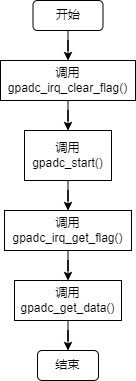

GPADC
======================

Analog to Digital Converter

简介
----------------------

- 12bit数据精度
- 主次两通道，主通道数据可用DMA读取
- 单通道最高256k采样率
- 双通道最高支持64k采样率
- 支持过采样处理
- 支持下采样处理
- 主通道支持高通录波器处理
- 支持18种不同信号源的采集
- 主次通道转换完成中断
- 主通道FIFO中断
- 单次和连续采样模式

功能描述及使用
----------------------

 .. image:: ../../_static/kiwi-adc-block.png
  :align: center

工作时钟
^^^^^^^^^^^^^^^^^^^^^^

主次两通道工作时钟相同，由CMU模块 ADC_CLK寄存器配置

 .. image:: ../../_static/kiwi-adc-clk.jpg
  :align: center

工作模式
^^^^^^^^^^^^^^^^^^^^^^

- 单采样

    模块默认处于空闲，直到软件发起开始命令，模块工作，采集数据后，将数据放入主通道数据寄存器，或次通道数据寄存器中。
  
- 连续采样
    软件发起开始命令，按照设置频率采样，输出数据。

- 混合采样
    主通道连续采样，次通道偶尔发起单次采样

主通道使用
^^^^^^^^^^^^^^^^^^^^^^

**1. 使能ADC模块，并配置模块时钟**

    - 置位CMU_CLKEN0.ADC，开启ADC时钟
    - 置位RMU_RSTEN0.ADC，释放ADC模块
    - 配置CMU_ADCCLK寄存器，选择模块工作时钟源，并选择分频

**2. 配置ADC_MCFG寄存器，设置主通道参数**

    - 配置MAIN_MODE比特，选择工作模式，值为0表示单次采样模式，值为1表示连续采样模式
    - 配置MAIN_SEL比特域，选择采样信号源，值为0表示采集信号GPIO00，值为1表示采集信号GPIO01，值为2表示采集信号GPIO02，值为3表示采集信号GPIO03，值为4表示采集信号GPIO04，值为5表示采集信号GPIO24，值为6表示采集信号GPIO25，值为7表示采集信号GPIO26，值为8表示采集信号VREF_1P5，值为9表示采集信号DVDD，值为10表示采集信号AVCC，值为11表示采集信号IOVCC，值为12表示采集信号AGND，值为13表示采集信号GPIO22，值为14表示采集信号GPIO23，值为15表示采集信号VCC，值为16表示采集信号MIC_P，值为17表示采集信号MIC_N，值为18表示采集信号MIC_P&N
    - 配置MAIN_DS比特域，设定下采样。值为0表示禁止下采样，值大于0，表示这顶值加一的下采样率
    - 配置MAIN_OSR比特域，设定上过样值，0表示禁止采样，值为1表示2倍过采样，值为2表示4倍过采样，值为3表示8倍过采样，值为4表示16倍过采样，值为5表示32倍过采样
    - MAIN_DS域MAIN_OSR不能同时为大于0的值
    - 配置MIAN_LAT比特，当为一个通道工作，此比特为1，当主次两通道一起工作，此比特为0
    - 配置MAIN_LE比特
    - 配置MIAN_SIGN比特，配置过采样和下采样数据为有符号数或无符号数，值为0表示无符号数，值为1表示有符号数
    - 配置DRQ_LVL比特域，配置fifo可读数据阈值中断，当FIFO中可读数据大于设定值，产生可读pending
    - 配置HPF_SEL比特域，设置高通滤波器，值为0表示禁止高通滤波，值为1表示32系数滤波器，值为2表示64系数录波器，值为3表示128系数滤波器，值为4表示256滤波器系数，置位5表示512滤波器系数，值为6表示1024系数滤波器，置位7表示2048系数滤波器

**3. 配置ADC_ANA寄存器，配置模拟参数**

**4. 配置ASC_CTL寄存器，配置采样率等参数**

    - 配置NC比特域
    - 配置WE比特域，设定采样率，采样率等于ADC工作时钟除以WE的设定值，即为模块的最大采样率
    - 配置MAIN_START比特，启动主通道采样，值为1启动采样，值为0，停止采样
 
**5. 读取ADC_STA获取FIFO状态**

**6. 读取ADC_MDAT获取主通道数据**

次通道使用
^^^^^^^^^^^^^^^^^^^^^^

**1. 使能ADC模块，并配置模块时钟**

    - 置位CMU_CLKEN0.ADC，开启ADC时钟
    - 置位RMU_RSTEN0.ADC，释放ADC模块
    - 配置CMU_ADCCLK寄存器，选择模块工作时钟源，并选择分频

**2. 设置ADC_CFG1，配置次通道参数**

    - 配置EXTRA_MODE比特，设置此通道工作模式，值为0表示单次采样模式，值为1表示连续采样模式
    - 配置EXTRA_SEL比特域，设置通道采集信号源，值为0表示采集信号GPIO00，值为1表示采集信号GPIO01，值为2表示采集信号GPIO02，值为3表示采集信号GPIO03，值为4表示采集信号GPIO04，值为5表示采集信号GPIO24，值为6表示采集信号GPIO25，值为7表示采集信号GPIO26，值为8表示采集信号VREF_1P5，值为9表示采集信号DVDD，值为10表示采集信号AVCC，值为11表示采集信号IOVCC，值为12表示采集信号AGND，值为13表示采集信号GPIO22，值为14表示采集信号GPIO23，值为15表示采集信号VCC，值为16表示采集信号MIC_P，值为17表示采集信号MIC_N，值为18表示采集信号MIC_P&N
    - 配置EXTRA_DS比特域，设定下采样。值为0表示禁止下采样，值大于0，表示这顶值加一的下采样率
    - 配置EXTRA_OSR比特域，设定上过样值，0表示禁止采样，值为1表示2倍过采样，值为2表示4倍过采样，值为3表示8倍过采样，值为4表示16倍过采样，值为5表示32倍过采样
    - EXTRA_DS域EXTRA_OSR不能同时为大于0的值
    - 配置EXTRA_LAT比特，当为一个通道工作，此比特为1，当主次两通道一起工作，此比特为0
    - 配置EXTRA_LE比特
    - 配置EXTRA_SIGN比特，设定数据符号，0表示无符号位，1表示有符号位

**3. 配置ADC_ANA寄存器，配置模拟参数**

**4. 配置ASC_CTL寄存器，配置采样率等参数**

    - 配置NC比特域
    - 配置WE比特域，设定采样率，采样率等于ADC工作时钟除以WE的设定值，即为模块的最大采样率
    - 配置MAIN_START比特，启动主通道采样，值为1启动采样，值为0，停止采样

**5. 读取ADC_PD寄存器**

    - 获取ECTRA_PD，若置位表示此通道采集到有效数据

**6. 读取ADC_EDAT寄存器**

    - 获取此通道采集数据。

API说明
^^^^^^^^^^^^^^^^^^^^^^

- api函数只提供次通道数据读取函数，默认ADC的初始化在系统初始化中进行
- 次通道ADC在api中重命名为GPADC，只支持单次采样

.. c:enum:: gpadc_signal_source_t

    GPADC采集的信号

    - *GPADC_Signal_GPIO00*: 信号来自GPIO00
	- *GPADC_Signal_GPIO01*: 信号来自GPIO01
	- *GPADC_Signal_GPIO02*: 信号来自GPIO02
	- *GPADC_Signal_GPIO03*: 信号来自GPIO03
	- *GPADC_Signal_GPIO04*: 信号来自GPIO04
	- *GPADC_Signal_GPIO24*: 信号来自GPIO24
	- *GPADC_Signal_GPIO25*: 信号来自GPIO25
	- *GPADC_Signal_GPIO26*: 信号来自GPIO26
	- *GPADC_Signal_VERF1P5*: 信号来自VERF1.5V
	- *GPADC_Signal_DVDD*: 信号来自DVDD
	- *GPADC_Signal_AVCC*: 信号来自AVCC
	- *GPADC_Signal_IOVCC*: 信号来自IOVCC
	- *GPADC_Signal_AGND*: 信号来自AGND
	- *GPADC_Signal_GPIO22*: 信号来自GPIO22(耐压5V)
	- *GPADC_Signal_GPIO23*: 信号来自GPIO23(耐压5V)
	- *GPADC_Signal_VCC*: 信号来自VCC(耐压5V)
	- *GPADC_Signal_MICP*: 信号来自MICP
	- *GPADC_Signal_MICN*: 信号来自MICN
    - *GPADC_Signal_MICPN*: 信号来自MICN和MICP
    
.. c:function:: void gpadc_start(gpadc_signal_source_t gpadc_signal)

    GPADC通道开始运行

    :param gpadc_signal: 采集的信号源，参数选择gpadc_signal_source_t
    :returns: 无

.. c:function:: uint16_t gpadc_get_data()

    获取GPADC通道采集数据

    :returns: GPADC数据
    :retval: uint16_t

.. c:function:: void gpadc_irq_enable()

    使能GPADC通道中断

    :returns: 无

.. c:function:: void gpadc_irq_disable()

    失能GPADC通道中断

    :returns: 无

.. c:function:: soc_set_t gpadc_irq_get_flag()

    获取GPADC通道中断pending

    :returns: 中断pending
    :retval Reset: 中断pending未产生，无有效数据
    :retval Set: 中断pending产生，有有效数据
    :note: gpadc_start()后，有效数据产生后，将返回Set

.. c:function:: void gpadc_irq_clear_flag()

    清除GPADC通道中断pending

    :returns: 无
    :note: 调用gpadc_get_data()读取数据后，应调用改函数，以后续读数的正确性。

.. c::function:: void gpadc_irq_handle()

    GPADC函数中断处理函数

    :returns: 无
    :note: 需要在adc_irq_entry()中调用

**使用**

    3v计算公式 ：Vout = Vadc/4096*3.0

    5v计算公式 ：Vout = Vadc/4096*12.0

    其中 Vout表示测量的电压值，单位V（伏）  Vadc表示adc的采样值

1. 调用gpadc_irq_clear_flag()清除有效数据pending
2. 调用gpadc_start(gpadc_signal),采集指定信号源
3. 调用gpadc_irq_get_flag()获取返回值，判断是否有效数据获取
4. 调用gpadc_get_data()获取采集信号数据

**注意**
    

寄存器定义
-----------------------

ADCnCLK
^^^^^^^^^^^^^^^^^^^^^^^

 .. image:: ../../_static/kiwi-reg-adc-clk.png
  :align: center

MCFG
^^^^^^^^^^^^^^^^^^^^^^^

 .. image:: ../../_static/kiwi-reg-adc-mcfg-1.png
  :align: center
 .. image:: ../../_static/kiwi-reg-adc-mcfg-2.png
  :align: center

CFG1
^^^^^^^^^^^^^^^^^^^^^^^

 .. image:: ../../_static/kiwi-reg-adc-cfg1-1.png
  :align: center
 .. image:: ../../_static/kiwi-reg-adc-cfg1-2.png
  :align: center

ANA
^^^^^^^^^^^^^^^^^^^^^^^

 .. image:: ../../_static/kiwi-reg-adc-ana-1.png
  :align: center
 .. image:: ../../_static/kiwi-reg-adc-ana-2.png
  :align: center

CTL
^^^^^^^^^^^^^^^^^^^^^^^

 .. image:: ../../_static/kiwi-reg-adc-ctl.png
  :align: center

IE
^^^^^^^^^^^^^^^^^^^^^^^

 .. image:: ../../_static/kiwi-reg-adc-ie.png
  :align: center

PD
^^^^^^^^^^^^^^^^^^^^^^^

 .. image:: ../../_static/kiwi-reg-adc-pd.png
  :align: center

MDAT
^^^^^^^^^^^^^^^^^^^^^^^

 .. image:: ../../_static/kiwi-reg-adc-mdat.png
  :align: center

EDAT
^^^^^^^^^^^^^^^^^^^^^^^

 .. image:: ../../_static/kiwi-reg-adc-edat.png
  :align: center

STA
^^^^^^^^^^^^^^^^^^^^^^^

 .. image:: ../../_static/kiwi-reg-adc-sta.png
  :align: center

