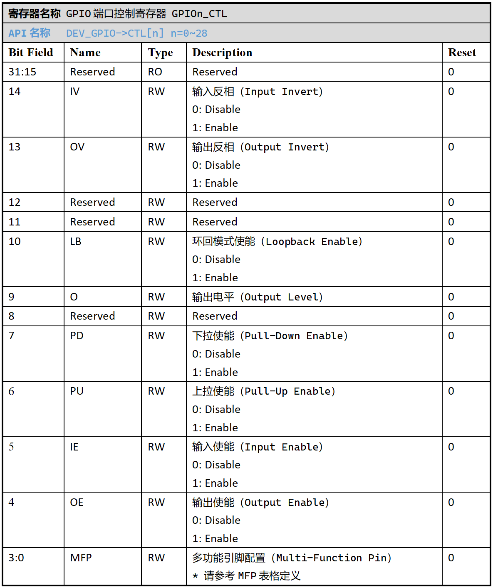
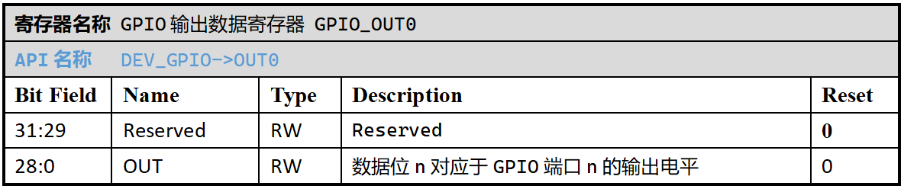
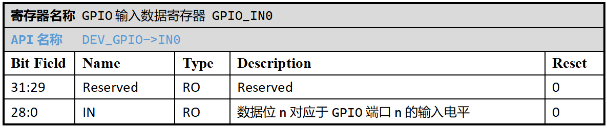
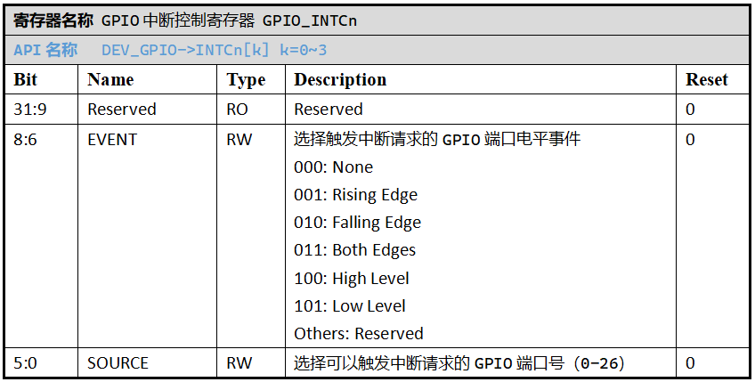
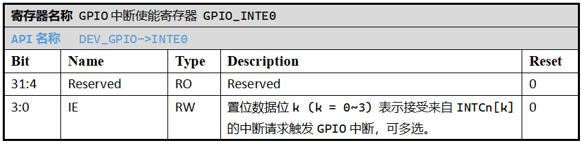
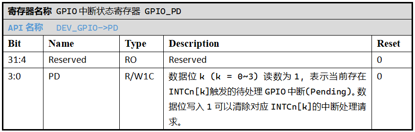
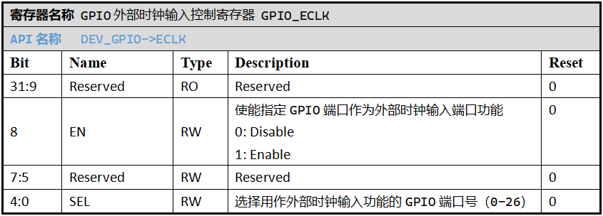
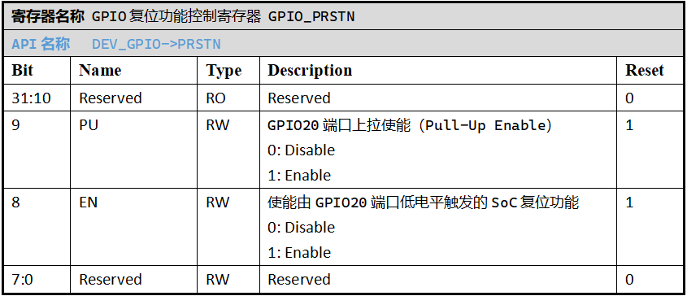

GPIO
======================

外设特性
----------------------

 .. image:: ../../_static/kiwi-gpio-banks.png
  :align: center
  :width: 512 px

 - **GPIO按照功能特性分为4组(Bank)**

   * ``GPIOA``: GPIO 00-21, 数字双向IO, 驱动能力 20mA, 耐压 IOVCC
  
    .. image:: ../../_static/kiwi-gpio-bank-A.png
     :align: center
     :width: 512 px

   * ``GPIOB``: GPIO 22-23, 数字双向IO, 驱动能力 8mA, 耐压 5V

    .. image:: ../../_static/kiwi-gpio-bank-B.png
     :align: center
     :width: 512 px

   * ``GPIOC``: GPIO 24-26, MIC ADC模拟IO，可复用为与GPIOA Bank同规格的数字双向IO
   * ``GPIOD``: GPIO 27-28, PA功率IO, 驱动电压 5V。GPIOD可作为数字IO复用，但仅具备有限的功能。
  
  GPIOA、GPIOB、GPIOC作为数字IO使用时都具备输入、输出、上拉、下拉能力，并支持输入、输出反向和出入环路功能。
  
  .. note::
   
   GPIOD Bank即GPIO27/28作为数字IO使用时，仅具备输出能力，不支持输入、上拉和下拉功能。
   同样不支持需要满足数字输入端口前提条件的功能复用，如GPIO中断触发、作为外部时钟信号的输入端口等。
   详情请参考 `GPIO MFP信息`_ 。

-------------------------------------------------------------------------------

外设使用
----------------------

典型使用场景
^^^^^^^^^^^^^^^^^^^^^^

GPIO管脚根据使用方式，可以划分为以下典型场景：

 **A. 作为常规数字端口**

  - 用户根据选择的GPIO端口号n，配置对应的 `GPIO端口控制寄存器CTL[n]`_ 。
  - 若作为数字输入端口，需要开启该端口的输入功能(CTL[n].IE = 1)，用户程序可以通过读取 `GPIO输入数据寄存器IN0`_ 的对应数据位n，获取当前输入的数字电平值。
  - 若作为数字输出端口，需要开启该端口的输出功能(CTL[n].OE = 1)，用户程序可以通过写入 `GPIO输出数据寄存器OUT0`_ 的对应数据位n，设置输出的数字电平值。
  - 用户根据需要开启端口的上拉/下拉功能(CTL[n].PU/PD)。
  - API链接：
    
    - :c:func:`gpio_init_pin`
    - :c:func:`gpio_deinit_pin`
    - :c:func:`gpio_read_pin_input`
    - :c:func:`gpio_set_pin_output`
    - :c:func:`gpio_reset_pin_output`
    - :c:func:`gpio_toggle_pin_output`
    - :c:func:`gpio_write_port_output`
    - :c:func:`gpio_read_port_input`
    - :c:func:`gpio_read_port_output` 

  .. image:: ../../_static/kiwi-gpio-irq.png
   :align: center

  SPV1x SoC支持选择最多4路GPIO数字输入端口开启电平信号触发中断的功能（上图所示）：

    - 选择一路GPIO端口n，通过CTL[n].IE = 1将其配置为数字输入端口。
    - 从 `GPIO中断控制寄存器INTC[k]`_ (k = 0~3)中选择一路，配置INTC[k].SOURCE = n。
    - 通过INTC[k].EVENT，配置GPIO端口n触发GPIO中断的电平事件，如上升沿、下降沿和高低电平。
    - 将 `GPIO中断使能寄存器INTE0`_ 中数据位k置位，选择INTC[k]对应通路，从而使能GPIO端口n的中断触发能力。
    - GPIO中断处理函数为 `gpio_irq_entry()` ，该函数可通过 `GPIO中断状态寄存器PD`_ 数据位判断触发GPIO中断的已注册通路INTC[k]，从而判断其上选择的GPIO端口n。
    - GPIO中断处理函数退出前，需要自行清除PD寄存器数据位k。
    - API链接：
    
      - :c:func:`gpio_irq_attach_pin`
      - :c:func:`gpio_irq_detach_pin`
      - :c:func:`gpio_irq_enable`
      - :c:func:`gpio_irq_disable`
      - :c:func:`gpio_irq_get_flag`
      - :c:func:`gpio_irq_clear_flag`

 **B. 根据MFP映射为外设端口**

  详情请参考指定外设单元的使用指南。

.. _GPIO MFP信息:
  
   .. image:: ../../_static/kiwi-gpio-mfp.png
    :align: center

 **C. 作为ADC的模拟输入端口**

 .. _GPADC: gpadc.html

  详情请参考  `GPADC`_ 章节内容。

 **D. 作为外部时钟源信号输入端口**

  - 用户从GPIO00-26中选择一路端口作为外部时钟源数字信号的输入口。
  - 配置相应的CTL寄存器，开启常规数字IO输入功能(CTL.IE = 1)。
  - 配置 `GPIO外部时钟输入控制寄存器ECLK`_ 中ECLK.SEL，选择相同的GPIO端口号。
  - 配置ECLK.EN = 1，选通从选定端口进入的外部时钟信号输入。

  详情请参考  :ref:`clock-source-module` 章节内容。

 **E. ONOFF特殊功能端口**

  详情请参考  :ref:`onoff-multifunction-module` 章节内容。

特殊预设场景
^^^^^^^^^^^^^^^^^^^^^^

  .. warning::
   
   以下描述为SPV1x SoC特定GPIO的预设功能，对SoC的正常上电引导、复位、器件供电、低功耗设计等方面有重大作用，
   请在进行PCB方案设计前务必参考该部分信息。

 .. list-table:: 
   :widths: 20 30 50
   :header-rows: 1

   * - GPIO端口
     - 预设功能
     - 注意事项
   * - GPIO6
     - BROM升级请求引脚
     - 电平敏感，BROM运行阶段程序开启上拉，应保持常态高电平。
   * - GPIO10
     - NOR Flash SCK信号引脚
     - NOR Flash默认工作于Single/Dual SPI Mode，用户需保证NOR Flash HOLD管脚保持于高电平。
   * - GPIO11
     - NOR Flash NSS信号引脚
     - 此GPIO端口在低功耗休眠模式(Hibernate)下的电平受PMU_PWR_CTL寄存器控制(PMU_PWR_CTL.NORM_NORNSS_PU)
   * - GPIO12
     - NOR Flash DAT0信号引脚
     -
   * - GPIO13
     - NOR Flash DAT1信号引脚
     -
   * - GPIO19
     - NOR Flash供电引脚(NORVCC)
     - 上电默认输出IOVCC电平，此功能使能受PMU单元控制。可经由PMU关闭NORVCC功能后，通过用户程序进行GPIO19管脚的MFP复用。
   * - GPIO20
     - 复位开关引脚(Reset)
     - 电平敏感，默认开启引脚上拉，此功能下应保持常态高电平。可由用户程序进行MFP复用。
   * - GPIO24
     - MIC正极性输入引脚(MIC_INP)
     - 可由用户程序进行MFP复用。
   * - GPIO25
     - MIC负极性输入引脚(MIC_INN)
     - 可由用户程序进行MFP复用。
   * - GPIO26
     - 麦克风供电引脚(VMIC)
     - 可由用户程序进行MFP复用。
   * - GPIO27
     - PA正极性输出引脚（PA_OUTP）
     - 可由用户程序进行MFP复用。
   * - GPIO28
     - PA负极性输出引脚（PA_OUTN）
     - 可由用户程序进行MFP复用。

 **A. Boot ROM（BROM）升级请求引脚**
  
  SPV1x SoC的Boot ROM程序在SoC上电或复位时执行，流程中将检测GPIO6电平。若此时GPIO6处于低电平，则BROM执行用户程序升级。 反之，BROM尝试执行用户程序引导。

 .. _Boot ROM (BROM): ./../../user-guide/brom.html

  更多BROM相关信息请参考 `Boot ROM (BROM)`_ 章节内容。

 **B. NOR Flash供电引脚(NORVCC)**

 .. _针对低功耗场景优化的NOR Flash接入策略: ./../../user-guide/low-power-mode/nor-low-power.html

  相关使用建议请阅读 `针对低功耗场景优化的NOR Flash接入策略`_ 章节内容。

 **C. 复位开关引脚（Reset）**

  GPIO20默认作为SoC复位(Reset)功能管脚使用，提供低电平触发的SoC复位功能，该功能由 `GPIO复位功能控制寄存器PRSTN`_ 进行配置。
  PRSTN.PU默认开启，提供管脚上拉能力，保证GPIO20端口处于常态高电平。
  用户程序可以自行清除PRSTN，关闭GPIO20的Reset功能，从而将其进行MFP复用。API链接：

   - :c:func:`gpio_prstn_disable`

--------------------------------------------------------------------------------

注意事项
----------------------
 
 1. 只有GPIO00-26端口能够提供外部时钟信号输入能力，需要事先将所选端口配置为数字输入端口(CTL.IE = 1)。
 2. 用户在使用GPIO20的常规IO功能或映射为MFP前，需要事先清除PRSTN，以关闭GPIO20预设的低电平Reset功能。
    否则GPIO20端口电平可能触发系统复位。

--------------------------------------------------------------------------------

API说明
----------------------

.. c:enum:: gpio_pin_t
  
  GPIO端口号枚举
  
   - *GPIO_Pin_00* 至 *GPIO_Pin_28*

.. c:enum:: gpio_pin_direction_t

  GPIO端口输入/输出方向枚举

   - *GPIO_Floating*：端口浮空
   - *GPIO_Digital_Output*： 数字输出端口
   - *GPIO_Digital_Input*： 数字输入端口

.. c:enum:: gpio_pin_pull_t

  GPIO端口上/下拉选择枚举

   - *GPIO_Pull_None*：无上拉/下拉
   - *GPIO_Pull_Up*：开启上拉
   - *GPIO_Pull_Down*：开启下拉

.. c:enum:: gpio_pin_irq_event_t

  可触发GPIO中断的端口输入电平事件枚举

   - *GPIO_IRQ_Event_None*：任何电平事件都不会触发中断
   - *GPIO_IRQ_Event_Rising_Edge*：上升沿触发中断
   - *GPIO_IRQ_Event_Falling_Edge*：下降沿触发中断
   - *GPIO_IRQ_Event_Both_Edges*：双边沿触发中断
   - *GPIO_IRQ_Event_High_Level*：高电平触发中断
   - *GPIO_IRQ_Event_Low_Level*：低电平触发中断

.. c:function:: void gpio_init_pin(gpio_pin_t pin, gpio_pin_direction_t direction, gpio_pin_pull_t pull)

  对指定的GPIO端口进行常规数字IO功能(数字输入/数字输出)的初始化。

  :param pin: GPIO端口号，通过枚举定义 :c:enum:`gpio_pin_t` 选择。
  :param direction: GPIO端口输入/输出方向，通过枚举定义 :c:enum:`gpio_pin_direction_t` 选择。
  :param pull: GPIO端口上/下拉选择，通过枚举定义 :c:enum:`gpio_pin_pull_t` 选择。 
  :returns: 无

.. c:function:: void gpio_deinit_pin(gpio_pin_t pin)

  将指定的GPIO端口功能重置为浮空、无上/下拉状态。

  :param pin: GPIO端口号，通过枚举定义 :c:enum:`gpio_pin_t` 选择。
  :returns: 无

.. c:function:: int32_t gpio_read_pin_input(gpio_pin_t pin)

  读取指定GPIO端口的数字输入电平。

  :param pin: GPIO端口号，通过枚举定义 :c:enum:`gpio_pin_t` 选择。
  :returns: 该端口的当前数字输入电平值。
  :rtype: int32
  :retval 0: 数字低电平
  :retval 1: 数字高电平

.. c:function:: void gpio_set_pin_output(gpio_pin_t pin)

  拉高指定GPIO端口的数字输出电平。

  :param pin: GPIO端口号，通过枚举定义 :c:enum:`gpio_pin_t` 选择。
  :returns: 无

.. c:function:: void gpio_reset_pin_output(gpio_pin_t pin)

  拉低指定GPIO端口的数字输出电平。

  :param pin: GPIO端口号，通过枚举定义 :c:enum:`gpio_pin_t` 选择。
  :returns: 无

.. c:function:: void gpio_toggle_pin_output(gpio_pin_t pin)

  翻转指定GPIO端口的数字输出电平。

  :param pin: GPIO端口号，通过枚举定义 :c:enum:`gpio_pin_t` 选择。
  :returns: 无

.. c:function:: void gpio_write_port_output(uint32_t val)

  对GPIO端口输出寄存器进行整体写入。

  :param val: 待输出电平，逐位对应于GPIO00-28。
  :returns: 无

.. c:function:: uint32_t gpio_read_port_input(void)

  读取GPIO输入寄存器当前值。

  :returns: GPIO输入寄存器当前值。
  :rtype: uint32

.. c:function:: uint32_t gpio_read_port_output(void)

  读取GPIO输出寄存器当前值。

  :returns: GPIO输出寄存器当前值。
  :rtype: uint32

.. c:function:: int32_t gpio_irq_attach_pin(gpio_pin_t pin, gpio_pin_irq_event_t event)

  将指定GPIO端口的输入电平事件注册为GPIO中断源(之一)。

  :param pin: GPIO端口号，通过枚举定义 :c:enum:`gpio_pin_t` 选择。
  :param event: 可触发中断的输入电平事件，通过枚举定义 :c:enum:`gpio_pin_irq_event_t` 选择。
  :returns: 注册成功的GPIO中断控制通道号
  :rtype: int32
  :retval 0-3: 注册成功，对应分配的GPIO中断控制通道号。
  :retval -1: 注册失败，当前没有闲置的GPIO中断控制通道可供注册。

.. c:function:: void gpio_irq_detach_pin(int32_t channel)

  重置指定GPIO中断控制通道的配置。

  :param channel: 希望重置的GPIO中断控制通道号(0-3)。
  :returns: 无

.. c:function:: void gpio_irq_enable(int32_t channel)

  使能指定GPIO中断控制通道。

  :param channel: 待使能的GPIO中断控制通道号(0-3)。
  :returns: 无

.. c:function:: void gpio_irq_disable(int32_t channel)

  失能指定GPIO中断控制通道。

  :param channel: 待失能的GPIO中断控制通道号(0-3)。
  :returns: 无

.. c:function:: void gpio_irq_get_flag(int32_t channel)

  查询指定GPIO中断控制通道的中断状态(Pending)。

  :param channel: GPIO中断控制通道号(0-3)。
  :returns: 中断状态。
  :rtype: int32
  :retval 0: 该通道无待响应中断。
  :retval 1: 该通道中断待响应。

.. c:function:: void gpio_irq_clear_flag(int32_t channel)

  清除指定GPIO中断控制通道的中断状态(Pending)。

  :param channel: GPIO中断控制通道号(0-3)。
  :returns: 无

.. c:function:: void gpio_prstn_enable()

  开启GPIO20端口预设的硬件复位功能，设置上拉。

  :returns: 无

.. c:function:: void gpio_prstn_disable()

  关闭GPIO20端口预设的硬件复位功能。

  :returns: 无

--------------------------------------------------------------------------------

寄存器定义
----------------------

.. _GPIO端口控制寄存器CTL[n]:

----------------------------------------------

.. _GPIO输出数据寄存器OUT0:

----------------------------------------------

.. _GPIO输入数据寄存器IN0:

----------------------------------------------

.. _GPIO中断控制寄存器INTC[k]:

----------------------------------------------

.. _GPIO中断使能寄存器INTE0:

----------------------------------------------

.. _GPIO中断状态寄存器PD:

----------------------------------------------

.. _GPIO外部时钟输入控制寄存器ECLK:

----------------------------------------------

.. _GPIO复位功能控制寄存器PRSTN:

