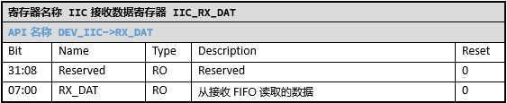

I2C(IIC)
======================

外设特性
----------------------

SPV1x有1个IIC模块。该IIC模块支持以下功能特性：

 1. 支持Master/Slave模式。
 2.	支持7bit Slave地址。
 3.	通信速率最高支持800K。
 4.	支持总线40ns毛刺滤波。
 5.	支持长时间总线保持功能。

外设使用
----------------------

1. 使用IIC前的配置
^^^^^^^^^^^^^^^^^^^^^^

 IIC使用前，需要配置工作时钟，并解除模块的复位状态。

 1. 在CMU_I2CnCLK中选择IIC的时钟源
 2. 配置CMU_CLKEN0.I2C0，使能IIC的时钟。
 3. 配置RMU_RSTEN0.I2C0，解除IIC的复位状态。
 4. 初始化IIC需要用到的GPIO引脚。

2. IIC主机功能配置
^^^^^^^^^^^^^^^^^^^^^^

 1. 配置\ `IIC_CFG`_.IIC_EN位，使能IIC模块。
 2. 配置\ `IIC_CFG`_.MODE位，选择Master功能。
 3. 配置\ `IIC_CFG`_.DIV_COR字段，设置IIC的SCK频率。DIV_COR的合理范围为1~255，同时，还需要确保分频后的频率不超过800K。
 4. 如果需要使用中断，则配置\ `IIC_IE`_\ 中的中断使能位。
 5. 发送起始信号和从机地址。向\ `IIC_CTL`_.CMD写入START_CMD，同时向\ `IIC_CTL`_.TX_DAT写入从机设备地址（7bit地址+写标志位）。IIC硬件会自动开始相应的总线操作，操作完成后，\ `IIC_PD`_.START_DET和\ `IIC_PD`_.BYTE_END会置位，软件还需要检查\ `IIC_PD`_.NACK_DET是否置位，以确定从机是否正确收到设备地址，并回复ACK。
 6. 发送寄存器地址。向\ `IIC_CTL`_.CMD写入RELEASE_BUS，同时向\ `IIC_CTL`_.TX_DAT写入寄存器地址，IIC硬件会自动开始相应的总线操作，操作完成后，\ `IIC_PD`_.BYTE_END会置位，软件需要检查\ `IIC_PD`_.NACK_DET是否置位，以确定从机是否正确收到寄存器地址，并回复ACK。
 7. 如果是需要写数据，则在完成步骤（5）之后，向\ `IIC_CTL`_.CMD写入RELEASE_BUS，同时向\ `IIC_CTL`_.TX_DAT写入要发送的数据。IIC硬件会自动开始相应的总线操作，操作完成后， \ `IIC_PD`_.BYTE_END会置位，软件还需要检查\ `IIC_PD`_.NACK_DET是否置位，以确定从机是否正确收到数据，并回复ACK。重复此步骤，直至所有数据发送完成。最后，执行步骤（9），发送停止位，结束本次通信。
 8. 如果是需要读数据，则在完成步骤（5）之后，向\ `IIC_CTL`_.CMD写入RESTART_CMD，同时向\ `IIC_CTL`_.TX_DAT写入从机设备地址（7bit地址+读标志位）。IIC硬件会自动开始相应的总线操作，操作完成后，\ `IIC_PD`_.START_DET和\ `IIC_PD`_.BYTE_END会置位，软件还需要检查\ `IIC_PD`_.NACK_DET是否置位，以确定从机是否正确收到设备地址，并回复ACK。
 9. 执行完步骤（7）后，向\ `IIC_CTL`_.CMD写入RELEASE_BUS，同时写\ `IIC_CTL`_.TX_ACK（）。IIC硬件会自动开始相应的总线操作，操作完成后，\ `IIC_PD`_.BYTE_END会置位。重复此步骤，直至所有数据发送完成。最后，执行步骤（9），发送停止位，结束本次通信。
 10. 发送停止位。向\ `IIC_CTL`_.CMD写入STOP_CMD。IIC硬件会自动开始相应的总线操作，操作完成后，\ `IIC_PD`_.STOP_DET会置位。

3. IIC从机功能配置
^^^^^^^^^^^^^^^^^^^^^^

 1. 配置\ `IIC_CFG`_.IIC_EN位，使能IIC模块。
 2. 配置\ `IIC_CFG`_.MODE位，选择Slave功能。
 3. 配置\ `IIC_CFG`_.DIV_COR字段。主机SCL时钟频率越高，\ `IIC_CFG`_.DIV_COR配置值越小，建议范围8~120。
 4. 配置\ `IIC_CFG`_.SLV_ADD字段，设置从机地址。
 5. 如果需要使用中断，则配置IIC_IE中响应的中断使能位。
 6. 响应主机寻址操作。当IIC从机收到主机的起始信号（或重复起始信号）和正确的从机地址后，\ `IIC_PD`_.START_DET和\ `IIC_PD`_.BYTE_END会置位。同时，IIC模块会将主机寻址时发送的读写标志位保存在\ `IIC_STA`_.RW_FLAG中，软件需要根据此标志位的状态，做好接收数据或者发送数据的准备。
 7. 响应主机的写寄存器地址/写数据操作。如果步骤（6）中收到正确的从机地址后，\ `IIC_STA`_.RW_FLAG的状态为0，那么接下来，主机将下发数据。主机每发送1字节数据，\ `IIC_PD`_.BYTE_END会置位一次，软件在检测到\ `IIC_PD`_.BYTE_END置位后，将数据从\ `IIC_RX_DAT`_\ 读走。
 8. 响应主机的读数据操作。如果步骤（6）中收到正确的从机地址后，\ `IIC_STA`_.RW_FLAG的状态为1，那么接下来，主机将读取数据。第1个数据需要在寻址后就写入\ `IIC_CTL`_.TX_DAT，后续的数据在\ `IIC_PD`_.BYTE_END置位后写入\ `IIC_CTL`_.TX_DAT。如果在\ `IIC_PD`_.BYTE_END置位后，检测到\ `IIC_PD`_.NACK_DET也置位，则表示主机已完成数据读取，此时软件不需要再向\ `IIC_CTL`_.TX_DAT写入有效数据。
 9. 响应主机的停止信号。当IIC从机收到停止信号后，\ `IIC_PD`_.STOP_DET会置位，此时表示本次通信结束。

注意事项
----------------------

 1. IIC有固定的协议要求，需要严格按规定的协议来操作IIC模块，否则会出现通信失败的情况。尤其是作为从机时，软件需要记录和判断从机当前所处的状态，同时还需要以较快的速度配合IIC模块，保证正确且快速地响应主机的各种操作。
 2. IIC作为主机时，如果IIC总线出现硬件异常（如SCL或SDA信号线出现短路，无法驱动和产生所需时序），\ `IIC_PD`_.START_DET和\ `IIC_PD`_.STOP_DET可能不会置位。如果软件使用查询的方式等待这些Pending位，最好加入超时机制，以避免程序陷入死循环。出现此类错误后，需要复位IIC模块，以重置IIC硬件状态机。
 3. \ `IIC_PD`_\ 寄存器中的Pending位，需要软件清除。在开始下一个步骤的操作前，软件需要主动清除对应的Pending位，避免上一个步骤的Pending位结果影响到下一个步骤的判断。
 4. IIC作为从机时，如果主机发送的从机地址与设置的\ `IIC_CFG`_.SLV_ADD不匹配，IIC模块不会起任何Pending。
 5. IIC作为从机时，每次主机寻址操作、主机写数据操作和主机读数据操作后，从机都会进行总线保持操作（从机拉低SCL信号线）,软件需要向\ `IIC_CTL`_.CMD写入RELEASE_BUS，来释放SCL信号线，如果从机需要向主机发送有效数据，还需要同时向\ `IIC_CTL`_.TX_DAT写入有效数据。
 6. IIC作为从机时，软件需要根据IIC协议的规则，来记录和判断从机当前所处的状态，同时软件还需要以较快的速度配合IIC模块，保证正确且快速地响应主机的各种操作。

API说明
----------------------

IIC API提供基础的IIC主机功能。

.. c:function:: void iic_init(uint32_t baud)

  IIC初始化。

  :param baud: IIC波特率(IIC SCL信号的频率)。
  :returns: 无

.. c:function:: void iic_deinit(void)

  IIC去初始化。

  :returns: 无

.. c:function:: int32_t iic_read(uint8_t dev_addr,uint8_t reg_addr,uint8_t *buf,uint32_t len)

  IIC读取数据。

  :param dev_addr: 7bit器件地址。
  :param reg_addr: 器件寄存器地址。
  :param buf: 指向容纳读取数据的缓冲区。
  :param len: 读取的数据长度。
  :returns: 0表示成功，其他值表示出错
  :rtype: int32_t

.. c:function:: int32_t iic_write(uint8_t dev_addr,uint8_t reg_addr,uint8_t *buf,uint32_t len)

  IIC写数据。

  :param dev_addr: 7bit器件地址。
  :param reg_addr: 器件寄存器地址。
  :param buf: 指向要写入的数据。
  :param len: 写入的数据长度。
  :returns: 0表示成功，其他值表示出错
  :rtype: int32_t

API使用示例
----------------------

 1. 在 `board.h` 中设置 `__USE_IIC` 为1，表示需要启用IIC。

 .. code-block:: c

  #define	__USE_IIC			(1)

 2. 在 `board.h` 中设置并定义对应IIC需要用到的引脚以及引脚对应的MFP值。

 .. code-block:: c

  #define	IIC_SDA_PIN			(GPIO_Pin_23)
  #define	IIC_SDA_MFP			(5)
  #define	IIC_SCL_PIN			(GPIO_Pin_24)
  #define	IIC_SCL_MFP			(5)

 .. note::

  * IIC默认引脚：SDA-GPIO23,SCL-GPIO24。
  * IIC引脚上需要外接上拉电阻，以保证通讯稳定。

 3. 调用 `iic_init()` 初始化IIC模块。

 该函数会初始化IIC用到的引脚，选择OSC_DEV时钟作为IIC的时钟。

 .. code-block:: c

  iic_init(400000);

 4. 调用 `iic_write()` 发送数据。

 阻塞式发送数据，直到所有数据发送完成或者出错。

 .. code-block:: c

  iic_write(0x56, 0x10, buf, 10);

 .. note::

  * IIC写操作需要检查函数的返回值，确认操作成功。读操作同样如此。

 5. 调用 `iic_read()` 读取数据。

 阻塞式读取数据，直到所有数据读取完成或者出错。

 .. code-block:: c

  iic_read(0x56, 0x10, buf, 10);

 6. 如果不需要再使用IIC，调用 `iic_deinit()` 去初始化。

 去初始化会关闭IIC的时钟，并让模块处于复位状态。相应的引脚复用也会被清除。

----------------------

寄存器定义
----------------------

.. _IIC_CFG:

----------------------------------------------

.. _IIC_CTL:

----------------------------------------------

.. _IIC_IE:

----------------------------------------------

.. _IIC_PD:

----------------------------------------------

.. _IIC_STA:

----------------------------------------------

.. _IIC_RX_DAT:

