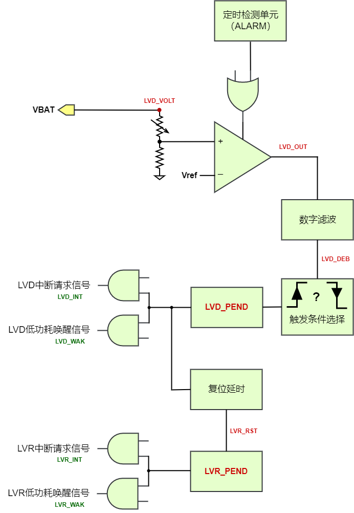

.. _lvd-module:

低电检测单元 (LVD)
======================

.. note::
   
   前置知识： :ref:`pmu-module`

LVD(Low Voltage Detect)为低电检测单元，用于实时监测电源电压，当电源电压与 LVD 设定阈
值满足触发条件时，则产生中断请求、低功耗唤醒信号或者复位，用户可根据该信号执行一些紧急任务。
另外，LVD 模块还可以用作于普通的模拟电压比较器使用。

外设特性
----------------------

外设使用
----------------------

典型使用场景
^^^^^^^^^^^^^^^^^^^^^^

**A. 在工作模式(Active Mode)下充当常规模拟电压比较器使用**

  LVD单元在正常工作模式(Active Mode)下可以作为模拟电压比较器，实时比较VBAT脚输入电压和指定阈值(LVD_VOLT)的相对大小关系，
  若VBAT > LVD_VOLT则LVD_OUT为高电平，反之LVD_OUT为低电平。
  LVD_OUT经过数字滤波消抖后输出LVD_DEB信号，其电平行为可以触发LVD内部信号LVD_PEND，从而按程序配置进一步产生
  LVD中断请求信号LVD_INT，触发PMU中断请求PMU_IRQ，用于触发PMU中断服务函数响应，或用于睡眠模式下WFI/WFE唤醒。

  1. 清除 *PMU中断请求/低功耗唤醒信号状态寄存器PEND* 中的LVD_PEND置位，
     防止未处置的PMU中断请求干扰后续配置流程。

     API链接：

      - :c:func:`pmu_irq_clear_flag`, 其中 source 传参选择预设枚举 *PMU_IRQ_Source_LVD*

  2. 通过 *PMU LVD功能控制寄存器LVD_CTL* ，配置电压比较阈值，电平事件和电平消抖时间。

     API链接：

      - :c:func:`lvd_init`

  3. 配置 *PMU中断使能寄存器INT_EN*, 设置LVD单元中断请求信号LVD_INT作为PMU中断源(之一)。

     API链接：

      - :c:func:`pmu_irq_enable`, 其中 source 传参选择预设枚举 *PMU_IRQ_Source_LVD*

  4. 配置并使能 *ECLIC* 单元中PMU对应的中断请求通道。

     API链接：

      - :c:func:`eclic_irq_init`
      - :c:func:`eclic_irq_enable`

  5. 当LVD单元触发PMU中断或作为WFE唤醒信号使SoC从Sleep Mode进入Active Mode后，
     用户代码需要清除 *PMU中断请求/低功耗唤醒信号状态寄存器PEND* 中的ALARM_PEND置位。

     API链接：

      - :c:func:`pmu_irq_clear_flag`, 其中 source 传参选择预设枚举 *PMU_IRQ_Source_LVD*

**B. 在Standby/Hibernate低功耗模式下作为唤醒信号源**

  该场景下，LVD单元可作为低功耗Standby Mode和Hibernate Mode的唤醒源，在进入低功耗状态后通过触发低电压事件唤醒SoC。

  SPV1x SoC提供一种低功耗模式下通过ALARM单元定时启动LVD检测的机制，。

  1. 清除 *PMU中断请求/低功耗唤醒信号状态寄存器PEND* 中的LVD_PEND置位，
     防止未处置的PMU低功耗唤醒信号干扰后续配置流程。

     API链接：

      - :c:func:`pmu_wak_clear_flag`, 其中 source 传参选择预设枚举 *PMU_Lpm_Wakeup_Source_LVD*

  2. 通过 *PMU LVD功能控制寄存器LVD_CTL* ，配置电压比较阈值，电平事件和电平消抖时间。

     API链接：

      - :c:func:`lvd_init`

  3. 配置ALARM单元，在低功耗模式下定时启动LVD单元进行电压检测。

     API链接：

      - :c:func:`alarm_init` , 其中 role 传参选择预设枚举 *ALARM_As_Standy_Or_Hibernate_Mode_Wakeup_Source*  

  4. 配置PMU_ALARM_CTL.ALARM_LVD = 1。

  5. 配置 *PMU低功耗唤醒信号使能寄存器WAK_EN*, 设置LVD单元低功耗唤醒信号LVD_WAK作为低功耗模式唤醒源(之一)。

     API链接：

      - :c:func:`pmu_wak_enable`, 其中 source 传参选择预设枚举 *PMU_Lpm_Wakeup_Source_LVD*

  6. 如果在Standby Mode下使用ALARM唤醒功能，需要使能 *ECLIC* 单元中PMU对应的中断请求通道。
     如果仅在Hibernate Mode下使用ALARM唤醒功能，则无需此步骤。

  7. 调用指定的函数，将SoC置于Standby Mode或Hibernate Mode。

  8. SoC从LVD事件产生的唤醒信号恢复工作后(Active Mode)，用户程序清除 *PMU中断请求/低功耗唤醒信号状态寄存器PEND* 中的ALARM_PEND置位，
     确保下一次低功耗状态的正常进入和唤醒。

     API链接：

      - :c:func:`pmu_wak_clear_flag`, 其中 source 传参选择预设枚举 *PMU_Lpm_Wakeup_Source_LVD*

