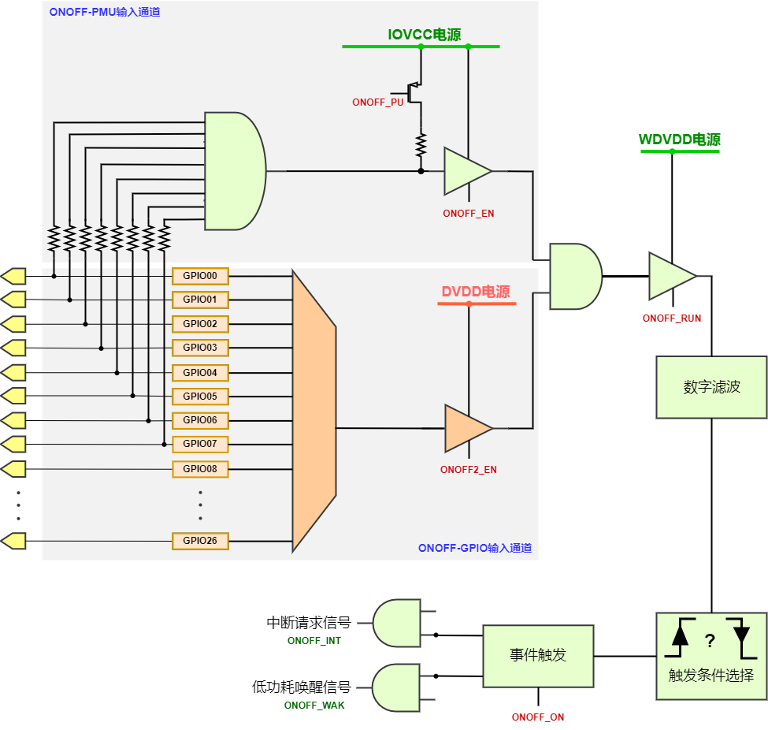
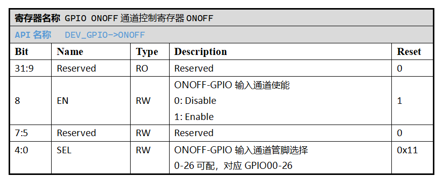
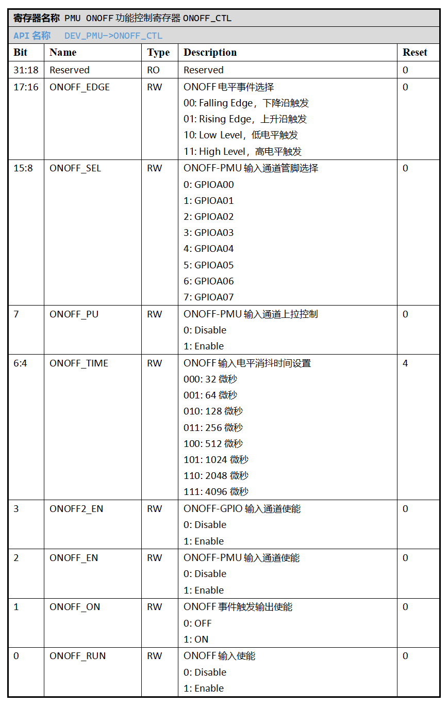

.. _onoff-multifunction-module:

ONOFF多功能单元
======================

.. note::
   
   前置知识： :ref:`pmu-module`

SoC SPV1x搭载了一个ONOFF多功能单元，对SoC指定管脚(Pad)数字输入电平事件进行实时监测，可以在事件触发时产生PMU单元中断请求信号，
或生成低功耗状态的唤醒信号。用户可以根据场景需要，灵活配置并利用ONOFF单元的输出信号进行应用设计。

外设特性
----------------------

 1. 能够对多种管脚数字电平事件进行响应：高/低电平、上升沿和下降沿。
 2. 能够作为PMU中断源之一，产生PMU单元中断请求，参与SoC低功耗睡眠模式(Sleep Mode)的唤醒。
 3. 能够作为唤醒源之一，产生PMU低功耗唤醒信号，参与SoC低功耗待机和休眠模式(Standby/Hibernate Mode)的唤醒。

外设使用
----------------------

**A. ONOFF功能管脚配置**

  ONOFF单元存在两路 **非互斥** 的管脚电平输入通道，用户可以根据低功耗场景要求选择至少一路输入通道进行配置：

``ONOFF-GPIO输入通道``
^^^^^^^^^^^^^^^^^^^^^^^^

  该输入通道复用GPIO单元的输入通道，由SoC内部DVDD电源进行供电，因此能够在Active/Sleep/Standby Mode下工作。
  Hibernate Mode下由于DVDD电源关断，该输入通道将无法工作。
  用户可以从GPIO00-GPIO26管脚中选择一路作为该通道下的电平输入端口，并使用GPIO单元对应端口的上下拉电阻进行控制。

  使用该输入通道的流程如下：

  1. 配置 *GPIO端口控制寄存器CTL[n]* 将管脚n设置为数字输入功能，并按需配置上下拉电阻。
  2. 配置 `GPIO ONOFF通道控制寄存器ONOFF`_ , 选中指定管脚n：GPIO_ONOFF.SEL = n， 
     并开启ONOFF功能：GPIO_ONOFF.EN = 1。
  3. 设置ONOFF输入信号消抖时间ONOFF_CTL.ONOFF_TIME，则ONOFF输入中脉宽小于ONOFF_TIME设置值的噪声信号都可以被滤除。
  4. 设置ONOFF输入电平事件类型ONOFF_CTL.ONOFF_EDGE。  
  5. 配置 `PMU ONOFF功能控制寄存器ONOFF_CTL`_ , 开启ONOFF-GPIO输入通道：PMU_ONOFF_CTL.ONOFF2_EN = 1。
  6. 开启ONOFF输入使能：PMU_ONOFF_CTL.ONOFF_RUN = 1。

  API链接：

  - :c:func:`onoff_gpio_init_pin`
  
``ONOFF-PMU输入通道``
^^^^^^^^^^^^^^^^^^^^^^^

  该输入通道通过PMU单元实现，由SoC内部常开电源IOVCC供电，
  因此能够包括Active/Sleep/Standby/Hibernate Mode在内的全部SoC功耗模式下工作。
  用户可以从GPIO00-GPIO07管脚中选择最多8路作为该通道下的电平输入端口，选中管脚电平经过与运算(Logical AND Operator)后产生通道输入信号。
  该通道配置有可选上拉电阻(100K欧姆阻值)用于控制。

  使用该输入通道的流程如下：

  1. 配置 *PMU ONOFF功能控制寄存器ONOFF_CTL* , 选择指定管脚n：PMU_ONOFF_CTL.ONOFF_SEL[n] = 1。
  2. 设置ONOFF输入信号消抖时间ONOFF_CTL.ONOFF_TIME，则ONOFF输入中脉宽小于ONOFF_TIME设置值的噪声信号都可以被滤除。
  3. 设置ONOFF输入电平事件类型ONOFF_CTL.ONOFF_EDGE。  
  4. 按需配置ONOFF-PMU通道上拉PMU_ONOFF_CTL.PU。
  5. 开启ONOFF-PMU输入通道：PMU_ONOFF_CTL.ONOFF_EN = 1。
  6. 开启ONOFF输入使能：PMU_ONOFF_CTL.ONOFF_RUN = 1。

  API链接：

  - :c:func:`onoff_pmu_init_pin`

.. warning::
    - 当选择“高电平”或“电平上升沿”作为电平事件类型时：

      - 为了满足其处于Standby/Hibernate Mode状态下的工作条件，使用ONOFF-PMU输入通道，需要保证32KHz OSC_PMU时钟处于开启状态。
      - 如果仅用于Standby Mode状态下的唤醒，也可以使用ONOFF-GPIO输入通道，但仍然需要保证32KHz OSC_PMU时钟的开启。

**B. ONOFF信号输出使能**

  通过开启 *PMU ONOFF功能控制寄存器ONOFF_CTL* 的ONOFF信号输出使能ONOFF_ON，
  当经由ONOFF输入通道的电平触发指定的事件时，ONOFF单元将 **同时** 产生中断请求信号（ONOFF_INT）和低功耗唤醒信号（ONOFF_WAK）。
  根据PMU的中断使能寄存器和低功耗唤醒信号使能寄存器的具体配置，ONOFF单元可以参与中断和低功耗唤醒等应用场景的响应。

  API链接：

    - :c:func:`onoff_output_enable`
    - :c:func:`onoff_output_disable`

-------------------------------------------------------------------------------------------------

API说明
-----------------------

.. c:enum:: onoff_debounce_time_t

  ONOFF输入信号消抖时间配置枚举定义。

   - *ONOFF_Debounce_Time_32us*：32us消抖时间
   - *ONOFF_Debounce_Time_64us*：64us消抖时间
   - *ONOFF_Debounce_Time_128us*：128us消抖时间
   - *ONOFF_Debounce_Time_256us*：256us消抖时间
   - *ONOFF_Debounce_Time_512us*：512us消抖时间
   - *ONOFF_Debounce_Time_1024us*：1024us消抖时间
   - *ONOFF_Debounce_Time_2048us*：2048us消抖时间
   - *ONOFF_Debounce_Time_4096us*：4096us消抖时间

.. c:enum:: onoff_event_t

  ONOFF输入电平事件类型枚举定义。

   - *ONOFF_Event_Falling_Edge*：电平下降沿
   - *ONOFF_Event_Rising_Edge*：电平上升沿
   - *ONOFF_Event_Low_Level*: 低电平
   - *ONOFF_Event_High_Level*: 高电平

.. c:function:: void onoff_gpio_init_pin(gpio_pin_t pin, gpio_pin_pull_t pull, onoff_event_t event, onoff_debounce_time_t debounce)

  对指定的GPIO端口进行ONOFF-GPIO输入通道配置。

  :param pin: ONOFF端口号，通过枚举定义 :c:enum:`gpio_pin_t` 选择。
  :param pull: ONOFF端口上/下拉选择，通过枚举定义 :c:enum:`gpio_pin_pull_t` 选择。
  :param event: 需要响应的ONOFF输入电平事件，通过枚举定义 :c:enum:`onoff_event_t` 选择。
  :param debounce: ONOFF输入信号消抖时间，通过枚举定义 :c:enum:`onoff_debounce_time_t` 选择。
  :returns: 无

.. c:enum:: onoff_pmu_pin_pull_t

  ONOFF-PMU通道上拉电阻配置枚举定义。

   - *ONOFF_PMU_Pull_None*：无上拉
   - *ONOFF_PMU_Pull_Up*：开启上拉

.. c:function:: void onoff_pmu_init_pin(gpio_pin_t pin, onoff_pmu_pin_pull_t pull, onoff_event_t event, onoff_debounce_time_t debounce)

  对指定的GPIO端口进行ONOFF-PMU输入通道配置。

  :param pin: ONOFF端口号，通过枚举定义 :c:enum:`gpio_pin_t` 选择，GPIO00-07可选。
  :param pull: ONOFF端口上拉选择，通过枚举定义 :c:enum:`onoff_pmu_pin_pull_t` 选择。 
  :param event: 需要响应的ONOFF输入电平事件，通过枚举定义 :c:enum:`onoff_event_t` 选择。
  :param debounce: ONOFF输入信号消抖时间，通过枚举定义 :c:enum:`onoff_debounce_time_t` 选择。  
  :returns: 无

.. c:function:: void onoff_output_enable()

  使能ONOFF输出信号。

  :returns: 无

.. c:function:: void onoff_output_disable()

  失能ONOFF输出信号。

  :returns: 无

--------------------------------------------------------------------------------

寄存器定义
----------------------

.. _GPIO ONOFF通道控制寄存器ONOFF:

---------------------------------------------------

.. _PMU ONOFF功能控制寄存器ONOFF_CTL:

  
