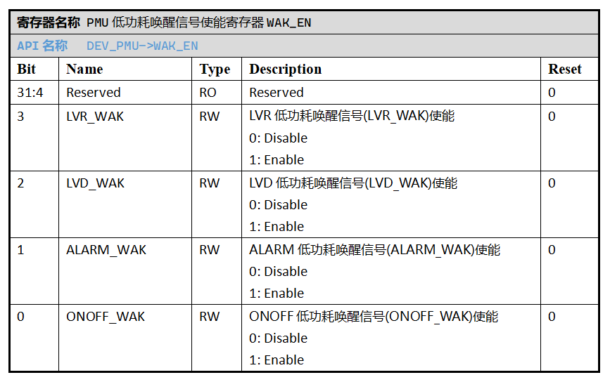

.. _pmu-module:

电源管理单元 (PMU)
======================

电源管理单元 (PMU) 负责产生芯片的各个部分电源，并对其进行管理和时序控制。

外设特性
----------------------

 1. 对SoC内部LDO进行开关控制和电压调节。
 2. 提供多种PMU中断触发机制。
 3. 实现SoC层面的低功耗模式。
 4. 提供多种机制用于从低功耗状态唤醒SoC。

外设使用
----------------------

典型使用场景
^^^^^^^^^^^^^^^^^^^^^^

PMU根据使用方向，可以划分为以下典型场景：

 **A. 对SoC内部LDO进行控制调节**

 .. image:: ../../_static/kiwi-lpm-state-standby-active.png
  :align: center

 如上图所示，SoC SPV1x面向应用方案提供5路片上电源，分别由不同的低压降稳压器(LDO)对Vcc外部输入电压转化获得，
 用于供给片上外设模块，并按需通过IO引脚向片外设备输出供电。

 .. image:: ../../_static/kiwi-pmu-ldo-description.png
  :align: center
  :width: 512 px

 上述LDO的关闭和开启在SoC进入和退出指定低功耗模式时，由PMU统一进行硬件控制，无需用户程序开销。
 同时，PMU模块设置了 `PMU电压控制寄存器VOLT_CTL`_ ，在应用场景满足的情况下，用户程序可以在进出低功耗模式前对LDO
 电压进行调整，从而改变片上电源电压，达到降低低功耗模式下静态功耗的目的。
 
 API链接：

  - :c:func:`pmu_iovcc_volt_set`
  - :c:func:`pmu_siovcc_volt_set`
  - :c:func:`pmu_avcc_volt_set`
  - :c:func:`pmu_dvdd_volt_set`

 .. warning:: 

  - 芯片上电时IOVCC默认值为3.2V，如方案应用要求调整IOVCC电压为2.0V时，可以在应用程序中进行设置。
    需要注意，由于变动压差较大，电压调整的过程中可能会造成Nor Flash的读取错误。
    因此建议是将调整IOVCC的代码放在IRAM中执行，或者执行分级调压策略。
  - 当CPU以高速时钟运行DVDD电压分级调压策略代码时，两次调压间隔不应少于100微秒。

 **B. PMU中断配置** 

  PMU单元通过 `PMU中断使能寄存器INT_EN`_ 可以选择最多4路信号作为PMU中断的触发信号，它们分别是：
  
   1. ONOFF中断请求信号ONOFF_INT
   2. ALARM中断请求信号ALARM_INT
   3. LVD中断请求信号LVD_INT
   4. LVR中断请求信号LVR_INT

 API链接：

  - :c:func:`pmu_irq_enable`
  - :c:func:`pmu_irq_disable`

  请分别阅读以下章节，获得指定信号对应的单元配置方法：

   - :ref:`onoff-multifunction-module`
   - :ref:`alarm-module`
   - :ref:`lvd-module`

  PMU中断触发后，用户程序（如PMU中断处理函数）可以通过检索 `PMU中断请求/低功耗唤醒信号状态寄存器PEND`_ 的数据位，
  判断PMU中断的来源并进行相应处理，然后通过对PEND寄存器对应数据位写1操作清楚请求标志。

 API链接：

  - :c:func:`pmu_irq_get_flag`
  - :c:func:`pmu_irq_clear_flag`

 **C. 低功耗模式：待机/休眠（Standby/Hibernate）进入和唤醒**

  PMU单元通过 `PMU低功耗唤醒信号使能寄存器WAK_EN`_ 可以选择最多4路信号作为SoC进入低功耗Standby/Hibernate Mode后的唤醒信号，它们分别是：
  
   1. ONOFF低功耗唤醒信号ONOFF_WAK
   2. ALARM低功耗唤醒信号ALARM_WAK
   3. LVD低功耗唤醒信号LVD_WAK
   4. LVR低功耗唤醒信号LVR_WAK
  
 API链接：

  - :c:func:`pmu_wak_enable`
  - :c:func:`pmu_wak_disable`
  - :c:func:`pmu_wak_get_flag`
  - :c:func:`pmu_wak_clear_flag`

  请分别阅读以下章节，获得指定信号对应的单元配置方法：

   - :ref:`onoff-multifunction-module`
   - :ref:`alarm-module`
   - :ref:`lvd-module`

  然后阅读 :ref:`lpm-config-and-wakeup` 章节内容，获得SoC层面低功耗模式的配置和进入方法。

--------------------------------------------------------------------------------

注意事项
----------------------

待补充

--------------------------------------------------------------------------------

API说明
----------------------

.. c:enum:: pmu_iovcc_volt_t

  IOVCC电压设置枚举定义。

	 - *IOVCC_Volt_2o0V*：IOVCC电压设置为2.0V
	 - *IOVCC_Volt_2o2V*：IOVCC电压设置为2.2V
	 - *IOVCC_Volt_2o4V*：IOVCC电压设置为2.4V
	 - *IOVCC_Volt_2o6V*：IOVCC电压设置为2.6V
	 - *IOVCC_Volt_2o8V*：IOVCC电压设置为2.8V
	 - *IOVCC_Volt_3o0V*：IOVCC电压设置为3.0V
	 - *IOVCC_Volt_3o2V*：IOVCC电压设置为3.2V
	 - *IOVCC_Volt_3o4V*：IOVCC电压设置为3.4V

.. c:function:: void pmu_iovcc_volt_set(pmu_iovcc_volt_t volt)

 设置IOVCC电压。

  :param volt: IOVCC目标电压值，通过枚举定义 :c:enum:`pmu_iovcc_volt_t` 选择。 
  :returns: 无

.. c:enum:: pmu_siovcc_volt_t

  SIOVCC电压设置枚举定义。

	 - *SIOVCC_Volt_3o0V*：SIOVCC电压设置为3.0V
	 - *SIOVCC_Volt_2o2V*：SIOVCC电压设置为2.2V

.. c:function:: void pmu_siovcc_volt_set(pmu_siovcc_volt_t volt)

 设置SIOVCC电压。

  :param volt: SIOVCC目标电压值，通过枚举定义 :c:enum:`pmu_siovcc_volt_t` 选择。 
  :returns: 无

.. c:enum:: pmu_avcc_volt_t

  AVCC电压设置枚举定义。

	 - *AVCC_Volt_1o8V*：AVCC电压设置为1.8V
	 - *AVCC_Volt_2o0V*：AVCC电压设置为2.0V
	 - *AVCC_Volt_2o2V*：AVCC电压设置为2.2V
	 - *AVCC_Volt_2o4V*：AVCC电压设置为2.4V
	 - *AVCC_Volt_2o6V*：AVCC电压设置为2.6V
	 - *AVCC_Volt_2o8V*：AVCC电压设置为2.8V
	 - *AVCC_Volt_3o0V*：AVCC电压设置为3.0V
	 - *AVCC_Volt_3o2V*：AVCC电压设置为3.2V

.. c:function:: void pmu_avcc_volt_set(pmu_avcc_volt_t volt)

 设置AVCC电压。

  :param volt: AVCC目标电压值，通过枚举定义 :c:enum:`pmu_avcc_volt_t` 选择。 
  :returns: 无

.. c:enum:: pmu_dvdd_volt_t

  DVDD电压设置枚举定义。

	 - *DVDD_Volt_0o9V*：DVDD电压设置为0.9V
	 - *DVDD_Volt_1o05V*：DVDD电压设置为1.05V
	 - *DVDD_Volt_1o20V*：DVDD电压设置为1.20V
	 - *DVDD_Volt_1o35V*：DVDD电压设置为1.35V

.. c:function:: void pmu_dvdd_volt_set(pmu_dvdd_volt_t volt)

 设置DVDD电压。

  :param volt: DVDD目标电压值，通过枚举定义 :c:enum:`pmu_dvdd_volt_t` 选择。 
  :returns: 无

.. c:enum:: pmu_irq_source_t

  PMU中断源枚举定义。

	 - *PMU_IRQ_Source_ONOFF*：选择ONOFF作为PMU中断源
	 - *PMU_IRQ_Source_ALARM*：选择ALARM作为PMU中断源
	 - *PMU_IRQ_Source_LVD*：选择LVD作为PMU中断源
	 - *PMU_IRQ_Source_LVR*：选择LVR作为PMU中断源

.. c:function:: void pmu_irq_enable(pmu_irq_source_t source)

  使能指定的一个PMU中断源。

  :param source: PMU中断源，通过枚举定义 :c:enum:`pmu_irq_source_t` 选择。 
  :returns: 无

.. c:function:: void pmu_irq_disable(pmu_irq_source_t source)

  失能指定的一个PMU中断源。

  :param source: PMU中断源，通过枚举定义 :c:enum:`pmu_irq_source_t` 选择。 
  :returns: 无

.. c:function:: int32_t pmu_irq_get_flag(pmu_irq_source_t source)

  查询指定PMU中断源的中断状态(Pending)。

  :param source: PMU中断源，通过枚举定义 :c:enum:`pmu_irq_source_t` 选择。 
  :returns: 指定中断源的中断状态(Pending)。
  :rtype: int32
  :retval 0: 该中断源未产生待响应中断。
  :retval 1: 该中断源已产生中断待响应。

.. c:function:: void pmu_irq_clear_flag(pmu_irq_source_t source)

  清除指定PMU中断源的中断状态(Pending)。

  :param source: PMU中断源，通过枚举定义 :c:enum:`pmu_irq_source_t` 选择。 
  :returns: 无

.. c:enum:: pmu_lpm_wakeup_source_t

  PMU低功耗模式唤醒源枚举定义。

	 - *PMU_Lpm_Wakeup_Source_ONOFF*：选择ONOFF作为PMU低功耗模式唤醒源
	 - *PMU_Lpm_Wakeup_Source_ALARM*：选择ALARM作为PMU低功耗模式唤醒源
	 - *PMU_Lpm_Wakeup_Source_LVD*：选择LVD作为PMU低功耗模式唤醒源
	 - *PMU_Lpm_Wakeup_Source_LVR*：选择LVR作为PMU低功耗模式唤醒源

.. c:function:: void pmu_wak_enable(pmu_lpm_wakeup_source_t source)

  使能指定的一个PMU低功耗唤醒源。

  :param source: PMU低功耗唤醒源，通过枚举定义 :c:enum:`pmu_lpm_wakeup_source_t` 选择。 
  :returns: 无

.. c:function:: void pmu_wak_disable(pmu_lpm_wakeup_source_t source)

  失能指定的一个PMU低功耗唤醒源。

  :param source: PMU低功耗唤醒源，通过枚举定义 :c:enum:`pmu_lpm_wakeup_source_t` 选择。 
  :returns: 无

.. c:function:: int32_t pmu_wak_get_flag(pmu_lpm_wakeup_source_t source)

  查询指定PMU低功耗唤醒源的输出信号状态。

  :param source: PMU低功耗唤醒源，通过枚举定义 :c:enum:`pmu_lpm_wakeup_source_t` 选择。 
  :returns: 指定低功耗唤醒源的输出信号状态。
  :rtype: int32
  :retval 0: 该低功耗唤醒源未产生唤醒信号。
  :retval 1: 该低功耗唤醒源已产生唤醒信号。

.. c:function:: void pmu_wak_clear_flag(pmu_lpm_wakeup_source_t source)

  清除指定PMU低功耗唤醒源的输出信号状态。

  :param source: PMU低功耗唤醒源，通过枚举定义 :c:enum:`pmu_lpm_wakeup_source_t` 选择。 
  :returns: 无

--------------------------------------------------------------------------------

寄存器定义
----------------------

.. _PMU电压控制寄存器VOLT_CTL:

-------------------------------------------------------

.. _PMU中断使能寄存器INT_EN:

-------------------------------------------------------

.. _PMU低功耗唤醒信号使能寄存器WAK_EN:

-------------------------------------------------------

.. _PMU中断请求/低功耗唤醒信号状态寄存器PEND:

