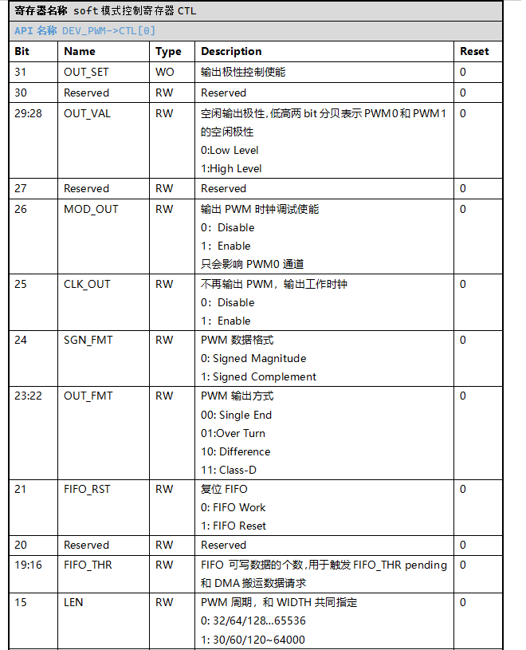
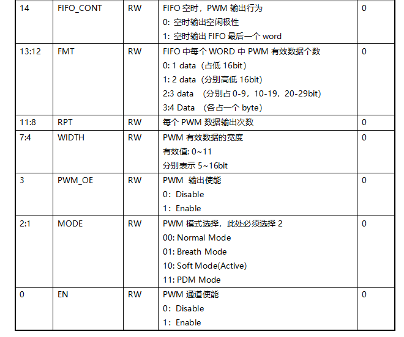

PWM
======================

PWM为脉冲宽度调制，可输出一路可调不同占空比大小的脉冲

外设特性
----------------------

 1. 五通道PWM
 2. 支持占空比模式，呼吸模式，软件模式，PDM模式，DTC模式
 3. 其中软件模式中支持单端，差分，classD，翻转输出模式
 4. 软件模式支持DMA搬运数据
 5. 软件模式支持DMA搬运数据
 6. DTC模式总共有6路PWM输出

功能描述及使用
-----------------------

 - 所有模式都是以不同方式输出不同周期占空比的脉冲
 - 占空比，呼吸，软件，PDM模式都是由同一地址寄存器PWM_CTL控制
 - 只有PWM0通道支持软件模式和PDM模式
 - 当PWM0通道作软件模式的差分和classD方式输出时，硬件上将占用PWM1（不需要软件配置PWM1通道，只需指定PWM1通道的GPIO）
 - 所有模式都存在两个比特，通道使能和通道输出使能比特去控制通道的输出，当只置位通道使能，不置位通道输出使能，通道将按照idle_polarity输出高低电平

工作时钟
^^^^^^^^^^^^^^^^^^^^^^^

 .. image:: ../../_static/kiwi-pwm-clk.jpg
  :align: center

 - 五通道PWM时钟单独配置
 - PWM0~PWM3通道时钟分别由PWM0CLK~PWM3CLK控制，DTC模式由PWM4CLK控制
 - 各时钟源的及配置与使能参看时钟配置模块

输出IO
^^^^^^^^^^^^^^^^^^^^^^^

- GPIO作为PWM通道的输出复用，需要配置GPIO功能复用
- 配置接口为DEV_GPIO->CTL[gpio_x] = gpio_mfp
- gpio_x为GPIO口的序号，gpio_mfp为功能复用号，PWM在GPIO上的复用见下表
- IOx表示GOIO口，/x表示GPIO功能复用号

 .. image:: ../../_static/kiwi-pwm-io.png
  :align: center

占空比模式
^^^^^^^^^^^^^^^^^^^^^^^

 .. image:: ../../_static/kiwi-pwm-mode-duty.png
  :align: center

 - PWM0~PWM3支持占空比模式
 - 普通PWM输出模式，可以修改周期和占空比
 - 由两个参数控制，一个参数控制PWM的周期，由PWM_CTL.PWM_LEN比特域指定，一个参数控制PWM的占空比，由PWM_CTL.PWM_DUTY比特域指定。两参数的单位都是PWM通道的工作时钟
 - 由于由PWM_CTL.PWM_LEN比特域只有8bit，最大输出PWM周期为256；PWM_CTL.PWM_DUTY比特域由9bit，但值范围只能0~256
 - 当未置位通道输出使能比特时，会输出空闲极性，由PWMn_CTL.PWM_IDP控制

 **使用**

 **1. 使能PWM模块，并配置通道时钟**
    
    - 置位CMU_CLKEN0.PWM，开启PWM模块时钟
    - 置位RMU_RSTEN0.PWM，释放PWM模块
    - 配置CMU_PWMnCLK寄存器，选择通道工作时钟源，并打开通道工作时钟

 **2. 配置PWMn_CTL，配置占空比模式参数**

    - 配置PWMn_CTL.MODE，值设定为0，意为通道以占空比模式运行
    - 配置PWMn_CTL.PWM_IDP指定未置位通道输出使能比特时，通道输出的电平极性。值为0表示输出低电平，置位1表示输出高电平
    - 配置PWMn_CTL.LEN比特域，指定通道输出PWM的周期，单位为通道的工作时钟
    - 配置PWMn_CTL.DUTY比特域，指定通道输出PWM的高电平个数，单位为通道的工作时钟
    - 配置PWMn_CTL.NUM比特域，指定通道输出PWM个数后，产生PWM_PD.BTH_END的值
    - 配置PWMn_CTL.EN比特，值设为1，使能通道

 **3. 使能通道输出**

    - 配置PWMn_CTL.PWM_OE，值设为1，使能通道输出

 **4. 修改PWM**
    
    - 根据实际情况修改PWMn_CTL.LEN和PWMn_CTL.DUTY输出不同PWM

呼吸模式
^^^^^^^^^^^^^^^^^^^^^^^

 .. image:: ../../_static/kiwi-pwm-mode-breath.png
  :align: center

 - PWM0~PWM3支持该模式
 - 呼吸模式本质仍是不同占空比的PWM输出，由三个参数指定。输出时，先输出一定数量占空比为0%的PWM，数量由参数PWMn_CTL.PWM_LNUM指定；再输出一定数量由%0占空比逐步升到100%占空比的PWM，数量由参数PWMn_CTL.PWM_QNUM指定；再输出一定数量100%占空比的PWM，数量由参数PWMn_CTL.PWM_HNUM指定，最后，输出一定数量由100%逐步降到0%占空比的PWM，数量由参数PWMn_CTL.PWM_QNUM指定。如此往复输出。当由100%降到0%时，产生PWM_PD.BTH_PD，即一个完整呼吸
 - 输出的PWM周期固定为256，单位为通道的工作时钟

 **使用**

 **1. 使能PWM模块，并配置通道时钟**

    - 置位CMU_CLKEN0.PWM，开启PWM时钟
    - 置位RMU_RSTEN0.PWM，释放PWM模块
    - 配置CMU_PWMnCLK寄存器，选择通道工作时钟源，并打开通道工作时钟

 **2. 配置PWMn_CTL，配置软件模式参数**

    - 配置PWMn_CTL.MODE，值设定为1，意为通道以呼吸模式运行
    - 配置PWMn_CTL.PWM_IDP指定未置位通道输出使能比特时，通道输出的电平极性。值为0表示输出低电平，置位1表示输出高电平
    - 配置PWMn_CTL.QNUM比特域，指定从满低电平到满高电平和从满低电平到满高低电平PWM个数，实际个数加一再乘以32
    - 配置PWMn_CTL.LNUM比特域，指定满低电平PWM个数，实际个数加一
    - 配置PWMn_CTL.HNUM比特域，指定满高电平PWM个数，实际个数加一
    - 配置PWMn_CTL.EN比特，值设为1，使能通道

 **3. 使能通道输出**

    - 配置PWMn_CTL.PWM_OE，值设为1，使能通道输出

 **4. 修改PWM**

    - 根据实际情况修改PWMn_CTL.QNUM和PWMn_CTL.LNUM，PWMn_CTL.HNUM输出不同PWM

软件模式
^^^^^^^^^^^^^^^^^^^^^^^

 - 只有PWM0支持该模式。配置由通道PWM0控制，但可能多占用PWM1通道输出，后续描述此现象
 - 此模式下，PWM的参数设定更加细致，配置更为灵活，功能更全面。输出的数据由PWM0_TX_DAT填入，且PWM0_TX_DAT是数据FIFO的入口地址，FIFO深度为8。该模式下，又可分为四个不同的输出模式，即在同样的PWM参数配置下，可以以不同形式输出PWM。
 - 四种输出模式分别为单端，翻转，差分，classd，其中单端模式和翻转模式，只有PWM0通道输出脉冲；差分和classd硬件自动占用PWM1（不需要软件配置，只需要使能GPIO的复用），从PWM0和PWM1通道上输出脉冲
 - 下图为各输出模式与部分参数的关系输出图

 .. image:: ../../_static/kiwi-pwm-mode-soft.png
  :align: center

 **单端**

  .. image:: ../../_static/kiwi-pwm-soft-single.jpg
    :align: center
    
  - 只在PWM0通道上输出PWM波形，PWM0_TX_DAT指定一个脉冲周期中，高电平占时钟的个数，且只有正数对应的值

 **翻转**

  .. image:: ../../_static/kiwi-pwm-soft-overturn.jpg
    :align: center

  - 只在PWM0通道上输出PWM波形，PWM0_TX_DAT交替指定高电平占时钟个数和低电平占时钟个数。且只有正数对应的值。适合红外输出

 **差分**

  .. image:: ../../_static/kiwi-pwm-soft-different.jpg
    :align: center

  - 会在PWM0通道和PWM1通道上输出，PWM1由硬件打开，软件上不用配置，PWM0_TX_DAT中有效数据指定脉冲周期中，高电平占时钟个数，单位为PWM0通道的工作时钟。数据认为有正有负，当值为正数时，在PWM0通道上输出，当 值为负数时，在PWM1通道上输出，PWM0_TX_DAT中有效数据的绝对值指定脉冲周期中，高电平占时钟个数。

 **ClassD**

  .. image:: ../../_static/kiwi-pwm-soft-classd.jpg
    :align: center

  - 会在PWM0通道和PWM1通道上输出，PWM1由硬件打开，软件上不用配置，PWM0_TX_DAT中有效数据指定PWM0通道与PWM1通道上高电平占时钟个数的差。数据有正负，当值为正数时，在脉冲周期中PWM0通道比PWM1通道多的高电平占时钟个数，当值为负数时，在脉冲周期中PWM0通道比PWM1通道少的高电平占时钟个数。

 **使用**

    **1. 使能PWM模块，并配置通道时钟**

     - 置位CMU_CLKEN0.PWM，开启PWM时钟
     - 置位RMU_RSTEN0.PWM，释放PWM模块
     - 配置CMU_PWM0CLK寄存器，选择通道工作时钟源，并打开通道工作时钟。
     - PWM0CLK时钟可以设置占空比，不以方波形式输出，当置位DUTY_MODE，DUTY_VAL的值指定低电平的占分频的个数

    **2. 配置PWM0_CTL，配置软件模式参数**

     - 配置PWM0_CTL.MODE，值设定为2，意为通道以软件模式方式运行
     - 配置PWM0_CTL.OUT_SET和PWM0_CTL.OUT_VAL，指定idle_polarity。当PWM0_CTL.OUT_SET值为1，PWM0_CTL.OUT_VAL低和高两个比特分别指定PWM0通道和PWM1通道空闲时的输出极性；当PWM0_CTL.OUT_SET值为0，PWM0_CTL.OUT_VAL值无效
     - 配置PWM_CTL.OUT_FMT,指定输出模式，值为0表示单端输出模式，值为1表示翻转输出模式，值为2表示差分输出模式，置位3表示classD输出模式
     - 配置PWM0_CTL.WIDTH，指定PWM0_TX_DAT有效数据比特宽度，0~11分别指5~16比特的有效数据宽度
     - 配置PWM0_CTL.LEN，指定PWM的周期，实际值与PWM0_CTL.WIDTH共同决定。具体为，当PWM0_CTL.LEN设定为0，PWM0_CTL.WIDTH值0~11，周期分别为32、64、128、256、512、1024、2048、4096、8192、16384、32768、65536；当PWM0_CTL.LEN设定为1，PWM0_CTL.WIDTH值0~11，周期分别为30、60、120、250、500、1000、2000、4000、8000、16000、32000、64000
     - 配置PWM0_CTL.FMT，指定PWM0_TX_DAT中有效数据的个数，0~3分别指1-4个有效数据
     - 配置PWM0_CTL.SGN_FMT，指定PWM0_TX_DAT中有效数据的符号格式，值为0表示最高位表示符号位，值为1表示补码形式表示符号。注意：最高位不是值有效比特的最高位，而是与PWM0_CTL.FMT有关，是在下图中每个数据的最高位
        
        .. image:: ../../_static/kiwi-pwm-soft-format.png
         :align: center
    
     - 配置PWM0_CTL.FIFO_CONT，指定当PWM0_TX_DAT对应FIFO数据全部输出完毕，即空的时候，PWM0通道输出行为，当值为0，就停止输出，进入IDLE。输出idle_polarity的值，当值为1，继续输出FIFO最后一个word的值（注意是最后一个word的值，不是最后一个有效数据的值）
     - 配置PWM0_CTL.FIFO_THR，指定PWM0_TX_DAT的FIFO阈值，用于触发PWM_PD.FIFO_THR，当FIFO中剩余数据小于等于设定阈值时，产生pending。注意FIFO深度为8。不能为0
     - 配置PWM0_CTL.RPT，指定每个有效数据在通道输出时的重复次数，即一个有效数据被重复输出的次数。值0-15分别表示1-16次输出
     - 配置PWM0_CTL.MOD_OUT设定输出PWM是否加上时钟调试。0表示不加上时钟调制，值未1，表示输出加上时钟调制
     - 配置PWM0_CTL.EN,值为1使能通道

    **3. 使能通道输出**

     - 配置PWM0_CTL.PWM_OE使能通道输出

    **4. 填入数据**

     - 读取PWM0_STA.FULL。若未置位，通过PWM0_TX_DAT向FIFO中填入数据

PDM模式
^^^^^^^^^^^^^^^^^^^^^^^

 - 只有PWM0支持该模式
 - PDM模式是将PWM0_TX_DAT的数据，直接按数据比特的方式从PWM0通道输出

 **使用**
    
    **1. 使能PWM模块，并配置通道时钟**

        - 置位CMU_CLKEN0.PWM，开启PWM时钟
        - 置位RMU_RSTEN0.PWM，释放PWM模块
        - 配置CMU_PWM0CLK寄存器，选择通道工作时钟源，并打开通道工作时钟
    
    **2. 配置PWM0_CTL，配置PDM模式参数**

        - 配置PWM0_CTL.MODE，值设为3，设置通道工作模式为PDM模式
        - 配置PWM0_CTL.PWM_IDP，设置通道空闲时的输出极性，0表示空闲输出低电平，1表示空闲输出高电平
        - 配置PWM0_CTL.FIFO_THR，设定PWM0_TX_DAT的FIFO阈值，当FIFO中剩余数据小于等于设定值时，产生PWM_PD.FIFO_THR
        - 配置PWM0_CTL.FIFO_CONT，设定FIFO空时，PWM输出行为，当值设为0，FIFO空时，PWM输出PWM_IDP设定值。当值设为1，FIFO空时输出FIFO中最后一个word的数据
        - 置位PWM0_CTL.EN，设为1，使能通道
    
    **3. 使能通道输出**

        - 配置PWM0_CTL.PWM_OE，值设未1，使能通道输出
    
    **填入数据**

        - 读取PWM0_STA.FULL。若未置位，通过PWM0_TX_DAT向FIFO中填入数据

DTC模式
^^^^^^^^^^^^^^^^^^^^^^^

 - 只有PWM4支持该模式，即DTC
 - 该模式为3对即共6路PWM输出通道构成，3对输出命名分别为U、V、W，由一个参数控制输出周期，由三个不同参数控制占空比，每对输出通道由H、L两路输出通道构成。用于驱动三项电机。
 - 假定驱动电路原理图如下

    .. image:: ../../_static/kiwi-pwm-dtc-motor.png
     :align: center

    - PWMC0,PWMC1为通道U
    - PWMC2,PWMC3为通道V
    - PWMC4,PWMC5为通道W

    - 每对输出通道默认互补，可以配置输出反向，使输出相同。
    - 支持死区时间设置
    - 为了避免每对通道输出的PWM，不会同时导通一路上下mos管，可以添加死区时间
    - 单对输出示意图如下图

    .. image:: ../../_static/kiwi-pwm-mode-dtc-out.png
         :align: center

    - 支持急刹功能。可以通过指定急刹控制GPIO，当GPIO上有指定电平时，停止输出PWM，当GPIO上指定电平变化，重新以一个完整的PWM继续输出。

 **使用**

  **1. 使能PWM模块，并配置通道时钟**

   - 置位CMU_CLKEN4.PWM，开启PWM时钟
   - 置位RMU_RSTEN4.PWM，释放PWM模块
   - 配置CMU_PWM4CLK寄存器，选择通道工作时钟源，并打开通道工作时钟

  **2. 配置周期**

   - 配置PWM_DTC_CFG1,设定U、V、W通道的周期

  **3. 配置占空比**
   
   - 配置PWM_DTC_CFG0,分别设定U、V、W通道的占空比

  **4. 配置空闲极性**

   - 配置PWM_DTC_IPE.Oxx_IDP，指定各输出通道的空闲极性，0表示空闲输出低，1表示空闲极性为高

  **5. 配置PWM_DTC_CTL**

     - 配置PWMUVW_EN比特，使能通道
     - 配置Oxx_POL比特，设定极性翻转输出，1表示翻转输出极性，0表示不反转。xx的含义：第一个x用U、V、W替换，代表通道，第二个x用L、H替换，代表各通道下互补的输出PWM
     - 配置DIR和CNT_MODE比特，设置一对通道输出的对齐方式，当CNT_MODE值为1，为中心对齐方式；当CNT_MODE为0且DIR值为0，表示上升沿右对齐；当CNT_MODE为0，且DIR值为1，表示下降左沿对齐
     - 配置EMBxx_POL比特，指定各通道，在刹车后输出的极性，1表示刹车首输出高电平，0表示刹车后输出低电平。xx的含义：第一个x用U、V、W替换，代表通道，第二个x用L、H替换，代表各通道下互补的输出PWM
     - 配置EMB_POL比特，指定启动刹车时，控制引脚电平的极性。0表示控制引脚为低电平时刹车，1表示控制引脚为高时刹车
     - 配置EMB_EN比特，0表示关闭刹车功能，1表示打开刹车功能
     - 配置PWMxx_EN比特，置位1，使能各路PWM。xx的含义：第一个x用U、V、W替换，代表通道，第二个x用L、H替换，代表各通道下互补的输出PWM
    
  **6. 配置输出极性**
     
     - 配置PWM_DTC_IPE.PWMOxx_OE比特，使能通道输出。xx的含义：第一个x用U、V、W替换，代表通道，第二个x用L、H替换，代表各通道下互补的输出PWM

  **7. 修改输出**

     - 根据实际情况修改PWM_DTC_CFG1和PWM_DTC_CFG0的值，输出不同周期占比的PWM

API说明
-----------------------

 - API接口将PWM模块重新按功能分为3个模块--PWM、SWM、DTC
    
    - **PWM** 模块为占空比模式和呼吸软件模式
    - **SWM** 模块为软件模式和PDM模式
    - **DTC** 模块为DTC模式

:注意:

    SWM模式和PWM0不可同时启用；当SWM选择差分或classd方式输出，硬件还会继续占用PWM1，故此时PWM1也不能使用

PWM模块
-----------------------

简介
^^^^^^^^^^^^^^^^^^^^^^^

 - 支持占空比模式和呼吸模式的配置，
 - 支持单个PWM输出和多个PWM输出中断的管理

.. c:enum:: pwm_channel_t

    PWM通道枚举

    - *PWM0*: PWM通道0
    - *PWM1*: PWM通道1
    - *PWM2*: PWM通道2
    - *PWM3*: PWM通道3

:说明:
 
 1. 枚举为了方便可以通道同时初始化，关闭等功能而设计，即函数通道参数可以使用枚举成员或运算表示同时配置多个通道

.. c:enum:: pwm_source_clk_t

    PWM通道时钟源

    - *PWM_Clock_OSCPMU*: 32kHz时钟
    - *PWM_Clock_OSCAUDIO*: 49.152MHz时钟
    - *PWM_Clock_OSCCORE*: corepll时钟，大小由corepll配置决定，参看时钟配置模块 XX
    - *PWM_Clock_EXTCLK*: 外部输入时钟
 
.. c:enum:: pwm_it_type_t

    PWM通道中断

    - *PWM_Period_IT*: 单个PWM输出中断
    - *PWM_Number_IT*: 多个PWM输出中断。对于占比模式需要配置NUMBER，对于呼吸模式，整个呼吸过程产生该中断

:说明:

 1. PWM_Period_IT表示占空比模式和呼吸模式，输出单个PWM时，产生的pending，	若使能该中断，将进入对应中断服务函数
 2. PWM_Number_IT在占空比模式，表示配置的PWM_CTL.NUMBER个的PWM输出产生的pending，在呼吸模式，表示一个完整的“呼吸”，即0%占空比到100%占空比，再回到0%占空比一个完成的过程，产生的pending
 3. pending 的产生，与中断的使能没有关系。两中断的中断服务函数是同一函数入	口，需要在中断服务函数中判断触发中断的pending

.. c:function:: void pwm_clock_set(pwm_channel_t PWMx,pwm_source_clk_t source_clk,uint32_t div)

    PWM通道时钟设置

    :param PWMx: PWM通道号 参数范围pwm_channel_t,可选PWM0,PWM1,PWM2,PWM3
    :param source_clk: source_clk可选时钟源，参数选pwm_source_clk_t
    :param div: 时钟分频系数，范围1-8192
    :returns: 无

.. c:function:: void pwm_duty_mode_init(pwm_channel_t PWMx,uint32_t period,uint32_t duty,soc_set_t idle_polarity,uint32_t number);
 
    PWM通道占空比模式初始化

    :param PWMx: PWM通道号 参数范围pwm_channel_t,可选PWM0,PWM1,PWM2,PWM3
    :param period: PWM 周期cycles，参数范围1-256
    :param duty: PWM 高电平cycles，参数范围0-256
    :param idle_polarity: 未调用pwm_start函数时，PWM输出极性，范围soc_set_t
    :param number: 产生PWM_Number_IT的PWM输出数量，范围1-64
    :returns: 无

.. c:function:: void pwm_duty_mode_set(pwm_channel_t PWMx,uint32_t period,uint32_t duty)

    PWM通道占空比模式参数设置

    :param PWMx: PWM通道号 参数范围pwm_channel_t,可选PWM0,PWM1,PWM2,PWM3
    :param period: PWM 周期cycles，参数范围1-256
    :param duty: PWM 高电平cycles，参数范围0-256
    :returns: 无

.. c:function:: void pwm_breath_mode_init(pwm_channel_t PWMx,uint32_t h_num,uint32_t l_num,uint32_t q_num,soc_set_t idle_polarity)

    PWM通道呼吸模式初始化

    :param PWMx: PWM通道号 参数范围pwm_channel_t,可选PWM0,PWM1,PWM2,PWM3
    :param h_num: PWM 满高电平输出个数，参数范围1-256
    :param l_num: PWM 满低电平输出个数，参数范围1-256
    :param q_num: 从满低电平到满高电平和从满低电平到满高低电平个数，设置值1-16，实际个数再乘以32
    :param idle_polarity: 未调用pwm_start函数时，PWM输出极性，范围soc_set_t
    :returns: 无

.. c:function:: void pwm_breath_mode_set(pwm_channel_t PWMx,uint32_t h_num,uint32_t l_num,uint32_t q_num)

    PWM通道呼吸模式参数设置

    :param PWMx: PWM通道号 参数范围pwm_channel_t,可选PWM0,PWM1,PWM2,PWM3
    :param h_num: PWM 满高电平输出个数，参数范围1-256
    :param l_num: PWM 满低电平输出个数，参数范围1-256
    :param q_num: 从满低电平到满高电平和从满低电平到满高低电平个数，设置值1-16，实际个数再乘以32
    :returns: 无

.. c:function:: void pwm_deinit(pwm_channel_t PWMx)

    PWM通道去初始化

    :param PWMx: PWM通道号 参数范围pwm_channel_t,可选PWM0,PWM1,PWM2,PWM3
    :returns: 无

.. c:function:: void pwm_start(pwm_channel_t PWMx)

    PWM通道开始输出pwm

    :param PWMx: PWM通道号 参数范围pwm_channel_t,可选PWM0,PWM1,PWM2,PWM3
    :returns: 无

.. c:function:: void pwm_abort(pwm_channel_t PWMx)

    PWM通道停止输出pwm

    :param PWMx: PWM通道号 参数范围pwm_channel_t,可选PWM0,PWM1,PWM2,PWM3
    :returns: 无

.. c:function:: void pwm_irq_enable(pwm_channel_t PWMx,pwm_it_type_t it_type)

    PWM通道中断使能

    :param PWMx: PWM通道号 参数范围pwm_channel_t,可选PWM0,PWM1,PWM2,PWM3
    :param it_type: 中断类型，参数范围pwm_it_type_t

        - *PWM_Period_IT*: 单个PWM输出中断
        - *PWM_Number_IT*: 多个PWM输出中断，对于占比模式需要配置NUMBER，对于呼吸模式，整个呼吸过程产生该中断

    :returns: 无

.. c:function:: void pwm_irq_disable(pwm_channel_t PWMx,pwm_it_type_t it_type)

    PWM通道中断失能

    :param PWMx: PWM通道号 参数范围pwm_channel_t,可选PWM0,PWM1,PWM2,PWM3
    :param it_type: 中断类型，参数范围pwm_it_type_t

        - *PWM_Period_IT*: 单个PWM输出中断
        - *PWM_Number_IT*: 多个PWM输出中断，对于占比模式需要配置NUMBER，对于呼吸模式，整个呼吸过程产生该中断

    :returns: 无

.. c:function:: soc_set_t pwm_irq_get_flag(pwm_channel_t PWMx,pwm_it_type_t it_type)

    获取PWM通道中断pending

    :param PWMx: PWM通道号 参数范围pwm_channel_t,可选PWM0,PWM1,PWM2,PWM3
    :param it_type: 中断类型，参数范围pwm_it_type_t

        - *PWM_Period_IT*: 单个PWM输出中断
        - *PWM_Number_IT*: 多个PWM输出中断，对于占比模式需要配置NUMBER，对于呼吸模式，整个呼吸过程产生该中断

    :returns: pending状态
    :retval Reset: pending未置位
    :retval Set: pending置位

.. c:function:: void pwm_irq_clear_flag(pwm_channel_t PWMx,pwm_it_type_t it_type)

    清除PWM通道中断pending

    :param PWMx: PWM通道号 参数范围pwm_channel_t,可选PWM0,PWM1,PWM2,PWM3
    :param it_type: 中断类型，参数范围pwm_it_type_t

        - *PWM_Period_IT*: 单个PWM输出中断
        - *PWM_Number_IT*: 多个PWM输出中断，对于占比模式需要配置NUMBER，对于呼吸模式，整个呼吸过程产生该中断

    :returns: 无

.. c:function:: void pwm_irq_handler()

    PWM中断处理函数

    :returns: 无
    :note: 需要在pwm_irq_entry中调用
    :note: 弱函数，用户可再定义同名函数

**使用**

    1. 确认通道未被使用
    2. pwm_clock_set(PWMx,source_clk,div)设置通道时钟
    3. 调用pwm_duty_mode_init()或pwm_breath_mode_init()初始化通道
    4. 调用pwm_start(PWMx)使通道开始输出pwm
    5. 根据情况调用pwm_duty_mode_set()或pwm_breath_mode_set()修改通道参数

    .. image:: ../../_static/kiwi-pwm-api-duty.jpg
        :align: center

寄存器定义
-----------------------

PWMnCLK
^^^^^^^^^^^^^^^^^^^^^^^

 .. image:: ../../_static/kiwi-reg-pwm-clk.png
  :align: center

duty CTL
^^^^^^^^^^^^^^^^^^^^^^^

 .. image:: ../../_static/kiwi-reg-pwm-dutyctl.png
  :align: center

breath CTL
^^^^^^^^^^^^^^^^^^^^^^^

 .. image:: ../../_static/kiwi-reg-pwm-breathctl.png
  :align: center

soft CTL
^^^^^^^^^^^^^^^^^^^^^^^

PDM CTL
^^^^^^^^^^^^^^^^^^^^^^^

 .. image:: ../../_static/kiwi-reg-pwm-pdmctl.png
  :align: center

PWM0_TX_DAT
^^^^^^^^^^^^^^^^^^^^^^^

 .. image:: ../../_static/kiwi-reg-pwm-txdat.png
  :align: center

PWM0_STA
^^^^^^^^^^^^^^^^^^^^^^^

 .. image:: ../../_static/kiwi-reg-pwm-sta.png
  :align: center

PD
^^^^^^^^^^^^^^^^^^^^^^^

 .. image:: ../../_static/kiwi-reg-pwm-pd.png
  :align: center

IE
^^^^^^^^^^^^^^^^^^^^^^^

 .. image:: ../../_static/kiwi-reg-pwm-ie.png
  :align: center

EN
^^^^^^^^^^^^^^^^^^^^^^^

 .. image:: ../../_static/kiwi-reg-pwm-en.png
  :align: center

DTC_CFG0
^^^^^^^^^^^^^^^^^^^^^^^

 .. image:: ../../_static/kiwi-reg-pwm-dtc-cfg0.png
  :align: center

DTC_CFG1
^^^^^^^^^^^^^^^^^^^^^^^ 
 .. image:: ../../_static/kiwi-reg-pwm-dtc-cfg1.png
  :align: center

DTC_IPE
^^^^^^^^^^^^^^^^^^^^^^^

 .. image:: ../../_static/kiwi-reg-pwm-dtc-ipe.png
  :align: center

DTC_CTL
^^^^^^^^^^^^^^^^^^^^^^^

 .. image:: ../../_static/kiwi-reg-pwm-dtc-ctl.png
  :align: center

