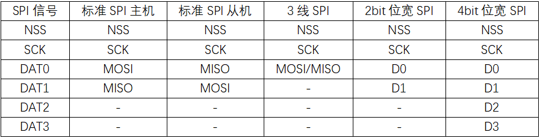
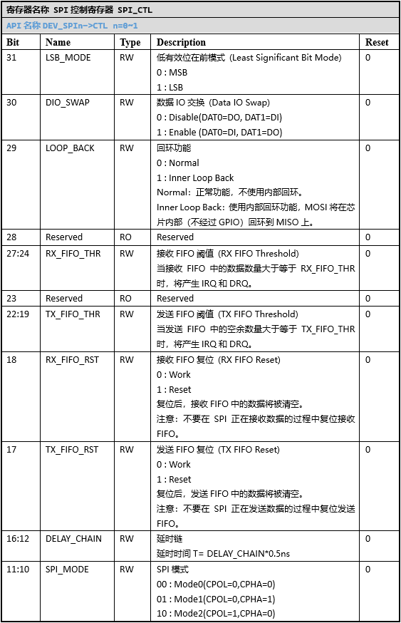
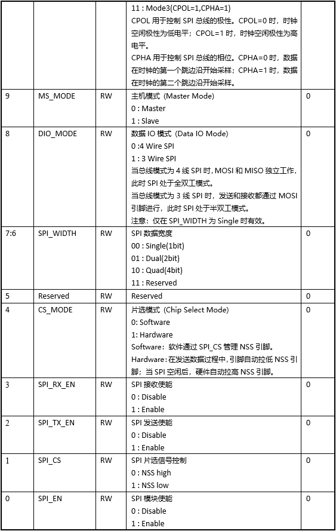
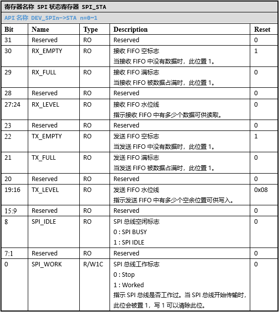
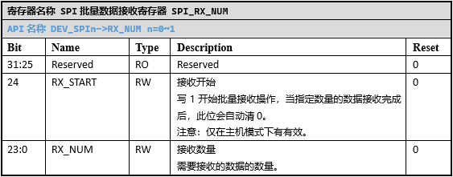
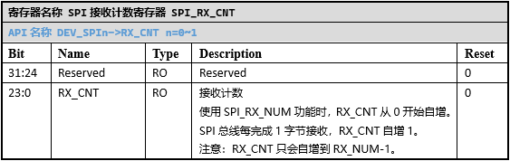
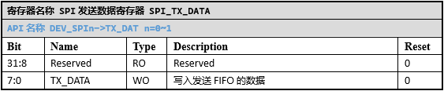
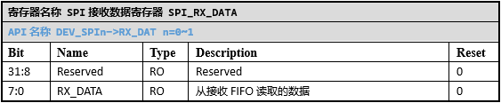
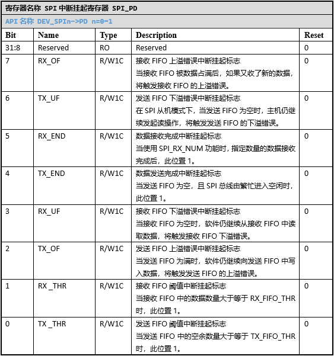
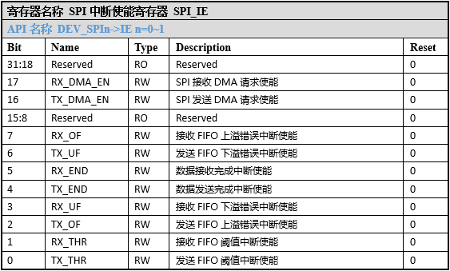

SPI
======================

外设特性
----------------------

SPV1x有2个SPI模块，每个SPI模块支持以下功能特性：

 1. 支持SPI Master/Slave模式
 2. 支持全双工和半双工模式。
    SPI的接收使能由\ `SPI_CTL`_.SPI_RX_EN位控制，发送使能由\ `SPI_CTL`_.SPI_TX_EN位控制。通过SPI_RX_EN和SPI_TX_EN的组合设置，实现全双工和半双工通讯。
 
    .. image:: ../../_static/kiwi-spi-mode.png
     :align: center
 
 3. 支持软件/硬件NSS信号控制
    在SPI主机模式下，通过配置\ `SPI_CTL`_.CS_MODE位选择软件NSS信号控制和硬件NSS信号控制。
    当选择软件NSS信号控制时，用户通过\ `SPI_CTL`_.SPI_CS位控制NSS引脚的电平。
    当选择硬件NSS信号控制时，SPI在启动数据发送前会自动拉低NSS引脚，待FIFO中的数据全部从数据引脚上发送完成后，SPI自动拉高NSS引脚。如果用户连续向FIFO中写入N字节数据，那么在整个N字节发送过程中，NSS引脚都会保持低电平。
 4. 支持1bit/2bit/4bit位宽收发
 5. 支持3线SPI（NSS，SCK，DAT0）
 6. 支持MODE0/MODE1/MODE2/MODE3
    SPV1x的MODE0~3分别对应不同时钟极性（CPOL）和时钟相位（CPHA）的组合，其关系如下：

    .. image:: ../../_static/kiwi-spi-cp.png
     :align: center

    不同CPOL和CPHA配置下，SPI的时序如下：

    .. image:: ../../_static/kiwi-spi-sequence.png
     :align: center

 7. 支持MSB（高位在前）/LSB（低位在前）
 8. 支持DIO_SWAP（MOSI和MISO交换）功能
 9. 支持Loopback功能
 10. 收发各自有8级深度的FIFO
 11. 支持中断和DMA请求

外设使用
----------------------

SoC的SPI分为标准SPI功能和扩展SPI功能。
标准SPI功能分为标准SPI主机和标准SPI从机。
扩展SPI功能分为3线SPI、2bit位宽SPI和4bit位宽SPI。
SoC的SPI有6个信号：NSS，SCK，DAT0，DAT1，DAT2，DAT3。在不同的功能场景下，所用到的SPI信号也不同。

1.  使用SPI前的配置
^^^^^^^^^^^^^^^^^^^^^^

SPI使用前，需要配置工作时钟，并解除模块的复位状态。

 1. 在CMU_SPInCLK中选择SPI的时钟源，并设置SPI的时钟分频值。
    此步骤决定在SPI主机模式下，SCK的时钟频率。
 2. 配置CMU_CLKEN0.SPIn，使能SPIn的时钟。
 3. 配置RMU_RSTEN0.SPIn，解除SPIn的复位状态。
 4. 初始化SPI需要用到的GPIO引脚。

2.  标准SPI功能
^^^^^^^^^^^^^^^^^^^^^^

标准SPI功能可与市面上的各种SPI设备进行通讯。

 **1. 标准SPI主机功能配置**

   a. 配置\ `SPI_CTL`_.MS_MODE位，选择Master功能。
   b. 配置\ `SPI_CTL`_.SPI_WIDTH位，选择Single（1bit位宽）。
   c. 配置\ `SPI_CTL`_.DIO_MODE位，选择4 Wire SPI（MOSI and MISO Seperate）。
   d. 配置\ `SPI_CTL`_.SPI_MODE字段，选择时钟极性和时钟相位。常见配置为Mode0（CPOL=0,CPHA=0）。
   e. 根据需要配置\ `SPI_CTL`_.LSB_MODE位，选择MSB或LSB。常见配置为MSB。
   f. 根据需要配置\ `SPI_CTL`_.DIO_SWAP位，以交换MOSI和MISO引脚。
   g. 配置\ `SPI_CTL`_.SPI_EN位，使能SPI模块。
   h. 配置\ `SPI_CTL`_.SPI_RX_EN和\ `SPI_CTL`_.SPI_TX_EN，使能SPI收发功能。
   i. 根据需要配置SPI的中断。配置\ `SPI_IE`_\ 寄存器中的相关位，以使能响应的中断。如果使用FIFO阈值中断，还需要配置\ `SPI_CTL`_.TX_FIFO_THR和\ `SPI_CTL`_.RX_FIFO_THR。
   j. 根据需要使能DMA请求。配置\ `SPI_IE`_.RX_DMA_EN位，使能SPI接收的DMA请求。配置\ `SPI_IE`_.TX_DMA_EN位，使能SPI发送的DMA请求。当使用SPI接收的DMA功能时，还需要将\ `SPI_CTL`_.RX_FIFO_THR设为1，使得SPI每收到一个字节数据，都发起一次DMA请求，将数据读到指定的内存空间。
   k. 通过CPU或DMA向TX_FIFO写入数据，SPI会自动开始数据传输。传输开始后，通过CPU或DMA读取RX_FIFO中的数据。

 **2. 标准SPI从机功能配置**

   a. 配置\ `SPI_CTL`_.MS_MODE位，选择Slave功能。
   b. 配置\ `SPI_CTL`_.SPI_WIDTH位，选择Single（1bit位宽）。
   c. 配置\ `SPI_CTL`_.DIO_MODE位，选择4 Wire SPI（MOSI and MISO Seperate）。
   d. 配置\ `SPI_CTL`_.SPI_MODE字段，选择时钟极性和时钟相位。常见配置为Mode0（CPOL=0,CPHA=0）。
   e. 根据需要配置\ `SPI_CTL`_.LSB_MODE位，选择MSB或LSB。常见配置为MSB。
   f. 根据需要配置\ `SPI_CTL`_.DIO_SWAP位，以交换MOSI和MISO引脚。
   g. 配置\ `SPI_CTL`_.SPI_EN位，使能SPI模块。
   h. 配置\ `SPI_CTL`_.SPI_RX_EN和\ `SPI_CTL`_.SPI_TX_EN，使能SPI收发功能。
   i. 根据需要配置SPI的中断。配置\ `SPI_IE`_\ 寄存器中的相关位，以使能响应的中断。如果使用FIFO阈值中断，还需要配置\ `SPI_CTL`_.TX_FIFO_THR和\ `SPI_CTL`_.RX_FIFO_THR。
   j. 根据需要使能DMA请求。配置\ `SPI_IE`_.RX_DMA_EN位，使能SPI接收的DMA请求。配置\ `SPI_IE`_.TX_DMA_EN位，使能SPI发送的DMA请求。当使用SPI接收的DMA功能时，还需要将\ `SPI_CTL`_.RX_FIFO_THR设为1，使得SPI每收到一个字节数据，都发起一次DMA请求，将数据读到指定的内存空间。
   k. 在主机发起传输前，向TX_FIFO预写入要发送给主机数据。在主机发起传输后，读取RX_FIFO中主机发送过来的数据，并向TX_FIFO继续写入后续要发送给主机的数据。

3.  扩展SPI功能
^^^^^^^^^^^^^^^^^^^^^^

扩展SPI功能用于某些特定的场景。当设备时序能与扩展SPI功能时序相兼容时，使用扩展SPI功能可以节省资源或提升性能。

 **1. 3线SPI功能配置**
    3线SPI功能将MISO和MOSI信号进行了合并。对于只需要半双工和单工SPI通讯的场景，使用3线SPI功能，既可以保证性能，又能节省GPIO引脚。

   a. 配置\ `SPI_CTL`_.MS_MODE位，选择Master功能。
   b. 配置\ `SPI_CTL`_.SPI_WIDTH位，选择Single（1bit位宽）。
   c. 配置\ `SPI_CTL`_.DIO_MODE位，选择3 Wire SPI（MOSI share with MISO）。
   d. 配置\ `SPI_CTL`_.SPI_MODE字段，选择时钟极性和时钟相位。常见配置为Mode0（CPOL=0,CPHA=0）。
   e. 根据需要配置\ `SPI_CTL`_.LSB_MODE位，选择MSB或LSB。常见配置为MSB。
   f. 配置\ `SPI_CTL`_.SPI_EN位，使能SPI模块。
   g. 当需要发送数据时，配置\ `SPI_CTL`_.SPI_TX_EN为1，\ `SPI_CTL`_.SPI_RX_EN为0。当需要接收数据时，配置\ `SPI_CTL`_.SPI_TX_EN为0，\ `SPI_CTL`_.SPI_RX_EN为1。
   h. 根据需要配置SPI的中断。配置\ `SPI_IE`_\ 寄存器中的相关位，以使能响应的中断。如果使用FIFO阈值中断，还需要配置\ `SPI_CTL`_.TX_FIFO_THR和\ `SPI_CTL`_.RX_FIFO_THR。
   i. 根据需要使能DMA请求。配置\ `SPI_IE`_.RX_DMA_EN位，使能SPI接收的DMA请求。配置\ `SPI_IE`_.TX_DMA_EN位，使能SPI发送的DMA请求。当使用SPI接收的DMA功能时，还需要将\ `SPI_CTL`_.RX_FIFO_THR设为1，使得SPI每收到一个字节数据，都发起一次DMA请求，将数据读到指定的内存空间。
   j. 当处于发送模式时，通过CPU或DMA向 TX_FIFO写入数据，SPI会自动开始数据传输。
   k. 当处于接收模式时，使用RX_NUM功能发起数据的读取操作，然后通过CPU或DMA读取RX_FIFO中的数据。

 **2. 2bit位宽SPI功能配置**
    2bit位宽SPI功能与标准SPI功能使用相同的引脚，但是数据引脚做了重新定义。2bit位宽SPI功能只支持半双工模式。

   a. 配置\ `SPI_CTL`_.MS_MODE位，选择Master功能。
   b. 配置\ `SPI_CTL`_.SPI_WIDTH位，选择Dual（2bit位宽）。
   c. 配置\ `SPI_CTL`_.DIO_MODE位，选择4 Wire SPI（MOSI and MISO Seperate）。
   d. 配置\ `SPI_CTL`_.SPI_MODE字段，选择时钟极性和时钟相位。常见配置为Mode0（CPOL=0,CPHA=0）。
   e. 根据需要配置\ `SPI_CTL`_.LSB_MODE位，选择MSB或LSB。常见配置为MSB。
   f. 配置\ `SPI_CTL`_.SPI_EN位，使能SPI模块。
   g. 当需要发送数据时，配置\ `SPI_CTL`_.SPI_TX_EN为1，\ `SPI_CTL`_.SPI_RX_EN为0。当需要接收数据时，配置\ `SPI_CTL`_.SPI_TX_EN为0，\ `SPI_CTL`_.SPI_RX_EN为1。
   h. 根据需要配置SPI的中断。配置\ `SPI_IE`_\ 寄存器中的相关位，以使能响应的中断。如果使用FIFO阈值中断，还需要配置\ `SPI_CTL`_.TX_FIFO_THR和\ `SPI_CTL`_.RX_FIFO_THR。
   i. 根据需要使能DMA请求。配置\ `SPI_IE`_.RX_DMA_EN位，使能SPI接收的DMA请求。配置\ `SPI_IE`_.TX_DMA_EN位，使能SPI发送的DMA请求。当使用SPI接收的DMA功能时，还需要将\ `SPI_CTL`_.RX_FIFO_THR设为1，使得SPI每收到一个字节数据，都发起一次DMA请求，将数据读到指定的内存空间。
   j. 当处于发送模式时，通过CPU或DMA向 TX_FIFO写入数据，SPI会自动开始数据传输。
   k. 当处于接收模式时，使用RX_NUM功能发起数据的读取操作，然后通过CPU或DMA读取RX_FIFO中的数据。

 **3. 4bit位宽SPI功能配置**
    4bit位宽SPI功能使用全部6个SPI信号。4bit位宽SPI功能与2bit位宽SPI类似，也只支持半双工模式。

   a. 配置\ `SPI_CTL`_.MS_MODE位，选择Master功能。
   b. 配置\ `SPI_CTL`_.SPI_WIDTH位，选择Quad（4bit位宽）。
   c. 配置\ `SPI_CTL`_.DIO_MODE位，选择4 Wire SPI（MOSI and MISO Seperate）。
   d. 配置\ `SPI_CTL`_.SPI_MODE字段，选择时钟极性和时钟相位。常见配置为Mode0（CPOL=0,CPHA=0）。
   e. 根据需要配置\ `SPI_CTL`_.LSB_MODE位，选择MSB或LSB。常见配置为MSB。
   f. 配置\ `SPI_CTL`_.SPI_EN位，使能SPI模块。
   g. 当需要发送数据时，配置\ `SPI_CTL`_.SPI_TX_EN为1，\ `SPI_CTL`_.SPI_RX_EN为0。当需要接收数据时，配置\ `SPI_CTL`_.SPI_TX_EN为0，\ `SPI_CTL`_.SPI_RX_EN为1。
   h. 根据需要配置SPI的中断。配置\ `SPI_IE`_\ 寄存器中的相关位，以使能响应的中断。如果使用FIFO阈值中断，还需要配置\ `SPI_CTL`_.TX_FIFO_THR和\ `SPI_CTL`_.RX_FIFO_THR。
   i. 根据需要使能DMA请求。配置\ `SPI_IE`_.RX_DMA_EN位，使能SPI接收的DMA请求。配置\ `SPI_IE`_.TX_DMA_EN位，使能SPI发送的DMA请求。当使用SPI接收的DMA功能时，还需要将\ `SPI_CTL`_.RX_FIFO_THR设为1，使得SPI每收到一个字节数据，都发起一次DMA请求，将数据读到指定的内存空间。
   j. 当处于发送模式时，通过CPU或DMA向TX_FIFO写入数据，SPI会自动开始数据传输。
   k. 当处于接收模式时，使用RX_NUM功能发起数据的读取操作，然后通过CPU或DMA读取RX_FIFO中的数据。

4.  RX_NUM功能
^^^^^^^^^^^^^^^^^^^^^^

当SPI只需要接收数据时，可以使用RX_NUM功能完成指定长度的数据接收。
配置\ `SPI_RX_NUM`_.RX_NUM为预期接收的数据字节数，同时配置\ `SPI_RX_NUM`_.RX_START启动SPI接收。RX_NUM功能启动后，CPU或DMA应及时读取RX_FIFO中的数据，否则RX_NUM功能会因RX_FIFO无可用空间而暂停工作。

注意事项
----------------------
 1. SPV1x的SPI数据长度固定为8bit。对于需要更大数据长度的场景（如16bit），可以将16bit拆分成2个8bit数据进行传输。
 2. SPI的DMA请求使能位在\ `SPI_IE`_\ 寄存器中。
 3. 当SPI处于主机全双工模式时，发送完1字节的同时也会收到1字节，即使收到的数据无用，也要及时读走，避免造成RX_FIFO上溢。
 4. 当SPI处于主机模式时，在开始通讯前，需要先拉低NSS引脚，然后再开始进行数据收发。数据收发过程中，需要保持NSS为低电平。
 5. 当SPI处于从机模式时，TX_FIFO中存储着要发送给主机的数据。TX_FIFO需要根据实际应用场景预先填入数据，否则当主机发起通讯时，TX_FIFO为空会导致TX_FIFO的下溢。
 6. 使用SPI中断时，除了配置\ `SPI_IE`_\ 寄存器，还需要配置CLIC和使能全局中断。如果SPI在使用过程中，会动态开启和关闭SPI内部中断，则在SPI中断函数中，需要同时判断\ `SPI_IE`_\ 和\ `SPI_PD`_\ ，确认中断使能且相应Pending bit置位，再去执行对应的处理逻辑。处理完对应的中断后，软件需要显式的对\ `SPI_PD`_\ 中对应的Pending bit写1，以清除其Pending状态。
 7. 写入TX_FIFO中的数据需要一定的时间才能从TX引脚发送完成（通过CPU写入和DMA写入都如此）。当\ `SPI_STA`_.SPI_IDLE为1，且\ `SPI_STA`_.TX_EMPTY为1时，就可以确定写入的数据已全部传输完成。
 8. 当SPI处于主机模式时，使能SPI模块时钟后，需要等待2个SCK的周期，以确保SPI时钟稳定后再开始数据收发。

-------------------------------------------------------------------------------

API说明
----------------------

SPI API提供标准SPI主机的功能。

.. c:function:: void spi_init(uint32_t chx,uint32_t baud)

  SPI初始化。

  :param chx: SPI通道，0~1。
  :param baud: SPI波特率(SPI SCK信号的频率)。
  :returns: 无

.. c:function:: void spi_deinit(uint32_t chx)

  SPI去初始化。

  :param chx: SPI通道，0~1。
  :returns: 无

.. c:function:: void spi_nss_ctrl(uint32_t chx,soc_enable_t en)

  SPI NSS信号控制。

  :param chx: SPI通道，0~1。
  :param en: Enable,NSS有效（低电平）；Disable，NSS无效（高电平）。
  :returns: 无

.. c:function:: uint8_t spi_transfer(uint32_t chx,uint8_t dat)

  SPI传输1个字节。

  :param chx: SPI通道，0~1。
  :param dat: 要发送的数据。
  :returns: 接收到的数据
  :rtype: uint8_t

.. c:function:: void spi_bulk_transfer(uint32_t chx,uint8_t *out,uint8_t *in,uint32_t len)

  SPI批量传输。

  :param chx: SPI通道，0~1。
  :param out: 指向要发送的数据。
  :param in: 指向容纳接收数据的缓冲区。
  :param len: 数据长度。
  :returns: 无

.. c:function:: void spi_bulk_write(uint32_t chx,uint8_t *buf,uint32_t len)

  SPI批量写数据。

  :param chx: SPI通道，0~1。
  :param buf: 指向要发送的数据。
  :param len: 数据长度。
  :returns: 无

.. c:function:: void spi_bulk_read(uint32_t chx,uint8_t *buf,uint32_t len)

  SPI批量读数据。

  :param chx: SPI通道，0~1。
  :param buf: 指向数据缓冲区。
  :param len: 要读取的数据长度。
  :returns: 无

API使用示例
----------------------

 1. 在 `board.h` 中设置 `__USE_SPI0` 或 `__USE_SPI1` 为1，表示需要启动SPI0或SPI1。

 .. code-block:: c

  #define	__USE_SPI0			(1)

 2. 在 `board.h` 中设置并定义对应UART需要用到的引脚以及引脚对应的MFP值。

 .. code-block:: c

  #define	SPI0_SCK_PIN		(GPIO_Pin_00)
  #define	SPI0_SCK_MFP		(1)
  #define	SPI0_NSS_PIN		(GPIO_Pin_01)
  #define	SPI0_NSS_MFP		(1)
  #define	SPI0_MOSI_PIN		(GPIO_Pin_02)
  #define	SPI0_MOSI_MFP		(1)
  #define	SPI0_MISO_PIN		(GPIO_Pin_03)
  #define	SPI0_MISO_MFP		(1)

 .. note::

   * SPI0默认引脚：NSS-GPIO00,SCK-GPIO01,MOSI-GPIO02,MISO-GPIO03。
   * SPI1默认引脚：NSS-GPIO16,SCK-GPIO17,MOSI-GPIO18,MISO-GPIO19。

 3.	调用 `spi_init()` 初始化对应的SPI。

 该函数会初始化SPI用到的引脚，选择OSC_AUDIO(49.152MHz)时钟作为SPI的时钟源，根据目标波特率设置时钟分频值(1~256)。

 .. code-block:: c

  spi_init(0, 1000000);

 4.	调用 `spi_nss_ctrl()` 控制NSS信号

 通常在数据收发前，需要拉低NSS信号，在数据收发完成后，再拉高NSS信号。

 .. code-block:: c

  spi_nss_ctrl(0, Enable);
  spi_nss_ctrl(0, Disable);

 5.	调用 `spi_transfer()` 或 `spi_bulk_transfer()` 进行数据双向收发，调用 `spi_bulk_write()` 进行数据单向发送，调用 `spi_bulk_read()` 进行数据单向读取。

 这些函数进行SPI数据传输时，都是阻塞进行的。

 .. code-block:: c

  recv = spi_transfer(0, 0xab);
  spi_bulk_transfer(0, tx_buf, rx_buf, 16);
  spi_bulk_write(0, tx_buf, 16);
  spi_bulk_read(0, rx_buf, 16);

 6.	如果不需要再使用SPI，调用 `spi_deinit()` 去初始化。

 去初始化会关闭SPI的时钟，并让模块处于复位状态。相应的引脚复用也会被清除。

----------------------

寄存器定义
----------------------

.. _SPI_CTL:

----------------------------------------------

.. _SPI_STA:

----------------------------------------------

.. _SPI_RX_NUM:

 
----------------------------------------------

.. _SPI_RX_CNT:

 
----------------------------------------------

.. _SPI_TX_DATA:

 
----------------------------------------------

.. _SPI_RX_DATA:

 
----------------------------------------------

.. _SPI_PD:

 
----------------------------------------------

.. _SPI_IE:

