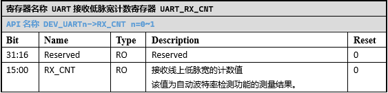

UART
======================

外设特性
----------------------

SPV1x有2个UART模块，每个模块均支持以下功能特性。

 1. 支持5~8bit数据位宽
 2. 支持奇偶校验和0/1校验
 3. 支持1bit/2bit停止位
 4. 支持自动波特率检测
 5. 支持Timeout功能
 6. 支持Loopback功能
 7. 支持帧错误检测
 8. 接收和发送以不同的波特率运行
 9. 接收和发送各自有8级深度的FIFO

外设使用
-----------------------

 **1. UART时钟和复位配置**

   1. 配置CMU_UARTnCLK，选择UART时钟源。
   2. 配置CMU_CLKEN0.UARTn，开启UART时钟。
   3. 配置RMU_RSTEN0.UARTn，释放UART模块。

 **2. 数据位宽选择**
    
    配置\ `UART_CFG`_.DATA_WIDTH，选择数据位宽。

 **3. 校验功能配置**

   1. 配置\ `UART_CFG`_.PARITY_EN，开始或关闭校验功能。
   2. 如果开启了校验功能，配置\ `UART_CFG`_.PARITY_SEL选择校验方式。用户可以置位\ `UART_IE`_.PARITY_ERR，使能校验错误中断功能。
   3. 如果关闭了校验功能，校验方式的选择可以忽略。

 **4. 停止位选择**
    
    配置\ `UART_CFG`_.STOP_BIT选择1bit/2bit停止位。

 **5. 波特率配置**
    
    UART支持收发以不同的波特率进行。\ `UART_DIV`_\ 分为高16bit（RX_DIV）和低16bit（TX_DIV），RX_DIV用于控制接收的波特率，TX_DIV用于控制发送的波特率。
    UART的波特率计算公式为：DIV = CLOCK/BAUD - 1。
    DIV为波特率分频值（RX_DIV或TX_DIV），CLOCK为UART时钟源的频率，BAUD为目标波特率。

 **6. Timeout功能配置**

    Timeout功能用于需要进行数据流断帧的场景。在数据接收过程中，上一字节接收完成后，下一字节的起始位未在指定的时间内开始传输，就会触发Timeout。Timeout由\ `UART_CFG`_.TO_DIV进行配置，其单位为接收波特率的比特宽度，可配置的范围为1~64bit。
    Timeout功能总是开启，如果不需要使用Timeout功能，软件只要关闭Timeout中断（\ `UART_IE`_.TIME_OUT）并忽略其Pending标志（\ `UART_PD`_.TIME_OUT）即可。

 **7. Loopback功能配置**

    配置\ `UART_CFG`_.LOOPBACK_EN可开启和关闭Loopback功能。Loopback功能开启后，UART的RX会在内部接到TX。
    Loopback功能用于快速验证UART的模块的收发配置是否正常。

 **8. 帧错误检测功能**

    在数据接收过程中，如果在停止位阶段采集到低电平，就会触发帧错误。
    帧错误检测功能总是开启，如果不需要使用帧错误检测功能，软件只要关闭帧错误检测中断（\ `UART_IE`_.FRAME_ERR）并忽略其Pending标志（\ `UART_PD`_. FRAME_ERR）即可。

 **9. FIFO相关配置**

    UART的发送和接收都有8级FIFO。合理的使用FIFO资源，可以降低软件的复杂度，提升软件的性能。FIFO主要用到的功能有2点：

    1. FIFO的阈值功能：\ `UART_CFG`_.RX_FIFO_THR/\ `UART_CFG`_.TX_FIFO_THR用于配置FIFO的阈值。在UART的中断收发场景中，如果每个字节的收发都进一次中断，会导致中断开销过大，通过使用阈值中断，可以在FIFO中有足够数据的时候，才进中断处理，并且能在一次中断中读取多个接收的数据或写入多个要发送的数据，以减少进出中断时的上下文切换开销。
    2. FIFO复位功能：\ `UART_CTL`_.RX_FIFO_RST/\ `UART_CTL`_.TX_FIFO_RST用于控制FIFO的复位，使用复位功能，可快速清除FIFO中的数据。

 **10. UART使能**

    UART的接收和发送功能可以独立工作，因此接收和发送有单独的使能控制位。
    \ `UART_CTL`_.RX_EN控制接收功能的使能，\ `UART_CTL`_.TX_EN控制发送功能的使能。

 **11. 中断功能配置**

    如果要使用UART的中断功能，需要在\ `UART_IE`_\ 中配置对应的中断使能。进入中断后，通过判断\ `UART_PD`_\ 中的Pending位，来确认中断的原因。
    为了让CPU接收UART的中断请求，还需要配置CLIC和全局中断使能。

 **12. 自动波特率检测功能配置**

    如果使用自动波特率检测功能，则按以下步骤操作：

    1. 配置\ `UART_CTL`_.ABD，开启自动波特率检测。
    2. 如果不使用中断，则等待\ `UART_CTL`_.ABD变回0。UART完成自动波特率检测后，硬件会将\ `UART_CTL`_.ABD清零。
    3. 如果使用中断，则开启\ `UART_IE`_.ABD，并配置CLIC和全局中断使能。自动波特率检测完成后，将触发UART中断。
    4. 自动波特率检测完成后，读取\ `UART_RX_CNT`_\ 中的测量值。如果测量的是单比特的位宽，则\ `UART_RX_CNT`_\ 的值可以作为RX_DIV或TX_DIV直接写入\ `UART_DIV`_\ 寄存器；如果测量的是多比特位宽（比如N比特），则RX_DIV或TX_DIV=(\ `UART_RX_CNT`_\ +1)/N-1。

注意事项
--------------------------

 1. 当使用自动波特率检测功能时，测量单比特的位宽往往导致计算出来的波特率误差较大，在高波特率下，误差尤为明显。建议通过测量多个比特的位宽，以减少计算出来的波特率的误差。此外，在自动波特率检测完成之前，先不要使能UART的
    接收功能，避免收到无用的数据。
 2. 向TX_FIFO写入数据时，需要确认TX_FIFO的剩余空间，避免写入过量的数据，导致TX_FIFO上溢。同理，从RX_FIFO读取数据时，需要确认RX_FIFO中有效数据的数量，避免过量读取数据，导致RX_FIFO下溢。
 3. 如果UART在使用过程中，会动态开启和关闭UART内部中断，则在UART中断函数中，需要同时判断\ `UART_IE`_\ 和\ `UART_PD`_\ ，确认中断使能且相应Pending bit置位，再去执行对应的处理逻辑。处理完对应的中断后，软件需要显式的对\ `UART_PD`_\ 中对应的Pending bit写1，以清除其Pending状态。
 4. 写入TX_FIFO中的数据需要一定的时间才能从TX引脚发送完成（通过CPU写入和DMA写入都如此）。当\ `UART_STA`_.TX_BUSY为0，且\ `UART_STA`_.TX_FIFO_EMPTY为1时，就可以确定写入的数据已全部传输完成。
 5. 如果要配合DMA进行UART数据收发，配置\ `UART_CTL`_.RX_DMA_EN和\ `UART_CTL`_.TX_DMA_EN开启接收和发送的DMA请求。此外，还需要将\ `UART_CFG`_.RX_FIFO_THR设为1，使得UART每收到一个字节数据，都发起一次DMA请求，将数据读到指定的内存空间。

-------------------------------------------------------------------------------

API说明
----------------------

UART API提供基础的UART初始化和数据收发功能，便于快速上手UART的使用。

.. c:function:: void uart_set_tx_pin(gpio_pin_t gpio_pin,uint32_t mfp)

  设置UART的发送引脚。

  :param gpio_pin: GPIO端口号，gpio_pin_t中的枚举值。
  :param mfp: 引脚的MFP值。
  :returns: 无

.. c:function:: void uart_set_rx_pin(gpio_pin_t gpio_pin,uint32_t mfp)

  设置UART的接收引脚。

  :param gpio_pin: GPIO端口号，gpio_pin_t中的枚举值。
  :param mfp: 引脚的MFP值。
  :returns: 无

.. c:function:: void uart_init(uint32_t chx,uint32_t baud,void (*recv_cb)(uint8_t))

  UART初始化。

  :param chx: UART通道，0~1。
  :param baud: UART波特率。
  :param recv_cb: 串口接收回调函数。
  :returns: 无

.. c:function:: void uart_deinit(uint32_t chx)

  UART去初始化。

  :param chx: UART通道，0~1。
  :returns: 无

.. c:function:: void uart_write(uint32_t chx,uint8_t *buf,uint32_t len)

  UART写（发送）数据。

  :param chx: UART通道，0~1。
  :param buf: 指向待写入的数据
  :param len: 待写入数据的长度
  :returns: 无

.. c:function:: uint32_t uart_read(uint32_t chx,uint8_t *buf,uint32_t len,uint32_t timeout)

  UART读（接收）数据。

  :param chx: UART通道，0~1。
  :param buf: 指向容纳待读取数据的缓冲区
  :param len: 待读取数据的长度
  :param timeout: 读取超时时间，单位us
  :returns: 实际读取到数据量
  :rtype: uint32_t 

API使用示例
----------------------

 1. 在 `"board.h"` 中设置 `__USE_UART0` 或 `__USE_UART1` 为1，表示需要启用UART0或UART1。

 .. code-block:: c
  
  #define	__USE_UART1			(1)

 2.	在 `"board.h"` 中设置并定义对应UART需要用到的引脚以及引脚对应的MFP值。

 .. code-block:: c

  #define	UART1_TX_PIN		(GPIO_Pin_08)
  #define	UART1_TX_MFP		(3)
  #define	UART1_RX_PIN		(GPIO_Pin_09)
  #define	UART1_RX_MFP		(3)

 .. note::

  * 如果未在 `"board.h"` 中配置UART引脚，那么UART0默认使用GPIO06作为发送，GPIO07作为接收。UART1默认使用GPIO08作为发送，GPIO09作为接收。
  * UART的接收引脚默认会开启上拉。

 3. 调用 `uart_init()` 初始化对应的UART模块。

 该函数会初始化UART用到的引脚，设置OSC_DEV时钟作为UART的时钟。如果 `recv_cb` 参数为NULL，那么UART接收通过 `uart_read()` 函数完成，否则，UART接收到数据后，将调用 `recv_cb` 函数指针，并传入接收到的数据。

 .. code-block:: c

  uart_init(1, 115200, uart1_cb);

 4. 调用 `uart_write()` 发送数据

 `uart_write()` 阻塞式发送数据，直到所有数据从引脚上发送完成。在低波特率下， `uart_write()` 的执行时间会较长。

 .. code-block:: c

  uart_write(1, "hello", 5);

 5. 调用 `uart_read()` 接收数据，或者在 `recv_cb` 中处理接收的数据。

 `uart_read()` 会阻塞式接收数据，直到指定长度的数据接收完成或者超时。

 `recv_cb` 会在UART接收中断被调用，当接收连续数据时， `recv_cb` 会被频繁调用。

 .. note::

  * 由于 `recv_cb` 是在中断函数中被调用的，因此 `recv_cb` 所指向的函数应力求简短。

 6. 如果不需要再使用UART，调用 `uart_deinit()` 去初始化。

 去初始化会关闭UART的时钟，并让模块处于复位状态。相应的引脚复用也会被清除。

----------------------

寄存器定义
----------------------

.. _UART_CFG:

----------------------------------------------

.. _UART_DIV:

 
----------------------------------------------

.. _UART_CTL:

----------------------------------------------

.. _UART_IE:

----------------------------------------------

.. _UART_PD:

----------------------------------------------

.. _UART_STA:

----------------------------------------------

.. _UART_RX_CNT:

----------------------------------------------

.. _UART_TX_DAT:

.. image:: ../../_static/kiwi-reg-uart-tx-dat.png
 :align: center

----------------------------------------------

.. _UART_RX_DAT:

 