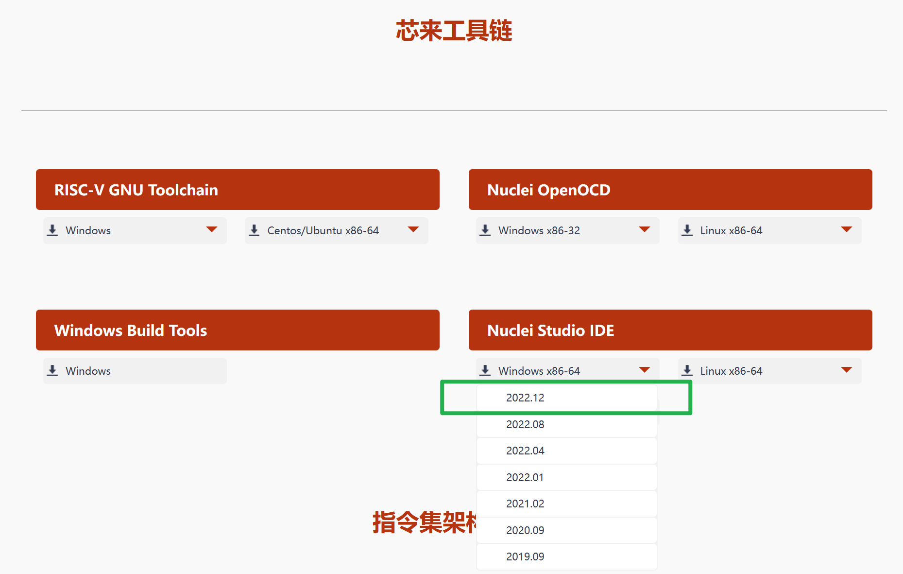
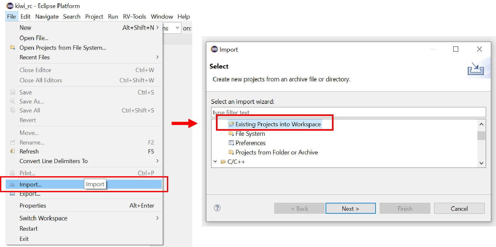
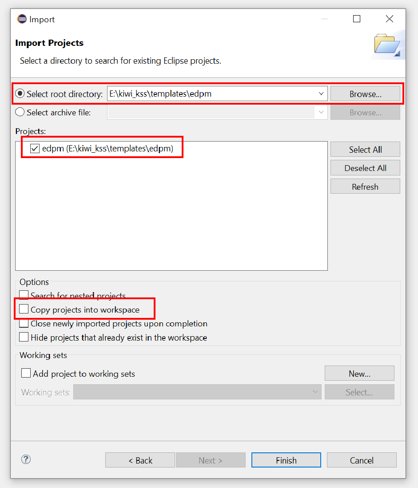
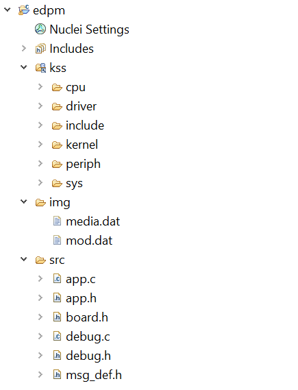
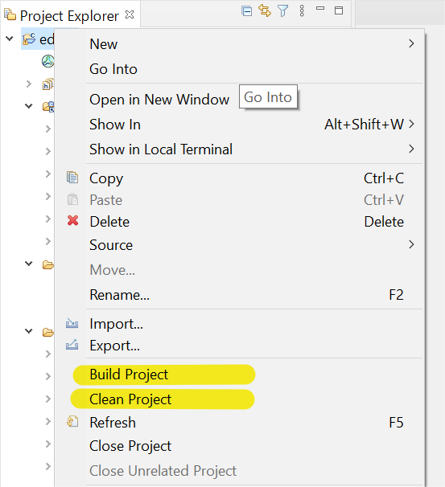
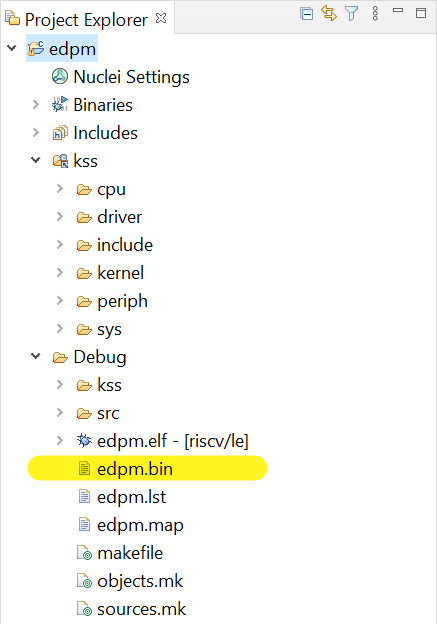

集成开发环境使用
===============================

IDE安装
------------------

SoC SPV1x的用户程序开发使用芯来科技Nuclei Studio IDE进行开发，请通过 `官方网站 <https://www.nucleisys.com/download.php>`_ 获取下载。
Nuclei Studio IDE基于Eclipse Platform开发，无需安装，将下载获得的压缩包解压至PC本地即可。

.. note::
  我司SPV1x SoC SDK和场景库基于Nuclei Studio IDE 2022-12 Win64版本进行开发和测试，推荐使用相同版本IDE进行用户程序的开发。

如果您选择的是Nuclei Studio IDE 2022-12版本，解压后可通过双击NucleiStudio文件夹下 ``Nuclei2212.exe`` 运行IDE，选择特定文件夹或使用IDE默认文件夹作为workspace。

SPV1x SDK说明
------------------

当前SPV1x SDK的文件层级如下：

- **kss:** SPV1x软件栈(SPV1x Software Stack)，包含SPV1x的初始化代码、外设驱动API和预设场景静态库。SDK下属全部模版工程和Demo工程通过IDE下链接(Link)的方式使用相同的kss进行编译，确保kss的必要更新能够同步到全部工程。

  更多关于KSS API的使用说明，请阅读章节 :ref:`api-reference`。

- **templates:** 模版工程集，包含工程“baremetal”和“edpm”。baremetal为极简while(1)工程，适于熟悉外设API的调用等单一目的。edpm为符合事件驱动编程模型(Event-driven Programming Model)的工程模版，适用于搭建正式SPV1x应用方案并积极调用预设场景库。
  
  更多关于EDPM的说明，请参考 :ref:`edpm-design` 章节。

- **evb** Demo工程集，其中收录了通过我司SPV1x Evaluation Board (EVB)板可进行直接展示和使用的工程合集，
  涵盖复杂外设组合应用、典型应用场景如离线语音识别、MIDI键盘等场景，并将持续更新。

  更多关于EVB板和Demo工程的说明，请参考 :ref:`evb-demos` 章节。

- **tool** 配套PC工具集（仅支持windows系统），包含且不限于以下软件：
  
 1. 固件烧录工具 SPV1x ODT, 用于将IDE编译打包生成的SOC固件通过BROM机制下载至芯片。
  
    详细使用方法请阅读章节 :ref:`firmware-downloader`。

 2. 音频打包工具 Audio Convert Tool，用于将用户选择的音频资源文件进行编码和封装，产生单一资源文件media.dat。
 
    详细使用方法请阅读章节 :ref:`audio-converter`。
 
 3. 下载器驱动，提供我司EVB或其他开发板板载USB转串口芯片所需的PC驱动(CH340系列)，已经独立下载器模块所需的PC驱动(FTDI系列)。

导入用户工程模版
------------------

- 点击下拉菜单 :guilabel:`File` ，选择 :guilabel:`Import`
- 在弹出窗口中，选择 :guilabel:`Existing Projects into workspace`

- 通过 :guilabel:`Select root directory` 选择待导入工程的根目录。
- 确保 :guilabel:`Projects`  一栏中勾选对应工程名。
- **不要** 勾选 "Copy projects into workspace"。
- 点击 :guilabel:`Finish` 。

用户工程模版说明
------------------

一个典型用户工程，其源码分属三个子文件夹：

  - **kss:** SPV1x软件栈(SPV1x Software Stack)，包含SPV1x的初始化代码、外设驱动API和预设场景静态库，目前由5个组件构成：

    .. image:: ../_static/sdk.png
      :align: center
      :width: 512 px

    1. ``cpu``    CPU内核的启动引导和RAM初始化代码，链接器脚本，中断向量表定义等。
    2. ``periph`` SoC常规外设的驱动API。
    3. ``kernel`` 用户程序准系统。
    4. ``driver`` 外部设备驱动。
    5. ``sys``    SoC预设场景库。
  
  - **src:** 用户代码文件夹。
  - **img:** 资源文件夹，包含media.dat和mod.dat两个二进制数据文件，前者为音乐内容数据，后者为离线语音识别模型数据。

用户工程编译
------------------

- 在 **Project Explorer** 中右键点击导入的工程名。
- (推荐)首先执行一次 :guilabel:`Clean Project` 。
- 执行 :guilabel:`Build Project` ，等待其完成。

- 在当前工程下将生成 **Debug** 文件夹，如未出现请点击工程名，执行 :guilabel:`Refresh` 。
- **Debug** 文件夹下扩展名".bin"文件即为可烧录SoC固件镜像。

.. note::
  推荐通过IDE下拉菜单 
  :menuselection:`Window --> Preferences --> General --> Workspace` 下开启如图选项，实现编译后自动刷新工程文件夹。
  
  .. image:: ../_static/kiwi-IDE-setting-refresh.png
    :align: center

用户工程重命名（等效：新建用户工程）
------------------------------------------

我们推荐以重命名SDK提供的模板工程或者EVB Demo工程的方式，生成用户自己的初始工程。

此种方式可以确保将SDK工程中已有的工具链相关推荐配置完全保留，如目标处理器设置、编译器选项和链接器脚本等重要参数。

用户可以通过以下两种方式对工程重命名：

 - 方式1： **通过 ProjectRename 工具进行转换**
  
  1. 在SDK下属tool文件夹中找到“工程重命名工具”，执行其中ProjectRename.exe，按照程序提示进行操作。

  .. image:: ../_static/kiwi-tool-projectrename.png
    :align: center
    :width: 512 px

 - 方式2： **手动修改工程设置文件**

  .. image:: ../_static/kiwi-tool-projectfile.png
    :align: center

  1. 使用文本编辑器，打开工程文件夹根目录下".project"文件，将其中<name>一栏键值修改为新工程的名称，保存文件。
  2. 如果该工程文件夹下已存在"Debug"子文件夹，请将其删除。
  3. （可选但推荐）将该工程文件夹名称修改为新工程名。