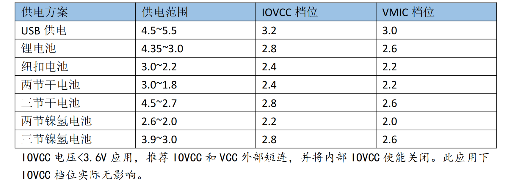

用户工程底层配置
===============================

.. note::
  使用底层初始化和配置相关API需要在链接器中正确关联静态库 ``lowlevel``，并在用户程序(.c)中
  包含头文件 *lowlevel.h*。

本章节介绍用户工程代码需要根据实际运行场景进行配置的底层外设的设置方法(API), 一般推荐将
对应代码置于 *./src/app.c* 下属 ``app_init()`` 函数中。以下为典型的 *app_init()* 函数范例：

.. code-block::

  __attribute__((aligned(4), optimize("Os"))) void app_init(void)
  {
    /* 可选：设置系统时钟和NOR控制器时钟 */
    /* 配置和使能OSC_CORE时钟@100MHz */
    clock_osc_core_set(OSC_Core_Frequency_100MHz);
    clock_osc_core_enable();
    /* 使用OSC_CORE时钟1分频作为系统时钟源，即 System Clock = 100MHz *
    clock_sysclk_set(Sysclk_Sel_Osc_Core, Clock_Source_Div_1);
    /* 使用系统时钟2分频作为NOR控制器时钟，即 Norc Clock = 50MHz */
    clock_norclk_set(Clock_Source_Div_2);

    /* 必要：设置IOVCC电压 */
    sys_set_iovcc(__ADC_IOVCC_3v2);

    /* 可选：ADC初始化 */
    adc_sys_init(__ADC_VMIC_2v8,__ADC_Samplerate_16khz,__ADC_Gain_44db);

  }

系统时钟和NOR控制器时钟
-------------------------------

.. important::
  扩展阅读：:ref:`clock-source-module`

- 用户根据需要调用 ``clock_sysclk_set()`` 对系统时钟(System Clock)频率进行设置，从而确定CPU/SRAM/DMA的工作速度。根据用户对系统时钟频率的需求，用户可能需要首先配置和开启上游高频时钟源。
- 用户根据需要调用 ``clock_norclk_set()`` 对NOR Flash控制器速度进行设置，其来自系统时钟的直接分频。NOR速度不超过50MHz即可满足大多数场景需求。
- 若用户不调用 ``clock_sysclk_set()`` ，系统时钟由SDK默认配置为OSC_AUDIO时钟，即49.152MHz。
- 若用户不调用 ``clock_norclk_set()`` ，Nor Flash速度由SDK默认配置为系统时钟2分频。

API链接：

- :c:func:`clock_sysclk_set`
- :c:func:`clock_norclk_set`

IOVCC电压
-------------------------------

.. important::
  扩展阅读：:ref:`pmu-module`

- 用户需要根据实际方案的供电电压，调用 ``sys_set_iovcc()`` 对IOVCC进行设置，推荐配置如下：

ADC初始化
-------------------------------

blabla

--------------------------------------------------------------------------------

API说明
----------------------