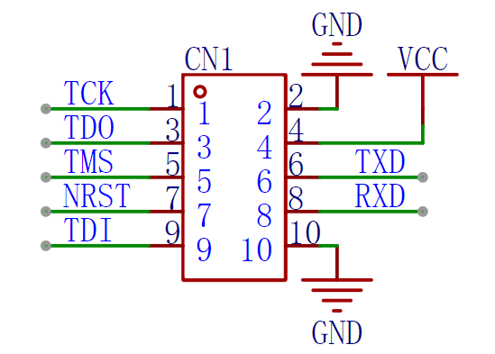

JTAG调试器接口参考设计
======================

| SpaceTouch Straw调试器通过IDC连接器（2x5P 2.54mm Pitch）与SPV1x开发板建立连接，提供JTAG调试和串口调试打印能力。

| 上图为推荐的SPV1x开发板侧IDC连接器插座参考设计，下表总结了不同应用场景下连接器引脚和SPV1x GPIO的连接情况：

+-----------+--------------+---------------+---------------------+---------------------+
|           |  4-wire JTAG |  2-wire cJTAG |  Full-duplex Serial |  Half-duplex Serial |
+===========+==============+===============+=====================+=====================+
| **TCK**   | GPIO0        | GPIO0         |                     |                     |
+-----------+--------------+---------------+---------------------+---------------------+
| **TDO**   | GPIO2        | N.C.          |                     |                     |
+-----------+--------------+---------------+---------------------+---------------------+
| **TMS**   | GPIO1        | GPIO1         |                     |                     |
+-----------+--------------+---------------+---------------------+---------------------+
| **TDI**   | GPIO3        | N.C.          |                     |                     |
+-----------+--------------+---------------+---------------------+---------------------+
| **NRST**  | N.C.         | N.C.          |                     |                     |
+-----------+--------------+---------------+---------------------+---------------------+
| **TXD**   |              |               | UART0 RX MFP        | N.C.                |
+-----------+--------------+---------------+---------------------+---------------------+
| **RXD**   |              |               | GPIO6               | GPIO6               |
+-----------+--------------+---------------+---------------------+---------------------+

.. note::
    - JTAG和串口打印场景彼此可以自由组合
    - 通过Straw调试器通路实现串口打印场景仅支持UART0通道

