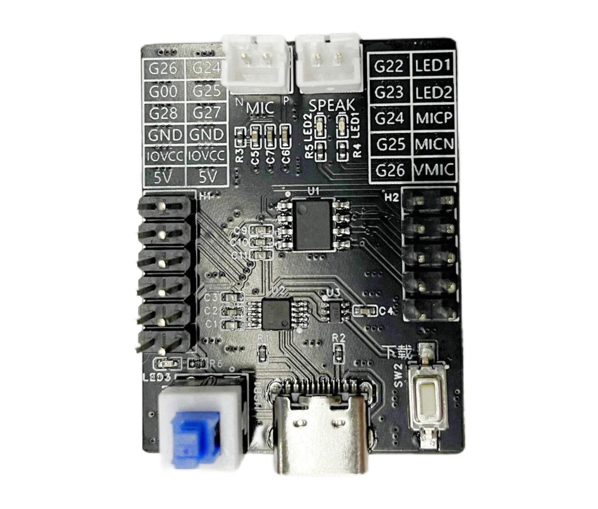

.. _esop8-dev-board:

SPV1x ESOP8 Demo Board说明
===================================

--------------------------------------------------------------------------

SPV1x ESOP-8 Demo Board是针对ESOP-8封装快速评估所推出的官方套件，以一枚SPV120A4芯片为核心，
板上集成在线烧录器，预留麦克风和喇叭接口。ESOP-8 Demo Board随SPV1x SDK提供若干演示工程，展示
基于离线语音识别的灯光控制等典型应用场景。

.. note::
    - 请咨询我司销售人员获取相关购买信息。

--------------------------------------------------------------------------

SPV1x ESOP8 演示板原理图下载链接： 

 - :download:`pdf格式 <../../_static/SPV120A4_ESOP8_schematics.pdf>`

--------------------------------------------------------------------------

SPV1x ESOP8 演示板说明书下载链接： 

 - :download:`pdf格式 <../../_static/SPV120A4_DEMO板说明书V1.0.pdf>`

