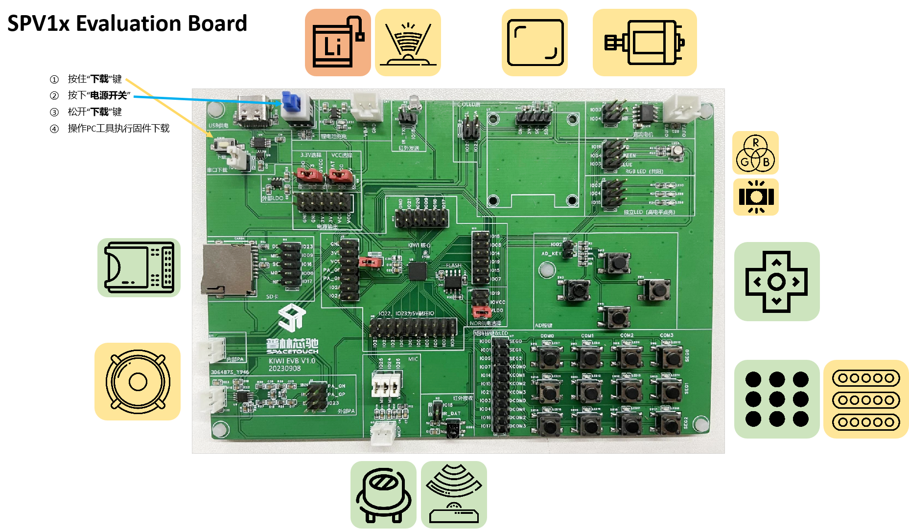
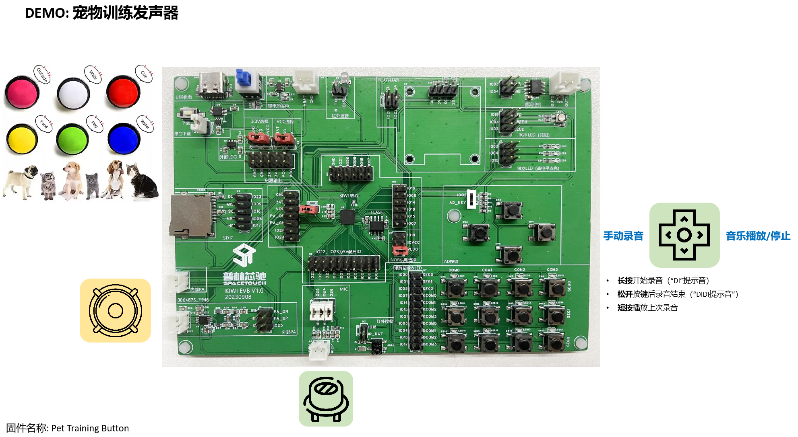

.. _evb-demos:

SPV1x Evaluation Board (EVB) 说明
=================================

SPV1x EVB 介绍
---------------------------------

SPV1x Evaluation Board(EVB)围绕SPV1x QFN40全封装芯片搭建，集成CH340E作为在线下载器，提供SD卡槽（SPI协议）、
IR发射/接收模块、电机控制模块、RGB LED灯珠、AD Key、Keypad Matrix、LED Matrix、内置/外接PA、麦克风输入、锂电池充电模块等多种板载外设，
通过跳线方式进行自由组合，
满足典型方案的快速体验和二次开发需求。

SPV1x EVB原理图下载链接： 

 - :download:`pdf格式 <../../_static/spv1x-evb.pdf>`

.. note::
  1. 请留意图中标注的外设用途说明以及跳线连接方式（白色）。
  2. EVB板串口下载波特率设置推荐不超过1000000。

.. warning:: 
  1. 当通过VBAT脚使用干电池电池仓进行供电时，**切勿** 接入USB供电。推荐使用锂电池，可以实现通过USB对电池充电。

SPV1x EVB 专属Demo说明
---------------------------------

SPV1x SDK提供基于EVB的如下Demo供早期评估，并保持更新：

1. **音频播放器 Omniplayer**

   用于评估SPV1x音乐播放器库使用，以及SPV1x所支持音频格式的播放效果。

2. **SD Card 音频播放器**

   用于评估SPV1x通过SPI接口获取和播放FAT32格式SD卡存储音频内容的流程。

3. **MIDI键盘**

   用于评估SPV1x以Keypad Matrix实现基于软件MIDI合成器的MIDI键盘效果。

4. **语音控制小夜灯**

   用于评估SPV1x实现离线语音识别并控制外设的效果。

5. **玩具仙人掌**

   模仿仙人掌玩具逻辑，用于评估SPV1x综合方案整合。

6. **玩具打地鼠**

   模仿打地鼠玩具逻辑，用于评估SPV1x综合方案整合。

7. **宠物训练发声器**

   用于评估SPV1x录音/播放场景库的使用。

.. image:: ../../_static/kiwi-evb-demos.png
   :align: center

-------------------------------------------------------------------------------

