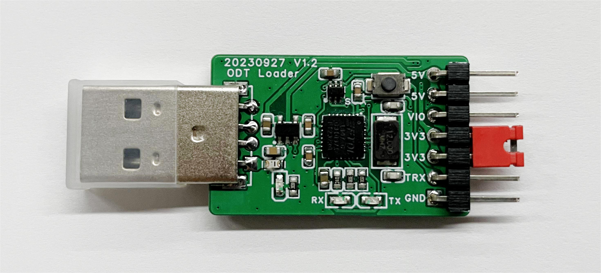

.. _odt_loader:

固件下载器(ODT Loader)说明
==========================

引脚信号说明
--------------------------

 1. 5V：对外5V供电。
 2. VIO：ODT Loader的IO参考电压，决定TRX引脚的通讯电压。
 3. 3V3：对外3.3V供电。
 4. TRX：串口收发引脚。
 5. GND：GND引脚。

使用方式
--------------------------

 1. SPV1x采用外部供电

  a. 给SPV1x断电。
  b. 连接GND到SPV1x的GND；连接TRX到SPV1x的GPIO06；连接VIO到SPV1x的IOVCC（可省去VIO连接，见注意事项-3）。
  c. 按住ODT Loader上的下载按钮，然后给SPV1x上电，上电稳定后，松开下载按钮。
  d. 等待PC对ODT Loader枚举完成，之后就可以使用上位机进行程序下载。

 2. SPV1x采用ODT Loader供电

  a. 先将ODT Loader从PC的USB口上移除。
  b. 连接GND到SPV1x的GND；连接TRX到SPV1x的GPIO06；连接5V或3V3（供电电压取决于实际的项目情况）到SPV1x的VCC；连接VIO到SPV1x的IOVCC（可省去VIO连接，见注意事项-3）。
  c. 按住ODT Loader上的下载按钮，然后再将ODT Loader连接到PC的USB口进行上电。上电稳定后，松开下载按钮。
  d. 等待PC对ODT Loader枚举完成，之后就可以使用上位机进行程序下载。

.. note::

 注意事项
  1. 5V引脚上能提供的最大电流取决于对应的USB口能提供的最大电流，过大的电流会导致USB口浪涌。建议汲取的电流不要超过500mA。
  2. 3.3V引脚上最大提供300mA电流。
  3. 当SPV1x的VCC供电不低于3.2V时，可以直接将ODT Loader的VIO与3V3连接在一起，使用3.3V的IO电平进行下载。当SPV1x的VCC电压低于3.2V时，需要将ODT Loader的VIO与SPV1x的IOVCC连接在一起。
  4. 当SPV1x在断电前处于低功耗模式时（特别是休眠模式），断电所需的时间会较长。

低成本固件下载器(ODT Loader(CH340E))说明
====================================================

.. image:: ../../_static/odt-loader-ch340e.png
   :align: center
   :width: 512 px

引脚信号说明
--------------------------

 1. 5V：对外5V供电。
 2. 3V3：对外3.3V供电。
 3. TRX：串口收发引脚。
 4. GND：GND引脚。

使用方式
--------------------------

 1. SPV1x采用外部供电

  a. 给SPV1x断电。
  b. 连接GND到SPV1x的GND；连接TRX到SPV1x的GPIO06。
  c. 按住ODT Loader(CH340E)上的下载按钮，然后给SPV1x上电，上电稳定后，松开下载按钮。
  d. 等待PC对ODT Loader(CH340E)枚举完成，之后就可以使用上位机进行程序下载。

 2. SPV1x采用ODT Loader(CH340E)供电

  a. 先将ODT Loader(CH340E)从PC的USB口上移除。
  b. 连接GND到SPV1x的GND；连接TRX到SPV1x的GPIO06；连接5V或3V3（供电电压取决于实际的项目情况）到SPV1x的VCC。
  c. 按住ODT Loader(CH340E)上的下载按钮，然后再将ODT Loader(CH340E)连接到PC的USB口进行上电。上电稳定后，松开下载按钮。
  d. 等待PC对ODT Loader(CH340E)枚举完成，之后就可以使用上位机进行程序下载。

.. note::

 注意事项
  1. 5V引脚上能提供的最大电流取决于对应的USB口能提供的最大电流，过大的电流会导致USB口浪涌。建议汲取的电流不要超过500mA。
  2. 3.3V引脚上最大提供300mA电流。
  3. 由于CH340E固定工作在3.3V模式，因此SPV1x的IO电压也需要在3.3V附近。建议下载时SPV1x的VCC供电不要低于3.2V。
  4. 当SPV1x在断电前处于低功耗模式时（特别是休眠模式），断电所需的时间会较长。

