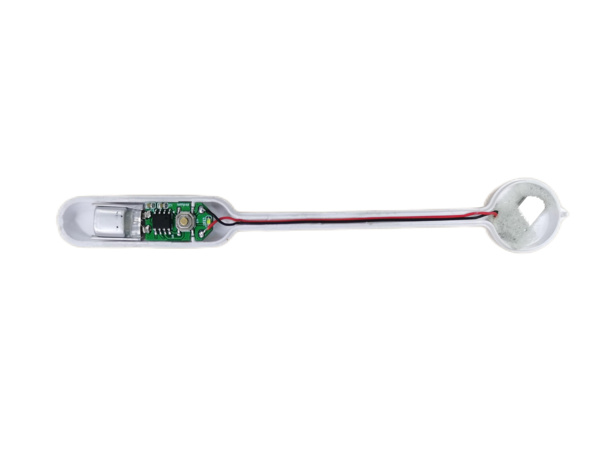

.. _ref_lollipop:

[SPV100A4][ESOP8]音乐棒棒糖
==============================

功能逻辑

 1. 长按按键（2秒）进行开机，开机后LED常亮，并开始播放音乐。
 2. 音乐播放状态下，短按按键可暂停播放。暂停后，LED变为闪烁。
 3. 音乐暂停状态下，短按按键可恢复音乐播放，LED变为常亮。
 4. 音乐暂停状态下持续10秒无操作，自动关机。
 5. 音乐播放和音乐暂停状态下，长按按键（2秒）进行关机。

原理图下载： 

 - :download:`svg格式 <../../_static/SPV100A4_ESOP8_音乐棒棒糖.svg>`