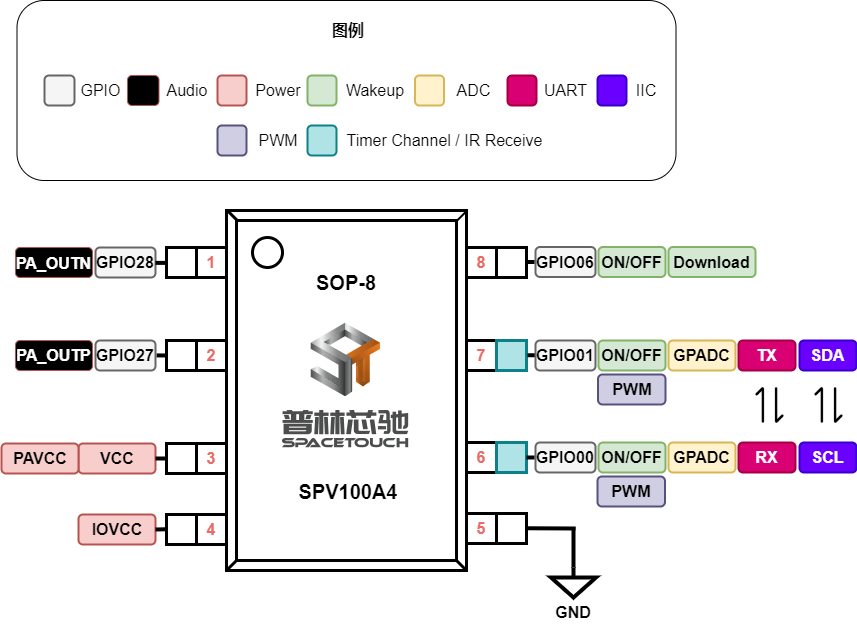
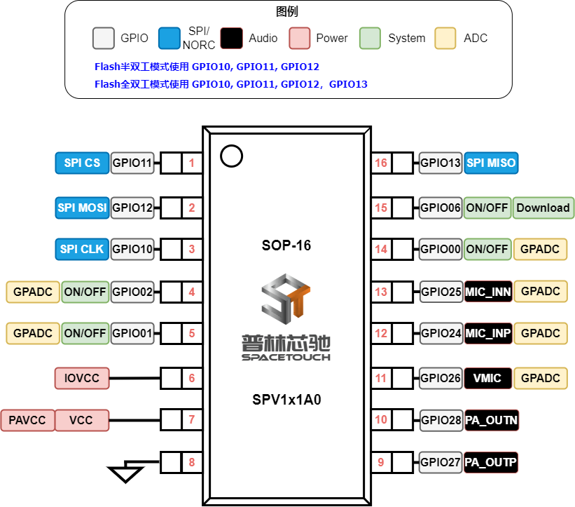
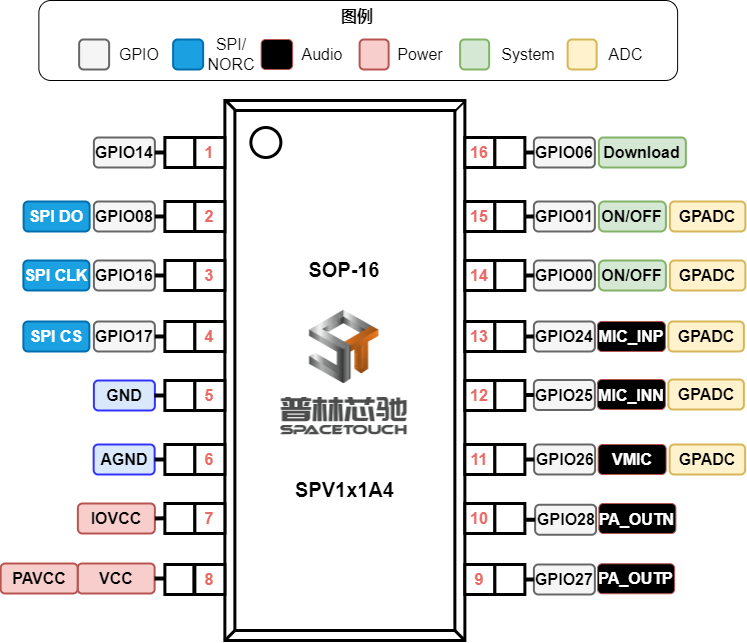

.. _soc-package:

SPV1x 芯片封装引脚说明
======================

.. seealso::
   
   GPIO MFP相关信息请参考： :ref:`gpio-api`

SOP-8 SPV100A4
---------------------------

独立执行音频解码播报功能的最小封装：

 - 可作为从机通过UART/IIC/IR等方式进行软件控制。
 - 具备PWM输出能力，实现LED呼吸灯等效果。
 - 支持ONOFF按键形式的低功耗唤醒。
 - 支持以AD Key形式进行按键扩展。

:download:`下载参考设计 <../../_static/SPV100A4_SOP8_schematics.pdf>`

-------------------------------------------------------------------

ESOP-8 SPV110A4/120A4
---------------------------

.. image:: ../../_static/kiwi-esop8-package.png
   :align: center

-------------------------------------------------------------------

SOP-16 SPV1x1A0
----------------------

-------------------------------------------------------------------

SOP-16 SPV1x1A4
----------------------

-------------------------------------------------------------------

SSOP-24 SPV1x2A4
----------------------

.. image:: ../../_static/kiwi-ssop24-package.png
   :align: center

