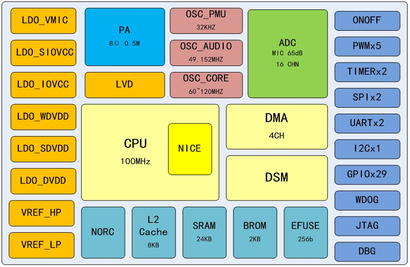

.. SPV1x Programming Guide documentation master file, created by
   sphinx-quickstart on Fri Apr 7 09:20:09 2023.
   You can adapt this file completely to your liking, but it should at least
   contain the root `toctree` directive.

SPV1x编程指南
===================================================

Bug反馈/新功能需求 请发送至 spv1x.feedback@spacetouch.co，感谢广大新老用户不吝赐教。

.. important::
    - 请关注 :ref:`changelog_pg`，及时获取新内容，最近更新于 **10-25-2023**。
    - SPV1x SDK当前最新版本为 **1.0.2-rc-10242023** ，详情见 :ref:`changelog_sdk`。
    - SPV1x 固件烧录程序 ODT 当前最新版本为 **v1.0.0-rc-10102023** :download:`点此下载 <_static/spv1x_odt_v1.0.0.zip>`。

本门户为针对 `珠海普林芯驰科技有限公司 <http://www.spacetouch.co/>`_ "SPV1x" SoC家族系列的文档中心， 
用于向广大用户提供及时全面的SoC编程指南信息。

SoC SPV1x是我司自主开发的SoC系列，主要应用于消费类玩具产品。SPV1x依托芯来科技N200系列RISC-V CPU内核和自研的数字音频模块，
能够进行高品质音频解码播放，支持16通道MIDI音频解码。SPV1x拥有12bit高性能ADC，能够采集MIC音频数据，并执行音频编码，离线语音识别等任务。

---------------------------------------------------

.. note::
    - SPV1x家族各个亚型由于硬件差异，支持场景库的范围不尽相同，详情请参考 :ref:`pick-target` 和 :ref:`soc-specs`。

==================  ==================   =====================  ====================
|快速入门|           |芯片指南|           |编程参考|              |硬件参考|
------------------  ------------------   ---------------------  -------------------- 
:ref:`get-started`  :ref:`user-guide`    :ref:`api-reference`   :ref:`hw-reference`
==================  ==================   =====================  ====================

.. |快速入门| image:: ./_static/get-started.png

.. |编程参考| image:: ./_static/api-reference.png

.. toctree::
   :maxdepth: 3
   :hidden:

   快速入门 <get-started/index>
   用户指南 <user-guide/index>
   软件参考 <api-reference/index>
   硬件参考 <hw-reference/index>
   SDK版本迭代记录 <changelog-sdk>
   编程手册版本迭代记录 <changelog-pg>
