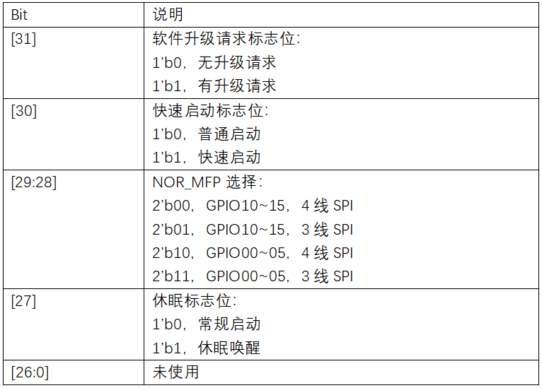
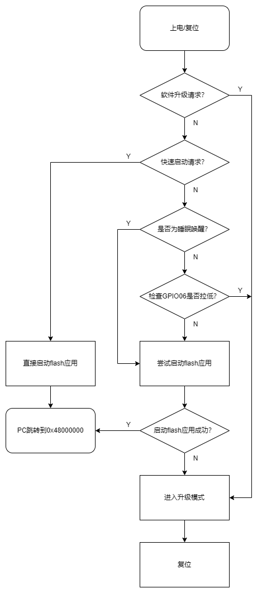

Boot ROM (BROM)
======================

.. _SPV1x SoC Memory Map说明: memory-map.html

.. note::
   
   前置知识： `SPV1x SoC Memory Map说明`_

当SPV1x SoC上电(Power On)或者发生复位(Reset)时，CPU指令指针(PC)将跳转到BROM空间，执行固化的BROM程序。

BROM程序使用AON_GLOBAL1寄存器与用户程序进行交互。在芯片发生复位或者芯片进入低功耗后，
AON_GLOBAL寄存器组的值可以保持不变，因此可以作为应用程序与BROM程序传递信息的载体。
AON_GLOBAL1各个有效位域描述如下：

BROM程序将通过一系列配置检测和逻辑判断机制，最终选择执行以下两种结论性场景之一：

 1. ``用户程序引导`` ：跳转至NOR Flash空间运行已烧录的用户程序。
 2. ``用户程序升级`` ：加载 ``Secondary Program Loader (SPL)`` ，通过SPL向NOR Flash烧录准备好的用户程序固件。

如上图所示，BROM程序的详细执行步骤描述如下：

 1. 当芯片上电或复位后（包含软件通过配置寄存器触发System Reset，休眠状态(Hibernate)唤醒导致的复位），
    芯片开始执行BROM程序。
 2. BROM程序检查 ``软件升级请求标志位`` AON_GLOBAL1[31]。如果该bit为1，说明用户程序希望进行程序的升级工作，
    此时BROM将进入用户程序升级。反之，则BROM继续执行步骤3。
 3. BROM检查 ``快速启动标志位`` AON_GLOBAL1[30]。如果该bit为1，说明用户程序希望尽快开始执行，
    此时BROM会直接根据 ``NOR_MFP`` AON_GLOBAL1[29:28]位域中的设置，初始化NORC中，然后进入用户程序引导。反之，BROM继续执行步骤4。
 4. BROM检查 ``休眠标志位`` AON_GLOBAL1[27]。如果该bit为1，说明本次是休眠唤醒导致的复位，此时BROM将跳过针对升级引脚（GPIO06）的检查，
    直接执行用户程序引导。反之，则BROM继续执行步骤5。
 5. BROM检查GPIO06的电平。如果GPIO06被拉低，说明存在用户程序升级请求，此时BROM执行用户程序升级。
    反之，则BROM尝试执行用户程序引导。
 6. 如果用户程序引导失败，则强制进入用户程序升级。
 7. 完成用户程序升级将触发执行SoC复位。复位后，芯片再次开始执行BROM程序，并由BROM程序完成新用户程序的引导。

.. note::

 1. 芯片冷启动时，AON_GLOBAL1[0:31]的初始值为0。
 2. BROM启动NOR Flash上的用户程序时，CPU PC将跳转至L2-CACHED NOR FLASH空间首地址0x48000000开始执行。
 3. 软件升级请求标志位、快速启动标志位、休眠标志位，在发生作用后，BROM程序会将其清除。如果后续需要再次使用这些功能，用户程序需要重新对其进行合理设置。

.. warning:: 

 1. 每次从NOR Flash启动用户程序时，AON_GLOBAL1[29:28]的值都会更新为实际启动成功的NOR_MFP编号，并且作为下次热启动的参考。
    用户程序请勿擅自修改AON_GLOBAL1[29:28]的内容，否则可能导致下次热启动失败。