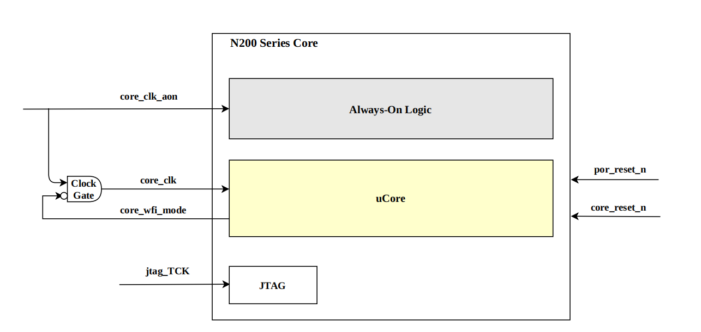
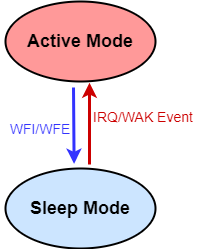

睡眠模式
===============================

睡眠模式 (Sleep Mode) 利用SPV1x SoC上搭载的Nuclei N200 RISC-V CPU所提供的WFI/WFE低功耗机制，
降低CPU空闲状态 (IDLE) 下的动态和静态功耗。该模式具备丰富灵活的低功耗进入和唤醒方式选择，
从睡眠模式下唤醒所需的程序流程简单，耗时短，在用户方案中部署的复杂度最低。

.. note::
   
  前置知识： :ref:`trap-handling-module`

CPU WFI/WFE低功耗机制
-------------------------------

上图描述了N200 CPU Core的内部时钟域，其主时钟域内含 ``core_clk`` 和 ``core_clk_aon`` 两路时钟信号，
二者同频同相，各自承担的功能如下：

 - core_clk: 驱动CPU核的主要时钟信号。
 - core_clk_aon: 用于驱动核内的Always-On逻辑单元，包含中断控制器ECLIC、Machine Timer和Debug等。

N200 CPU提供了 ``WFI (Wait For Interrupt)`` 和 ``WFE (Wait For Event)`` 两种机制，用于进入睡眠模式
并分别配置成依靠中断或外部事件的唤醒方式。SPV1x SDK将二者分别封装成 :c:func:`lpm_wfi_enter` 和 :c:func:`lpm_wfe_enter` 供用户调用。

睡眠模式的进入
-------------------------------

当用户执行wfi/wfe后，

 - CPU立即停止执行当前指令流。
 - CPU等待执行中的bus访问完成，包括：指令获取、数据加载和保存操作。

完成上述操作后，CPU进入睡眠模式：

 - core_wfi_mode信号拉高。
 - core_clk 时钟信号关闭(gated-off)，降低CPU Core的动态功耗。

睡眠模式的唤醒
-------------------------------

如果用户以 :c:func:`lpm_wfi_enter` 方式进入睡眠模式：

 - 任何在中断控制器ECLIC上注册并使能的中断，包含软件中断、Machine Timer中断和外设中断，都可以将SoC从睡眠模式唤醒。
 - （推荐）如果CPU全局中断使能 *mstatus.mie* 为1，则SoC从睡眠模式唤醒后将首先进入唤醒源的中断服务函数执行，
   退出中断服务函数后CPU继续执行  :c:func:`lpm_wfi_enter` 后面的程序流程。
 - （不推荐）如果CPU全局中断使能 *mstatus.mie* 为0，则SoC从睡眠模式唤醒后直接执行  :c:func:`lpm_wfi_enter` 后面的程序流程。
   用户程序则需要妥善查找唤醒中断源，并处理其中断请求信号(Pending)。

 API链接：

  - :c:func:`lpm_wfi_enter`

如果用户以 :c:func:`lpm_wfe_enter` 方式进入睡眠模式，：

 - 任何在中断唤醒管理单元（INT）注册的外设中断请求信号，都可以将SoC从睡眠模式唤醒。
 - （推荐）用户将CPU全局中断使能 *mstatus.mie* 置为0，杜绝外设中断请求同时触发ECLIC中断控制器的响应。如此，
   SoC从睡眠模式唤醒后，CPU将继续执行 :c:func:`lpm_wfe_enter` 后面的程序流程。用户程序可以通过 *INT中断唤醒事件状态寄存器STAT0*,
   快速查找到唤醒睡眠模式的外设源，然后处置其中断请求信号(Pending)。随后，用户程序即可根据实际情况重新开启CPU全局中断使能位。 
 - 为了便于使用，SPV1x SDK将以上流程封装为函数 :c:func:`lpm_wfe_enter` ，并在其中调用了弱定义钩子函数 :c:func:`lpm_wfe_wakeup_handler`，
   其传参为INT_STAT0寄存器当前值，用户可以使用强定义实现该钩子函数，并在其中完成唤醒外设源中断请求信号处置等必要操作。

 API链接：

  - :c:func:`lpm_wfe_enter`
  - :c:func:`lpm_wfe_wakeup_handler`

同时，无论用户以何种方式进入睡眠模式，当发生 ``Non-Maskable Interrupt (NMI)`` 
或来自于调试模块(Debug Module)的 ``调试请求 (Debug Request)`` ，
都可以将SoC从睡眠模式唤醒。

SoC从睡眠模式被唤醒后，core_wfi_mode信号被拉低，core_clk时钟信号重新开启，CPU恢复执行。

使用INT单元配置外部唤醒事件
-------------------------------

该外设模块向用户提供以下功能：

 1. 对WFE方式进入睡眠模式所需的外部唤醒事件的选择。
   
    用户可以通过配置DEV_INT->MASK0寄存器，选择所需的外部唤醒事件。
    这些外部唤醒事件源与SoC ECLIC模块接入的外部中断源一一对应。

 API链接：

  - :c:func:`lpm_wfe_set_event`

 2. 在SoC进入睡眠模式时，INT模块可以额外关闭指定的模块时钟，进一步节省睡眠模式下的场景功耗，
    并在SoC从睡眠模式唤醒时，自动开启这些模块时钟。

    用户可以通过配置DEV_INT->CLKEN1寄存器，选择需要自动开关的模块。
    包括 MEM/HST/DEV Bus、RAM、CACHE、NORC等，默认值情况下，这些模块的时钟在进入睡眠模式时保持开启。

 API链接：

  - :c:func:`lpm_wfe_keep_clock_off`

基于WFI的睡眠模式配置方法
-------------------------------

 1. 配置用于WFI唤醒的外设，包括该外设自身的中断使能（IE）。建议首先手动清除该外设的中断请求状态(Pending)。
 2. 调用 :c:func:`eclic_irq_init` 配置ECLIC与该外设中断对应的通道，然后通过  :c:func:`eclic_irq_enable` 将该通道使能。
 3. 调用 :c:func:`global_irq_enable`，开启全局中断使能。
 4. 用户程序调用 :c:func:`lpm_wfi_enter` 进入睡眠模式。
 5. SoC将在下次该外设中断触发时，退出睡眠模式，并首先执行该外设的中断服务函数（用户需要在中断服务函数中妥善清除外设自身的中断请求信号）， 然后回到 :c:func:`lpm_wfi_enter` 后续代码继续执行。

基于WFE的睡眠模式配置方法
-------------------------------

 1. 配置用于WFE唤醒的外设，包括该外设自身的中断使能（IE）。建议首先手动清除该外设的中断请求状态(Pending)。
 2. 调用 :c:func:`lpm_wfe_set_event` 函数，使能DEV_INT->MASK0寄存器下与该外设事件对应的比特位，从而选择该外设作为WFE唤醒源。
    SPV1x SDK中提供以下枚举定义用于配置该寄存器。
    
    .. code-block:: 
      
      typedef enum
      {
         Lpm_Wfe_Event_UART1        = (1ul<<0),  /* UART1 wakeup event */
         Lpm_Wfe_Event_TIMER1       = (1ul<<1),  /* Timer1 wakeup event */
         Lpm_Wfe_Event_CAPTURE1     = (1ul<<2),  /* Capture1 wakeup event */
         Lpm_Wfe_Event_SPI1         = (1ul<<3),  /* SPI1 wakeup event */
         Lpm_Wfe_Event_I2C0         = (1ul<<4),  /* I2C wakeup event */
         Lpm_Wfe_Event_PMU          = (1ul<<5),  /* PMU wakeup event */
         Lpm_Wfe_Event_DMA          = (1ul<<6),  /* DMA wakeup event */
         Lpm_Wfe_Event_GPIO         = (1ul<<7),  /* GPIO input wakeup event */
         Lpm_Wfe_Event_UART0        = (1ul<<8),  /* UART0 wakeup event */
         Lpm_Wfe_Event_TIMER0       = (1ul<<9),  /* Timer0 wakeup event */
         Lpm_Wfe_Event_CAPTURE0     = (1ul<<10), /* Capture0 wakeup event */
         Lpm_Wfe_Event_SPI0         = (1ul<<11), /* SPI0 wakeup event */
         Lpm_Wfe_Event_PWM          = (1ul<<12), /* PWM wakeup event */
         Lpm_Wfe_Event_ADC          = (1ul<<13), /* ADC wakeup event */
         Lpm_Wfe_Event_DSM          = (1ul<<14), /* DSM wakeup event */
         Lpm_Wfe_Event_WDT          = (1ul<<15)  /* Watch Dog Timer wakeup event */
      } lpm_wfe_event_t;

 3. 调用 :c:func:`lpm_wfe_keep_clock_off` 函数，通过配置DEV_INT->CLKEN1寄存器，指定SoC在进入睡眠模式时同步关闭的模块时钟。
    SPV1x SDK中提供以下枚举定义用于该配置步骤。

    .. code-block:: 
      
      typedef enum {
        Lpm_Wfe_Keep_Default_Clocks_On =   DEV_INT_CLKEN1_SYS
                                          |DEV_INT_CLKEN1_DEV
                                          |DEV_INT_CLKEN1_MEM
                                          |DEV_INT_CLKEN1_NORC
                                          |DEV_INT_CLKEN1_CACHE
                                          |DEV_INT_CLKEN1_RAM1
                                          |DEV_INT_CLKEN1_HST,
        Lpm_Wfe_Keep_Minimum_Clocks_On =   DEV_INT_CLKEN1_SYS
                                          |DEV_INT_CLKEN1_DEV
      } lpm_wfe_clken_t;

    ``Lpm_Wfe_Keep_Default_Clocks_On`` 代表SDK推荐的保守休眠模式时钟策略：进入睡眠模式后同时关闭BROM和CPU单元时钟，其余时钟保持原有开关状态不变。
    这种策略是稳健的时钟处置方案，建议在大多数场景中选用。

    ``Lpm_Wfe_Keep_Minimum_Clocks_On`` 代表SDK提供的激进休眠模式时钟策略：进入睡眠模式后仅保留WFE唤醒必需的系统时钟和DEV总线时钟，其余时钟均同步关闭。
    这种策略需要SoC在睡眠模式期间不能进行外设的复杂活动（如Nor Flash读取，DMA传输，RAM访存），要以实际场景为出发点进行评估。

 4. 用户程序调用 :c:func:`lpm_wfe_enter` 进入睡眠模式。
 5. SoC将在下次该外设自身触发(IP)时，退出睡眠模式，继续执行wfe后的用户代码。
 6. 用户需要提供强定义 :c:func:`lpm_wfe_wakeup_handler` 函数实现，
    用于对产生唤醒信号（外设中断请求）的INT注册外设进行妥善处置，如清除当前存在的中断请求信号。
    SPV1x SDK提供了一个弱定义函数作为参考模版，用户可以自行补齐不同外设中断唤醒后的处置流程。

    .. code-block:: 
      
      __WEAK void lpm_wfe_wakeup_handler(uint32_t wfe_status)
      {
        switch(wfe_status) {
          case Lpm_Wfe_Event_UART1:
            break;
          case Lpm_Wfe_Event_TIMER1:
            break;
          case Lpm_Wfe_Event_CAPTURE1:
            break;
          case Lpm_Wfe_Event_SPI1:
            break;
          case Lpm_Wfe_Event_I2C0:
            break;
          case Lpm_Wfe_Event_PMU:
            break;
          case Lpm_Wfe_Event_DMA:
            break;
          case Lpm_Wfe_Event_GPIO:
            break;
          case Lpm_Wfe_Event_UART0:
            break;
          case Lpm_Wfe_Event_TIMER0:
            break;
          case Lpm_Wfe_Event_CAPTURE0:
            break;
          case Lpm_Wfe_Event_SPI0:
            break;
          case Lpm_Wfe_Event_PWM:
            break;
          case Lpm_Wfe_Event_ADC:
            break;
          case Lpm_Wfe_Event_DSM:
            break;
          case Lpm_Wfe_Event_WDT:
            break;
          default:
            break;
        }
      }

API说明
----------------------

.. c:enum:: lpm_wfe_event_t
  
  WFE睡眠模式唤醒事件枚举定义。
  
   - *Lpm_Wfe_Event_UART1*：UART1中断作为唤醒事件
   - *Lpm_Wfe_Event_TIMER1*：TIMER1中断作为唤醒事件
   - *Lpm_Wfe_Event_CAPTURE1*：CAPTURE1中断作为唤醒事件
   - *Lpm_Wfe_Event_SPI1*：SPI1中断作为唤醒事件
   - *Lpm_Wfe_Event_I2C0*：I2C0中断作为唤醒事件
   - *Lpm_Wfe_Event_PMU*：PMU中断作为唤醒事件
   - *Lpm_Wfe_Event_DMA*：DMA中断作为唤醒事件
   - *Lpm_Wfe_Event_GPIO*：GPIO中断作为唤醒事件
   - *Lpm_Wfe_Event_UART0*：UART0中断作为唤醒事件
   - *Lpm_Wfe_Event_TIMER0*：TIMER0中断作为唤醒事件
   - *Lpm_Wfe_Event_CAPTURE0*：CAPTURE0中断作为唤醒事件
   - *Lpm_Wfe_Event_SPI0*：SPI0中断作为唤醒事件
   - *Lpm_Wfe_Event_PWM*：PWM中断作为唤醒事件
   - *Lpm_Wfe_Event_ADC*：ADC中断作为唤醒事件
   - *Lpm_Wfe_Event_DSM*：DSM中断作为唤醒事件
   - *Lpm_Wfe_Event_WDT*：WDT中断作为唤醒事件

.. c:enum:: lpm_wfe_clken_t

  睡眠模式时钟策略枚举定义。

   - *Lpm_Wfe_Keep_Default_Clocks_On*： 保守策略，大多数场景推荐使用。
   - *Lpm_Wfe_Keep_Minimum_Clocks_On*： 最少时钟保留策略，需场景条件满足。

.. c:function:: void lpm_wfi_enter()

  进入低功耗睡眠模式，等待中断唤醒(WFI)。

  :returns: 无

.. c:function:: void lpm_wfe_set_event(lpm_wfe_event_t event)

  配置睡眠模式下，可供唤醒的外设事件。

  :param event: 提供唤醒功能的外设事件，通过枚举定义 :c:enum:`lpm_wfe_event_t` 选择。
  :returns: 无

.. c:function:: void lpm_wfe_keep_clock_off(lpm_wfe_clken_t setting)

  配置睡眠模式下，可以同步关闭的模块时钟。

  :param setting: 睡眠模式下，各个模块的时钟开关策略，通过枚举定义 :c:enum:`lpm_wfe_clken_t` 选择。
  :returns: 无

.. c:function:: void lpm_wfe_enter()

  进入低功耗睡眠模式，等待事件唤醒(WFE)并完成唤醒后必要动作。

  :returns: 无

.. c:function:: void lpm_wfe_wakeup_handler(uint32_t wfe_status)

  WFE睡眠模式唤醒后用户自定义处理函数，用户需要提供该函数的强定义版本，用于完成必要的操作，如清除唤醒事件的对应的中断请求信号。

  :param wfe_status: 当前各个唤醒事件的触发情况，用户可以参考该函数的弱定义版本进行解析。
  :returns: 无

