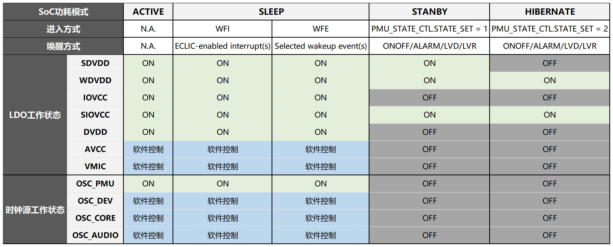
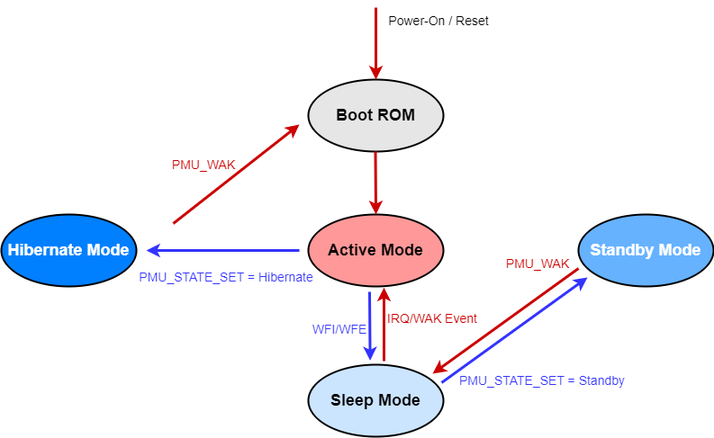

.. _lpm-config-and-wakeup:

低功耗模式配置和唤醒
==========================

.. note::
   
   前置知识： :ref:`pmu-module`

为了服务于电池供电的产品场景，SPV1x SoC按照功耗逐级降低的顺序设置了3种低功耗模式：

 - 睡眠模式 ``Sleep Mode``
 - 待机模式 ``Standby Mode``
 - 休眠模式 ``Hibernate Mode``

其中睡眠模式基于SoC中断唤醒管理模块 ``INT`` 进行配置，
而功耗更低的待机模式和休眠模式是通过SoC电源管理模块 ``PMU`` 进行配置。

下图简要总结了三种低功耗模式的进入-唤醒机制，以及各个模式间的切换流程。

关于三种模式的详细介绍和使用建议请阅读对应的章节：

.. toctree::
   :maxdepth: 1
   
   睡眠模式 <int-cpu-lpm>
   待机模式 <pmu-soc-lpm-standby>
   休眠模式 <pmu-soc-lpm-hibernate>
   针对低功耗场景优化的Nor Flash接入策略 <nor-low-power>

