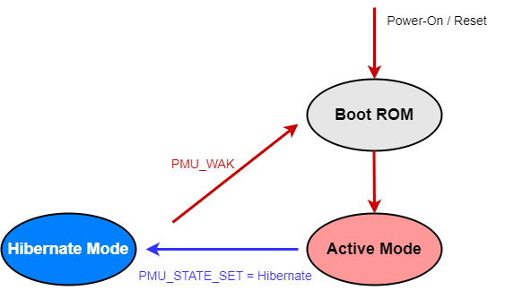

休眠模式
===============================

.. note::
   
   前置知识： :ref:`pmu-module`

睡眠模式 (Sleep Mode) 以开关CPU核内时钟域的方式，降低CPU空闲场景下的SoC动态功耗。
而 休眠模式 (Standby Mode) 和 休眠模式 (Hibernate Mode) 的引入，则是通过电源管理单元(PMU)的操作，
开关SoC层级的电源域，以影响全体SoC外设的方式，进一步降低指定场景的功耗。

休眠模式 (Hibernate Mode) 特性
-------------------------------

休眠模式下：

 - CPU与常规外设单元掉电，内部寄存器状态丢失。
 - SRAM与L2 Cache掉电，数据内容丢失。

休眠模式的进入
-------------------------------

1. 配置 PMU_STATE_CTL.STATE_SET = 0x2 选择休眠模式。
2. 配置 PMU_STATE_CTL.STATE_MODE = 0，即“立即触发”，SoC将即时进入休眠模式。

休眠模式的唤醒
-------------------------------

PMU提供4种机制用于将SoC从低功耗休眠模式（Hibernate Mode）唤醒。用户可以同时选择多种唤醒机制。
任意被选中的唤醒机制在触发后将产生PMU低功耗唤醒信号PMU_WAK，CPU将从Boot ROM(BROM)开始重新引导用户程序。

.. note::
  SoC从休眠模式唤醒后，尽管CPU重新从BROM代码开始引导用户程序，但 *PMU中断请求/低功耗唤醒信号状态寄存器PEND* 
  与当前触发的唤醒源对应的数据位仍然保持置位，用户程序需要妥善处置该信息并将其清除，以便后续低功耗状态的正常进入。

------------------

按键唤醒(ONOFF)机制
^^^^^^^^^^^^^^^^^^^^^^^^^^^^^^^

通过指定管脚的数字输入电平事件触发低功耗唤醒信号。请阅读章节 :ref:`onoff-multifunction-module` 内容。

定时唤醒(ALARM)机制
^^^^^^^^^^^^^^^^^^^^^^^^^^^^^^^

通过PMU内部定时器ALARM在指定时间后产生低功耗唤醒信号。请阅读章节 :ref:`alarm-module` 内容。

低电压检测唤醒(LVD)机制
^^^^^^^^^^^^^^^^^^^^^^^^^^^^^^^

PMU内部低电压检测模块(LVD)可以实时监测电源电压，当其下降至设定的阈值时，产生低功耗唤醒信号。
请阅读章节 :ref:`lvd-module` 内容。

低电压复位唤醒(LVR)机制
^^^^^^^^^^^^^^^^^^^^^^^^^^^^^^^

LVD事件发生后，可以继续触发低电压复位(LVR)事件，导致SoC复位。请阅读章节 :ref:`lvd-module` 内容。

需要提示的是：以上4种唤醒方式同时也是 PMU 提供的4种 PMU 中断触发方式，用户完全可以在非低功耗场景下部署使用，
用于实时监控供电电压等必要动作。

休眠模式配置方法
-------------------------------

多功能按键唤醒(ONOFF)配置
^^^^^^^^^^^^^^^^^^^^^^^^^^^^^^^

 1. 由于休眠模式下仅有ONOFF-PMU通道可用，需调用 :c:func:`lpm_set_onoff_pmu` 配置作为ONOFF用途的管脚(GPIO00-07可选)。
 2. 调用 :c:func:`lpm_hibernate_enter` 函数，进入休眠模式。 
 3. 指定时间后ALARM触发，将SoC从休眠模式唤醒，CPU从BROM开始引导程序，
    用户程序需要妥善PMU_PEND寄存器置位信息并将其清除，以便后续低功耗状态的正常进入。

定时唤醒(ALARM)配置
^^^^^^^^^^^^^^^^^^^^^^^^^^^^^^^

 1. 调用 :c:func:`lpm_set_alarm` 函数，配置ALARM定时。
 2. 调用 :c:func:`lpm_hibernate_enter` 函数，进入休眠模式。 
 3. 指定时间后ALARM触发，将SoC从休眠模式唤醒，CPU从BROM开始引导程序，
    用户程序需要妥善PMU_PEND寄存器置位信息并将其清除，以便后续低功耗状态的正常进入。

低电压检测唤醒(LVD)配置
^^^^^^^^^^^^^^^^^^^^^^^^^^^^^^^

低电压复位唤醒(LVR)配置
^^^^^^^^^^^^^^^^^^^^^^^^^^^^^^^

待描述

-------------------------------------------------------------------------------

API说明
-------------------------------

.. c:function:: void lpm_hibernate_enter()

  进入低功耗休眠模式，等待低功耗唤醒源唤醒信号。

  :returns: 无