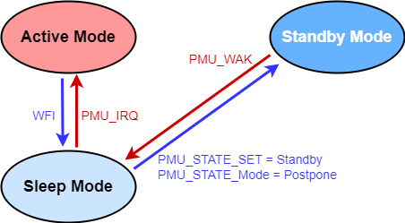

待机模式
===============================

.. note::
   
   前置知识： :ref:`pmu-module`

睡眠模式 (Sleep Mode) 以开关CPU核内时钟域的方式，降低CPU空闲场景下的SoC动态功耗。
而 待机模式 (Standby Mode) 和 休眠模式 (Hibernate Mode) 的引入，则是通过电源管理单元(PMU)的操作，
开关SoC层级的电源域，以影响全体SoC外设的方式，进一步降低指定场景的功耗。

待机模式 (Standby Mode) 特性
-------------------------------

待机模式下：

 - CPU与常规外设单元关闭，其内部寄存器状态保留(Retention)。
 - SRAM与L2 Cache数据保留。

待机模式的进入
-------------------------------

1. 配置 PMU_STATE_CTL.STATE_SET = 0x1 选择待机模式。
2. 配置 PMU_STATE_CTL.STATE_MODE = 1，即“延迟触发”，SoC需经由睡眠模式进入待机模式。
   这样操作的优点是可以确保CPU当前工作切实完成（指令处置、BUS访问等），唤醒后程序能够从可控的状态开始运行。
3. 调用wfi指令，SoC进入低功耗状态。

待机模式的唤醒
-------------------------------

PMU提供4种机制用于将SoC从低功耗待机模式（Standby Mode）唤醒。用户可以同时选择多种唤醒机制。
任意被选中的唤醒机制在触发后将同时产生PMU低功耗唤醒信号PMU_WAK和PMU中断请求信号PMU_IRQ，
PMU_WAK用于将SoC从待机模式唤醒至睡眠模式，PMU_IRQ信号继续将SoC从睡眠模式唤醒至工作模式(Active Mode)
继续从执行待机前的代码位置执行程序。

按键唤醒(ONOFF)机制
^^^^^^^^^^^^^^^^^^^^^^^^^^^^^^^

通过指定管脚的数字输入电平事件触发低功耗唤醒信号。请阅读章节 :ref:`onoff-multifunction-module` 内容。

定时唤醒(ALARM)机制
^^^^^^^^^^^^^^^^^^^^^^^^^^^^^^^

通过PMU内部定时器ALARM在指定时间后产生低功耗唤醒信号。请阅读章节 :ref:`alarm-module` 内容。

低电压检测唤醒(LVD)机制
^^^^^^^^^^^^^^^^^^^^^^^^^^^^^^^

PMU内部低电压检测模块(LVD)可以实时监测电源电压，当其下降至设定的阈值时，产生低功耗唤醒信号。
请阅读章节 :ref:`lvd-module` 内容。

低电压复位唤醒(LVR)机制
^^^^^^^^^^^^^^^^^^^^^^^^^^^^^^^

LVD事件发生后，可以继续触发低电压复位(LVR)事件，导致SoC复位。请阅读章节 :ref:`lvd-module` 内容。

需要提示的是：以上4种唤醒方式同时也是 PMU 提供的4种 PMU 中断触发方式，用户完全可以在非低功耗场景下部署使用，
用于实时监控供电电压等必要动作。

待机模式配置方法
-------------------------------

多功能按键唤醒(ONOFF)配置
^^^^^^^^^^^^^^^^^^^^^^^^^^^^^^^

 1. 根据需求选择指定的输入通道配置ONOFF按键，
    ONOFF-PMU通道对应 :c:func:`lpm_set_onoff_pmu`， 
    ONOFF-GPIO通道对应 :c:func:`lpm_set_onoff_gpio` 。
 2. 调用 :c:func:`lpm_standby_enter` 函数，进入待机模式。 
 3. 指定时间后ALARM触发，将SoC从待机模式唤醒，CPU从待机位置继续执行程序，包括用户可自定义的流程
    :c:func:`lpm_standby_wakeup_handler`。

定时唤醒(ALARM)配置
^^^^^^^^^^^^^^^^^^^^^^^^^^^^^^^

 1. 调用 :c:func:`lpm_set_alarm` 函数，配置ALARM定时。
 2. 调用 :c:func:`lpm_standby_enter` 函数，进入待机模式。 
 3. 指定时间后ALARM触发，将SoC从待机模式唤醒，CPU从待机位置继续执行程序，包括用户可自定义的流程
    :c:func:`lpm_standby_wakeup_handler`。

低电压检测唤醒(LVD)配置
^^^^^^^^^^^^^^^^^^^^^^^^^^^^^^^

 1. 调用 :c:func:`lpm_set_lvd` 函数，配置LVD定时检测。
 2. 调用 :c:func:`lpm_standby_enter` 函数，进入待机模式。 
 3. 指定时间后ALARM触发，将SoC从待机模式唤醒，CPU从待机位置继续执行程序，包括用户可自定义的流程
    :c:func:`lpm_standby_wakeup_handler`。

低电压复位唤醒(LVR)配置
^^^^^^^^^^^^^^^^^^^^^^^^^^^^^^^

API说明
-------------------------------

.. c:function:: void lpm_set_alarm(alarm_time_t period)

  设置低功耗定时唤醒(ALARM)时间。

  :param period: ALARM低功耗唤醒定时设置，通过枚举定义 :c:enum:`alarm_time_t` 选择。
  :returns: 无

.. c:function:: void lpm_set_lvd(lvd_volt_t volt, lvd_event_t event, lvd_debounce_time_t debounce, alarm_time_t period)
  
   设置LVD低功耗唤醒。

  :param volt: LVD输入电压阈值，通过枚举定义 :c:enum:`lvd_volt_t` 选择。
  :param event: LVD输出电平事件，通过枚举定义 :c:enum:`lvd_event_t` 选择。
  :param debounce: LVD输出消抖时间，通过枚举定义 :c:enum:`lvd_debounce_time_t` 选择。
  :param period: ALARM定时周期，通过枚举定义 :c:enum:`alarm_time_t` 选择。  
  :returns: 无

.. c:function:: void lpm_set_onoff_pmu(gpio_pin_t pin, onoff_pmu_pin_pull_t pull, onoff_event_t event, onoff_debounce_time_t debounce)
  
   设置ONOFF-PMU低功耗唤醒。

  :param pin: ONOFF管脚，通过枚举定义 :c:enum:`gpio_pin_t` 选择，GPIO00-07可选。
  :param pull: ONOFF-PMU通道上拉电阻配置，通过枚举定义 :c:enum:`onoff_pmu_pin_pull_t` 选择。
  :param event: ONOFF电平事件设置，通过枚举定义 :c:enum:`onoff_event_t` 选择。
  :param debounce: ONOFF电平消抖时间设置，通过枚举定义 :c:enum:`onoff_debounce_time_t` 选择。  
  :returns: 无

.. c:function:: void lpm_set_onoff_gpio(gpio_pin_t pin, gpio_pin_pull_t pull, onoff_event_t event, onoff_debounce_time_t debounce)
  
   设置ONOFF-GPIO低功耗唤醒。

  :param pin: ONOFF管脚，通过枚举定义 :c:enum:`gpio_pin_t` 选择，GPIO00-26可选。
  :param pull: ONOFF-GPIO通道上下拉电阻配置，通过枚举定义 :c:enum:`gpio_pin_pull_t` 选择。
  :param event: ONOFF电平事件设置，通过枚举定义 :c:enum:`onoff_event_t` 选择。
  :param debounce: ONOFF电平消抖时间设置，通过枚举定义 :c:enum:`onoff_debounce_time_t` 选择。  
  :returns: 无

.. c:function:: void lpm_standby_enter()

  进入低功耗待机模式，等待低功耗唤醒源唤醒信号。

  :returns: 无

.. c:function:: void lpm_standby_wakeup_handler(uint32_t pmu_pend)

  低功耗待机模式唤醒后必要动作的用户自定义函数，用户请参考SDK提供的弱定义版本准备。

  :returns: 无

.. code-block:: 

   __WEAK void lpm_standby_wakeup_handler(uint32_t pmu_pend)
   {
      switch(_rv32_ctz(pmu_pend)) {
      case PMU_Lpm_Wakeup_Source_ONOFF:
         break;
      case PMU_Lpm_Wakeup_Source_ALARM:
         break;
      case PMU_Lpm_Wakeup_Source_LVD:
         break;
      case PMU_Lpm_Wakeup_Source_LVR:
         break;
      default:
         break;
      }
   }