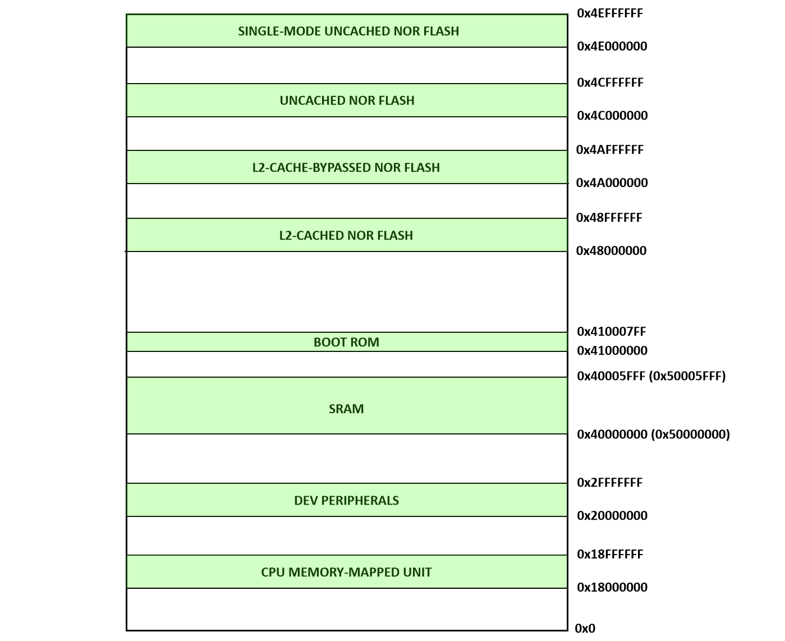
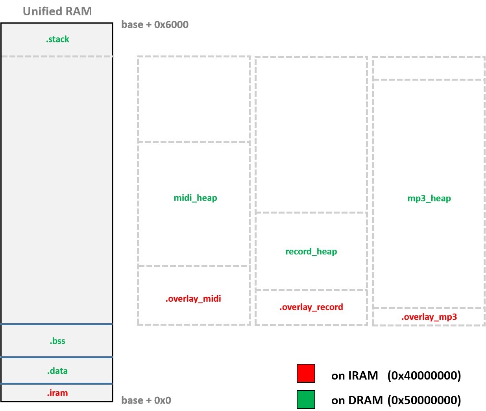
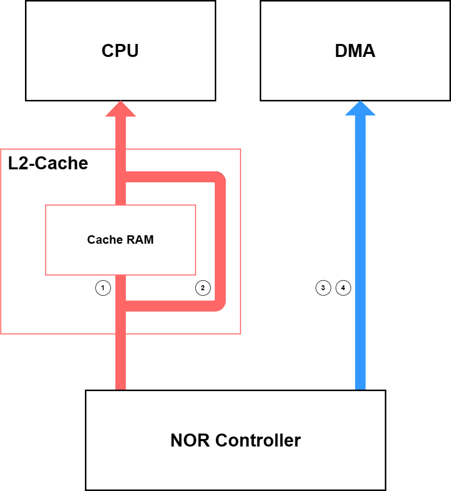

SPV1x SoC 寻址空间映射
========================

Memory Map
----------------------

.. _Boot ROM: brom.html

上图描述了SPV1x SoC的全局Memory Map, 子空间的划分如下：

  - ``CPU MEMORY-MAPPED UNIT`` 为CPU核内Memory-mapped Unit（如中断控制器ECLIC，Machine Timer）配置寄存器所在空间。
  - ``DEV PERIPHERALS`` 为SoC各Memory-mapped外设（如DMA, UART）配置寄存器所在空间。
  - ``SRAM`` 为On-chip Static RAM所在空间，其特性和使用建议请继续阅读 `SRAM Space`_ 。
  - ``BOOT ROM`` 即 ``BROM`` ，为SoC提供上电引导和固件升级所需的固化程序，其特性和使用建议请参考专属章节 `Boot ROM`_ 。
  - ``NOR FLASH`` 空间由4个细分线性空间组成，对应面向NOR FLASH的不同访问模式，以提供细分场景下的最优性能方案，其特性和使用建议请继续阅读 `NOR Flash Space`_ 。

----------------------

.. _SRAM Space:

SRAM空间
----------------------

SPV1x SoC的SRAM具有以下特性：

  - 24KB
  - 1 Block
  - 单周期访问性能
  - 具有2组线性地址空间: ``0x40000000~0x40005fff`` 与 ``0x50000000~0x50005fff`` ，对应同一物理地址空间
  - 用户工程下，默认：

    + 将 0x40000000 起始的线性空间作为代码空间 ``IRAM Region`` 使用
    + 将 0x50000000 起始的线性空间作为数据空间 ``DRAM Region`` 使用

结合SPV1x SRAM的特性，上图描述了用户工程下SRAM的静态段划分：

  - ``.iram`` 段位于IRAM，用于放置中断向量表和有必要运行于SRAM的函数，由用户程序完成初始化。
  - ``.data`` 段位于DRAM，用于存放程序中已初始化的全局变量，由用户程序完成初始化。
  - ``.bss`` 段位于DRAM，用于存放程序中未初始化的全局变量，由用户程序完成初始化。
  - ``.stack`` 段位于DRAM，作为栈使用（栈顶设置于0x50006000位置），存放程序临时创建的局部变量，由编译器生成必要的栈操作代码。

.bss段与.stack段之间的SRAM区域 ``OVERLAY`` 是SPV1x各个预设场景工作时的占用空间，
每个场景下该区域一般被划分成场景特定的SRAM代码段和数据段，其中后者以堆(heap)的形式存在和使用。
在工作场景需要进行切换时，用户可以通过调用目标场景提供的init()函数完成对该区域的有效初始化。

.. note::
  由于IRAM和DRAM对应同一组物理空间，因此在二者上分别设置的段需要确保其地址范围的低15位不发生重叠，此工作已经由我司提供的链接脚本文件所完成，用户无需额外操作。

------------------

.. _NOR Flash Space:

NOR Flash空间
------------------

SPV1x SoC支持使用最大16MB容量的单颗SPI NOR Flash作为固件的存储介质，CPU和DMA通过NOR Flash Controller(NORC)模块进行Flash内容的读取。
为了匹配CPU和NOR Flash之间的速度差异，SPV1x SoC使用8KB 2路组连接形式的L2 Cache进行衔接（上图所示）。

考虑到细分应用场景下用户程序开发的便利，SPV1x SoC使用4组线性空间来实现对于不同主机(CPU/DMA)，以不同数据通路(Cached/Uncached)对相同Flash物理地址空间进行访问的需求：

  1. ``CACHED NOR FLASH``: 起始地址0x48000000, 为典型的Cache空间：当CPU（或其他主设备，如DMA）发起读操作，首先在L2 Cache中进行检索，
     如果Cache RAM中缓存了访问地址下的数据，则直接返回该数据，否则则发起NOR Flash直读数据请求，获得数据并更新至Cache RAM。
     考虑到以上特性，该空间在方案开发中主要作为CPU程序代码的运行地址（VMA）空间使用，也可以用做高频次/线性访问的静态表的存储空间。
  2. ``CACHE-BYPASSED NOR FLASH``:起始地址0x4A000000，主设备在该地址空间下使用Cache总线通路直接访问NOR Flash，但是不检查Cache命中，也不会更新Cache RAM的内容。
     由于该空间使用了Cache总线通路，因此当主设备通过CACHE-BYPASSED空间进行NOR Flash数据访问时，Cache RAM的数据则无法被访问，反之亦然。该空间在方案开发中主要用于CPU访问低频词/随机位置/小规模的静态表数据。
  3. ``UNCACHED NOR FLASH``:起始地址0x4C000000，主设备对该地址空间的访问将绕开L2 Cache，直接通过NORC访问NOR Flash。单次访问的数据搬运量为32Bytes。在方案开发中，该空间主要交由DMA进行中大规模连续静态数据向SRAM的搬运。
  4. ``SINGLE-MODE UNCACHED NOR FLASH``:起始地址0x4E000000，此地址空间的访问特性与UNCACHED NOR FLASH空间基本相同。区别在于NORC将根据访问数据的位宽(1 Byte/1 Half Word/1 Word)决定单次访问NORC实际读取的数据量。因此该空间主要用于协助DMA对小位宽离散静态数据的搬运。

.. note::
  我司提供的链接脚本中，默认将CPU代码段.text和静态只读数据段.rodata的运行地址VMA映射于0x48000000-0x48ffffff的地址空间，
  用户可以通过SDK中提供的宏定义 ``NORC_CACHE_ADDR(addr)`` ``NORC_CACHE_BYPASS_ADDR(addr)`` ``NORC_UNCACHE_ADDR(addr)``  ``NORC_UNCACHE_SINGLE_ADDR(addr)``
  将特定静态数据地址向上述四个线性空间地址进行转换，便于后续场景使用。 