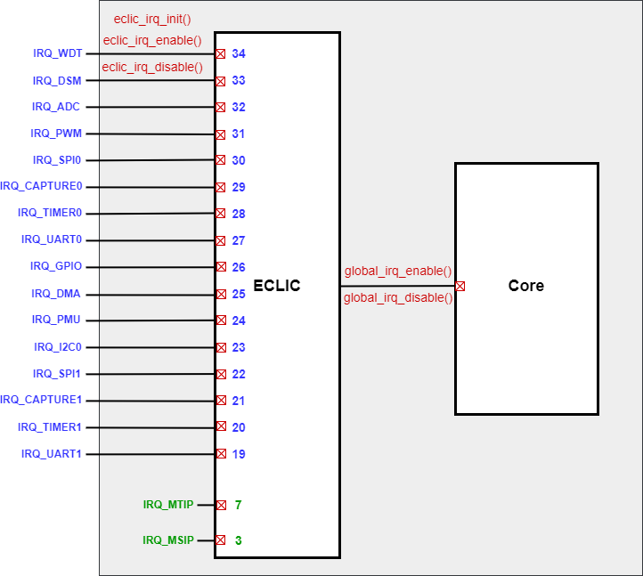

.. _trap-handling-module:

中断/异常/NMI处理
======================

中断处理
----------------------

SPV1x SDK中以中断向量表的方式进行中断处理，支持中断抢占，支持8个抢占优先级。
为了提高中断响应速度并增强用户程序的灵活性，SPV1x SDK将中断向量表放置于IRAM代码空间下，
支持实时配置(attach)向量表中的外设中断服务函数入口。

外设中断服务函数统一以 `void xxx_irq_entry(void)` 形式定义，其中xxx为外设名称，如dma、gpio和uart0等，
与上图中断源名称一一对应。函数声明形式如下：

.. code-block:: 
    
    __attribute__((interrupt, aligned(4))) void xxx_irq_entry(void)
    {
        nested_irq_enter();

        xxx_irq_handler();

        nested_irq_exit();
    }

- __attribute__((interrupt, aligned(4))) 用于区分中断服务函数与普通用户函数，其通用寄存器现场保护和返回机制上存在明显差异。
- nested_irq_enter/exit() 为支持中断嵌套和抢占所必须的步骤。
- xxx_irq_handler()为外设xxx的用户定义中断处理流程，包括清除外设xxx自身的中断Pending位(PD)等必要操作。为了提升代码跳转性能，我们鼓励用户直接在xxx_irq_entry()中以非调用子函数的方式进行用户中断处理流程的书写，比如直接操作宏定义的外设寄存器。

综上所述，以PWM为例，常规的外设中断完整配置流程如下：

 1. 配置PWM外设的控制寄存器，开启PWM的中断使能位(IE)
 2. 配置PWM于中断控制器ECLIC中相关寄存器：

   - 通过 :c:func:`eclic_irq_init` 配置PWM中断在向量表模式下的抢占优先级。
   - 通过 :c:func:`eclic_irq_enable` 开启ECLIC上PWM中断请求信号的输入通路。

 3. 准备外设中断处理函数 :c:func:`pwm_irq_entry` ，并以静态编译或动态挂载的方式接入中断向量表。
 4. 开启全局中断使能 :c:func:`global_irq_enable` 。

.. note::
    - SDK提供 :c:func:`cpu_enter_critical` 和 :c:func:`cpu_exit_critical` 用于用户程序对共享资源执行安全访问。

异常处理
----------------------

SPV1x用户程序流程中的同步异常和Non-maskable Interrupt(NMI)均执行统一的处理函数： ``trap_entry()``。
trap_entry()首先对 mepc，mcause，mtval等关键CSR寄存器现场进行保存，然后判断 mcause.exccode != 0xFFF成立，
则确认发生同步异常，并分支进入对应的处理流程。反之，则确认发生NMI。

.. code-block:: 

    __attribute__((interrupt, aligned(64))) void trap_entry(void)
    {
        uint32_t mcause;
        uint32_t mepc;
        uint32_t mtval;

        mepc = __RV_CSR_READ(CSR_MEPC);
        mcause = __RV_CSR_READ(CSR_MCAUSE);
        mtval = __RV_CSR_READ(CSR_MTVAL);

        if((mcause & 0xFFF) == 0xFFF) {
            /* NMI handling process here */
        } else {
            /* All exceptions except for NMI are handled here */
        }

        while(1);
    }

NMI处理
----------------------

如上文所述，Non-maskable Interrupt(NMI)发生时，CPU PC跳转至 trap_entry() 入口执行，
通过判断 mcause.exccode == 0xFFF 确认NMI发生，并分支进入对应的处理流程。

可以触发NMI的事件源（外设中断信号）通过DEV_INT->NMI_MASK0寄存器进行配置，各个比特位对应含义与WFE唤醒机制中使用的
DEV_INT->MASK0寄存器一一对应。

------------------------------------------------------------------------------

API说明
----------------------

.. c:enum:: IRQn_Type
  
  外设中断源在ECLIC中的入口通道号。
  
   - *IRQ_Source_MSIP*：软件中断源
   - *IRQ_Source_MTIP*：CPU核内Machine Timer中断源
   - *IRQ_Source_UART1*：UART1中断源
   - *IRQ_Source_TIMER1*：TIMER1中断源
   - *IRQ_Source_CAPTURE1*：CAPTURE1中断源
   - *IRQ_Source_SPI1*：SPI1中断源
   - *IRQ_Source_I2C0*：I2C0中断源
   - *IRQ_Source_PMU*：PMU中断源
   - *IRQ_Source_DMA*：DMA中断源
   - *IRQ_Source_GPIO*：GPIO中断源
   - *IRQ_Source_UART0*：UART0中断源
   - *IRQ_Source_TIMER0*：TIMER0中断源
   - *IRQ_Source_CAPTURE0*：CAPTURE0中断源
   - *IRQ_Source_SPI0*：SPI0中断源
   - *IRQ_Source_PWM*：PWM中断源
   - *IRQ_Source_ADC*：ADC中断源
   - *IRQ_Source_DSM*：DSM中断源
   - *IRQ_Source_WDT*：WDT中断源

.. c:enum:: eclic_irq_priority_t

  中断抢占优先级。0-7优先级依次递增。

   - *IRQ_Priority_0*： 抢占优先级P0，为最低优先级
   - *IRQ_Priority_1*： 抢占优先级P1
   - *IRQ_Priority_2*： 抢占优先级P2
   - *IRQ_Priority_3*： 抢占优先级P3
   - *IRQ_Priority_4*： 抢占优先级P4
   - *IRQ_Priority_5*： 抢占优先级P5
   - *IRQ_Priority_6*： 抢占优先级P6
   - *IRQ_Priority_7*： 抢占优先级P7，为最高优先级

.. c:function:: void eclic_irq_init(IRQn_Type source, eclic_irq_priority_t priority)

  对ECLIC指定外设中断通道进行配置，设置为向量模式和电平触发模式。

  :param source: 配置外设中断源，通过枚举定义 :c:enum:`IRQn_Type` 选择。
  :param priority: 该中断的抢占优先级，通过枚举定义 :c:enum:`eclic_irq_priority_t` 选择。
  :returns: 无

.. c:function:: void eclic_irq_enable(IRQn_Type source)

  使能ECLIC指定外设中断通道。

  :param source: 配置外设中断源，通过枚举定义 :c:enum:`IRQn_Type` 选择。
  :returns: 无

.. c:function:: void eclic_irq_disable(IRQn_Type source)

  失能ECLIC指定外设中断通道。

  :param source: 配置外设中断源，通过枚举定义 :c:enum:`IRQn_Type` 选择。
  :returns: 无

.. c:function:: void global_irq_enable()

  使能全局中断响应。

  :returns: 无

.. c:function:: void global_irq_disable()

  失能全局中断响应。

  :returns: 无

.. c:function:: void eclic_irq_attach(IRQn_Type source, void (*irq_entry)(void))

 向中断向量表指定中断源挂载新的中断处理函数。如果静态编译阶段预留的中断服务函数入口已满足场景需求，则无需考虑使用此功能。

 :param source: 配置外设中断源，通过枚举定义 :c:enum:`IRQn_Type` 选择。
 :param irq_entry: 新中断服务函数名。
 :returns: 无