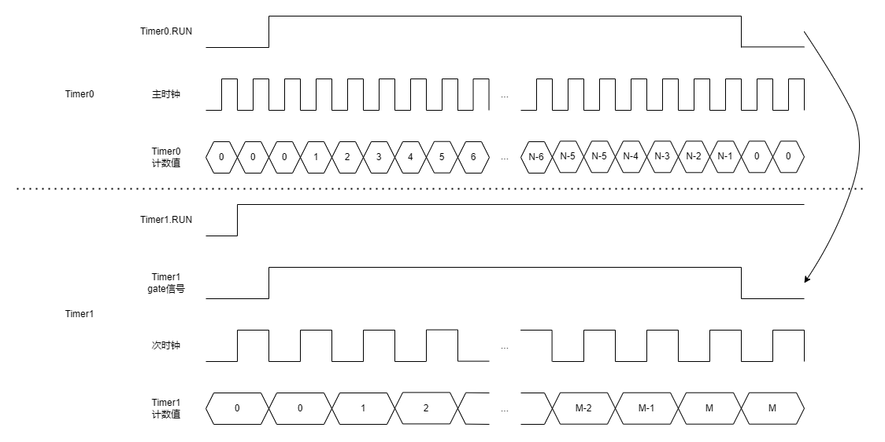

时钟脉冲计数器
===============================

操作原理
-------------------------------

使用2个定时器外设Timer0/Timer1，分别对2个时钟源（为便于描述，分别称之为主时钟和次时钟）进行脉冲计数。2个定时器同时开始计数并同时结束计数，计数结束后，2个定时器的计数值之比就是时钟源的频率比。

实现方式
-------------------------------

 1. Timer0运行于free run模式下，时钟源选取主时钟，LEN寄存器设置为固定值N。
 2. Timer1运行于gate模式下，时钟源选取次时钟，LEN寄存器设置为65535，gate极性设置为高电平，gate信号来源选取Timer0的TIMER0_RUN信号。
 3. 先使能Timer1的RUN控制位，然后再使能Timer0的RUN控制位。此时，Timer1的RUN控制位和gate信号都满足工作条件，Timer1会同步启动计数。
 4. 等待Timer0溢出（查询或者中断方式）。Timer0溢出后，Timer0的RUN信号自动清零，计数停止，Timer1也会同时停止计数。此时读取Timer1的计数值M。
 5. 时钟源1与时钟源2的频率比为N:(M+1)。

注意事项
-------------------------------

 1. Timer0和Timer1的可选时钟源，参考CMU_TIMERnCLK寄存器。
 2. Timer0 LEN寄存器值N的选取，需要根据应用的实际情况进行权衡。在定时器的最大允许计数范围（65536）内，N的值越大，测量精度越高，但是测量过程的时间也越长。此外，还需要考虑在整个测量周期内，Timer1的计数值不会溢出。
 3. 每次测量前，需要将Timer1的RUN控制位清零，以清除Timer1的计数值。测量开始时，先使能Timer1的RUN控制位，再使能Timer0的RUN控制位。

