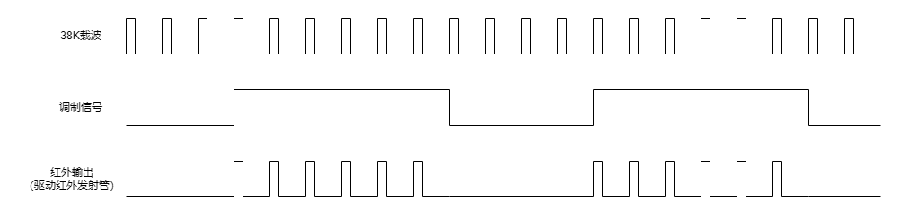

IR编码
===============================

操作原理
-------------------------------
 1. 红外发射的核心是调制一个38KHz的载波。当红外一体化接收头收到38KHz的红外信号时，OUT引脚输出低电平，当红外一体化接收头未收到38KHz的红外信号时，OUT引脚输出高电平（或高阻）。
 2. 常用的红外协议，通过“有38K载波”和“无38K载波”的时间宽度组合，来实现对“0”和“1”的编码。为了便于区分完整的红外帧，在设计红外协议时，通常会在帧头和帧尾加入特殊宽度的载波信号。

实现方式
-------------------------------

 1. 生成载波信号

    载波信号是一个频率为38KHz的，占空比为1/3或1/4的脉冲信号。
    SPV1x的 ``CMU_PWM0CLK`` 可以提供所需载波的生成。以选取OSC_AUDIO时钟（49.152MHz）为例，生成1/4占空比的38K信号，其步骤如下：
     
     a. 确定分频系数DIV
         
        DIV=49.152MHz/38KHz-1=1292。1292为四舍五入取整后的结果。

     b. 确定占空比值DUTY_VAL
         
        DUTY_VAL决定38KHz的低电平宽度，当需要1/4占空比时，低电平宽度占整个载波周期的3/4，因此DUTY_VAL=49.152MHz/38KHz*3/4-1=969。969为四舍五入取整后的结果。

  .. image:: ../../_static/kiwi-ir-implementation.png
    :align: center

 2. 根据协议生成调制信号

    使用PWM0的软件翻转模式，用于生成调制信号波形，其步骤如下：

     a. 设置PWM0初始输出值为0。红外帧空闲时，没有载波信号发射，因此调制信号为低。

     b. 向PWM0_TX_DAT依次写入数据A,B,C,D…，PWM0会先输出(A+1)个时钟的高电平，再输出(B+1)个时钟的低电平，再输出(C+1)个时钟的高电平，再输出(D+1)个时钟的低电平…。当PWM0_TX_DAT中的数据输出完成后，PWM0输出停止，回到初始输出值（低电平）。

  .. image:: ../../_static/kiwi-ir-implementation-continue.png
    :align: center

 3. 输出调制后的载波
    
    开启PWM0的调制输出（MOD_OUT）功能，PWM0会自动使用软件翻转模式的输出去调制载波，完成最终红外驱动信号的输出。

注意事项
-------------------------------

 1. 只有PWM0支持时钟源占空比调节和软件模式，因此红外发射只能使用PWM0来完成。
    当需要使用时钟源占空比调节功能时，需要设置CMU_PWM0CLK.DUTY_MODE位。
 2. 配置CMU_PWM0CLK.DIV和CMU_PWM0CLK.DUTY_VAL时，需要将理论值减1后写入。
    配置PWM0_TX_DAT时，也需要注意这一点。
 3. PWM0_TX_DAT中的内容，通过配置，可以看作成1个16bit数据，或2个16bit数据，或3个10bit数据，或4个8bit数据。
    此外，PWM0_TX_DAT背后为8*32bit的FIFO，因此，可以一次写入多个值。

    .. image:: ../../_static/kiwi-pwm-format.png
      :align: center

 4. 在整个红外帧发送过程中，PWM0_TX_DAT中的数据不能断流。
    利用PWM0_TX_DAT的FIFO机制或使用DMA向PWM0_TX_DAT写入数据，可以有效避免数据断流问题。

