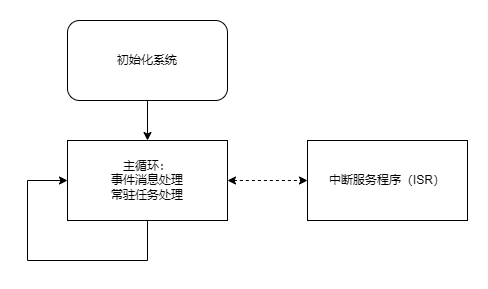

.. _edpm-design:

事件驱动型用户程序设计
===============================

SoC SPV1x用户程序采用经典的前后台系统结构。 ``前台程序`` 为中断服务程序(ISR)， ``后台程序`` 为任务主循环。

为了满足SoC预设应用场景的特殊要求，SPV1x的前后台系统进行了特殊的改进：

 1. 对于前台程序，使用了 ``中断嵌套`` ，以保证系统的实时性。
    使用了中断嵌套后，当低优先级中断正在处理的过程中，如果发生了更高优先级的中断，程序会暂停低优先级中断的处理，转而处理高优先级的中断。
    在音频播放过程中，SPV1x需要周期解码音频帧数据，以保证音频播放不会断流。而后台程序每次循环周期不可控，因此解码操作无法在后台程序中执行。此外解码过程相对比较耗时，少则几百微秒，多则几毫秒。为了保证在解码过程中，系统仍然能快速响应外部的事件，需要将解码操作放在低优先级中断里，而外部事件对应的中断放在高优先级的中断里。
 2. 对于后台程序，为了便于组织后台程序的逻辑，引入了 ``事件驱动`` 框架。
    在事件驱动框架下，每一个事件与一个对应的消息 ``msg`` 进行绑定，当对应的事件发生时，就向消息队列 ``msg_queue`` 中发送一个对应的消息。因此对于任务主循环 ``loop()`` ，只需要不停地处理队列中的消息即可。
    为了兼顾一些常驻任务（即没有任何事件发生也要执行的代码），主循环在每次循环的过程中，都会调用一次常驻任务 ``always_run()`` 。

事件驱动型框架使用说明
===============================

 1. 消息队列的深度配置

    消息队列的深度在“event_kernel.h”中配置:

    ``#define	MSG_POOL_DEPTH		(32)``
    
 2. 向消息队列中发送消息

    用户通过调用 ``msg_post()`` 向消息队列中发送一条消息，该函数的详细说明如下：
    
  .. c:function:: int32_t msg_post(msg_queue_t *mq,msg_t *msg)

   向消息队列中写入一条消息。

   :param mq: 指向消息队列。框架已定义好默认的消息队列，因此调用时固定填入 ``msg_queue`` 。
   :param msg: 指向待发送的消息。
   :retval  0: 写入队列成功。
   :retval -1: 写入队列失败。通常原因是消息队列已满。
   :note: 该函数在主循环中和中断中调用，都是安全的。待发送的消息结构体会被拷贝到消息队列中，因此 ``msg`` 可以指向一个临时的结构体。

  .. c:struct:: msg_t
  
    消息结构体

     .. c:member:: void *tag

       指向消息携带的附加数据。tag用于传递大量的或者复杂的数据。如果不使用，可以设置为NULL。

     .. c:member:: uint16_t val

       消息携带的附加值。例如：按键模块使用val值来标识按键的不同状态（短按、短按抬起、长按、长按抬起等）。

     .. c:member:: uint8_t id

       消息的ID。例如：系统中有3个按键，那么ID值用于区分是哪一个按键。
    
     .. c:member:: uint8_t type

       消息的类型。通常类型值与功能模块相关。例如：所有的按键消息都会有同样的type值。

  在文件 ``msg_def.h`` 中已经定义了一些消息类型和消息ID，用户可以根据项目需求进行扩充。

.. note::
   
  注意事项：
   1. 消息队列的初始化 和 从队列中读取消息 都是由框架来完成的，用户只需要根据实际需求发送消息，以及在 ``event_handler()`` 中处理已有的消息即可。
   2. 消息队列的容量有限。当消息的产生速度大于主循环的消息处理速度时，消息队列就会饱和，进而导致消息丢失。因此要避免非常频繁地向队列发送消息。
   3. 前台程序和后台程序都可以发送消息，因为事件可能来自于主循环中的逻辑，也可能来自于ISR。
   4. 为保证系统实时性，越高优先级的中断处理越追求简短快速。中断只做必要的操作（如发送一个消息、将关键数据复制到缓冲区），尽量将事情放在后台程序完成。
   5. 可以利用消息转换或消息合并来简化逻辑。例如系统同时支持红外遥控和GPIO按键，而它们都有一个“播放键”，那么可以在程序中进行如下处理：

      a. 消息转换处理：收到红外的“播放键”消息，向消息队列中推送一条GPIO的“播放键”消息，这样就将红外按键的处理转换到了现有的GPIO按键处理逻辑上。
      b. 消息合并处理：将红外遥控键码，直接与现有的GPIO按键进行映射，当红外收到“播放键”的键码时，直接向消息队列推送一条GPIO的“播放键”消息。

